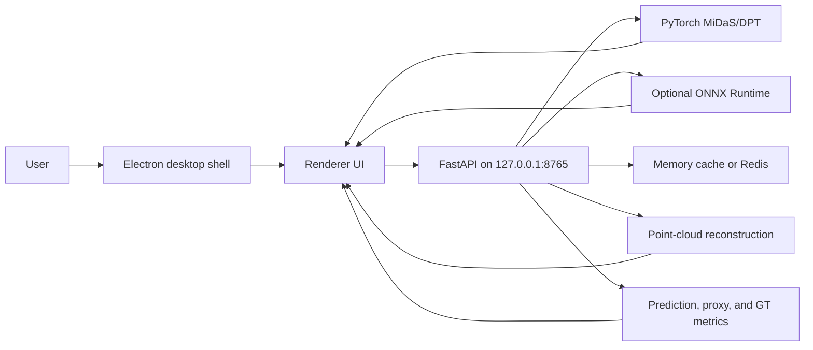

# DepthLens Pro

[](electron-app/package.json)
[](backend/requirements.txt)
[](pyproject.toml)
[](backend/requirements.txt)
[](models/onnx/README.md)
[](LICENSE)

DepthLens Pro is a local-first Electron + FastAPI workstation for monocular depth estimation, real-time webcam depth previews, and approximate 2D-to-3D point-cloud reconstruction. It is designed as a portfolio-grade desktop ML app: the renderer stays sandboxed, the backend runs on localhost, heavyweight model downloads are optional, and diagnostics are visible through both the UI and API.

## What is current

- **Desktop depth workflow:** upload an image, choose MiDaS/DPT model settings, preview color or grayscale depth maps, download outputs, compare results, and optionally evaluate against ground-truth depth.
- **Real-time webcam depth MVP:** capture browser/Electron camera frames, send capped-FPS JPEG frames to the local `/estimate` endpoint, and preview live depth maps without leaving localhost.
- **3D Reconstruction workspace:** turn an uploaded image or latest depth result into an approximate colored point cloud through `/api/reconstruct`, with PLY/OBJ export, metadata export, progress UI, and browser preview data.
- **Guide tab:** the old static About-style content has been replaced by an in-app guide with setup, workflow, model, metric, benchmark, webcam, reconstruction, and troubleshooting guidance.
- **Operational backend:** liveness, readiness, health, device discovery, model metadata, colormap metadata, cache metrics, ONNX diagnostics, benchmarks, batch inference, and cache clearing are available as API endpoints.
- **Safe local defaults:** Redis is optional, ONNX is optional, model warmup can be skipped, and tests mock or stub heavyweight ML/runtime paths.



## Tech stack

| Layer | Technology | Notes |
|---|---|---|
| Desktop shell | Electron 42 | Starts/reuses the local backend, owns packaged resources, and keeps renderer Node access disabled. |
| Frontend | HTML, CSS, JavaScript | Depth workflow, webcam MVP, 3D reconstruction tab, benchmarks, diagnostics, guide tab, and responsive header navigation. |
| Backend | FastAPI, Uvicorn, Pydantic | Local HTTP API, structured settings, diagnostics, and inference orchestration. |
| ML runtime | PyTorch, MiDaS/DPT | Canonical inference path for `midas_small`, `dpt_hybrid`, and `dpt_large`. |
| Optional acceleration | ONNX Runtime | Used only when valid exported `.onnx` files and compatible providers are available. |
| Cache | In-memory cache, optional Redis | Redis failures fall back to memory cache; cache payloads use safe versioned JSON. |
| Packaging | electron-builder | Native app packaging is intentionally ARM64-only for macOS, Windows, and Linux. |
| Tests | pytest, Black, Ruff, mypy, Node tests | CI-friendly tests avoid mandatory GPU services, Redis, browser automation, and model downloads. |

## Repository layout

```text
DepthLensPro/
├── .env.example                 # Local safe defaults you can copy to .env
├── backend/                     # FastAPI app, routes, inference, diagnostics, tests
│   ├── api/                     # /live, /ready, /estimate, /reconstruct, diagnostics
│   ├── services/                # inference, cache, benchmarks, GT, ONNX, reconstruction
│   ├── scripts/export_onnx.py   # Optional ONNX export/validation helper
│   └── tests/                   # Lightweight backend test suite
├── electron-app/                # Electron main/preload code, packaging scripts, Node tests
├── frontend/                    # Renderer UI, styles, welcome animation, guide/webcam/reconstruct UI
├── models/onnx/                 # Optional generated ONNX files live here; binaries are not committed
├── scripts/                     # Setup, native build, doctor, backend diagnostics
├── docker-compose.yml           # Optional backend + Redis stack
├── Dockerfile                   # Backend-only container image
├── LICENSE                      # MIT License
└── package.json                 # Root npm runbook wrappers
```

## Quick start

> The first-run path intentionally skips ONNX export. PyTorch inference remains available, and ONNX can be added later if you need benchmark comparisons.

### Prerequisites

- Git.
- Python 3.12 target; setup scripts accept Python 3.10 through 3.12.
- Node.js and npm.
- Docker only if you want the backend + Redis container path.

### 1. Install dependencies

macOS ARM64:

```bash
scripts/setup-macos.sh --without-onnx
```

Linux ARM64/aarch64:

```bash
scripts/setup-linux.sh --without-onnx
```

Windows ARM64 PowerShell:

```powershell
.\scripts\setup-windows.ps1 --without-onnx
```

Cross-platform root wrappers are also available:

```bash
npm run setup
npm run setup:mac
npm run setup:linux
npm run setup:win
```

Successful setup should leave a repo-owned `venv/`, install `electron-app/node_modules/`, create `models/onnx/`, and pass resource verification:

```bash
npm run verify:resources
```

### 2. Run local development mode

Start the backend from the repository root:

```bash
npm run backend:dev
```

In a second terminal, verify it:

```bash
curl http://127.0.0.1:8765/live
curl http://127.0.0.1:8765/ready
```

Then start Electron:

```bash
npm run frontend:dev
```

Electron will reuse the already-running backend when it passes DepthLens checks. If no compatible backend is live in normal app usage, Electron starts an owned Uvicorn child process.

### 3. Use the app

- **Generate depth:** select an image, choose model/device/colormap/metric options, then run inference.
- **Evaluate with GT:** attach `.png`, `.tif`, `.tiff`, or `.npy` ground-truth depth when you need true benchmark metrics.
- **Webcam:** open the webcam panel, start the camera, and prefer `midas_small` for the smoothest first demo.
- **3D Reconstruction:** select an image or reuse the latest result, tune point budget/export options, and download PLY/OBJ plus metadata.
- **Guide:** use the in-app guide tab for workflow and troubleshooting reminders.

## Native packaging

Native packaging scripts currently enforce ARM64/aarch64 targets only.

| Platform | Command | Output |
|---|---|---|
| macOS Apple Silicon | `npm run build:mac:arm64` | `electron-app/dist/mac-arm64/DepthLens Pro.app` plus DMG output |
| Windows ARM64 | `npm run build:win:arm64` | `electron-app/dist/win-arm64-unpacked/` plus NSIS installer output |
| Linux ARM64/aarch64 | `npm run build:linux:arm64` | `electron-app/dist/*arm64*.AppImage` |

Unsupported native targets such as macOS x64/universal, Windows x64, and Linux x64 intentionally fail through Electron helper scripts. The backend may still run on other platforms when Python dependencies are installable.

## Docker backend path

Docker Compose starts only the backend and Redis; it does not start Electron.

```bash
docker compose up --build
```

Check the service:

```bash
curl http://127.0.0.1:8765/live
```

Stop it:

```bash
docker compose down
```

## Optional ONNX

Generated ONNX binaries are intentionally not committed. Keep them under `models/onnx/` or point the backend at a custom directory with `DEPTHLENS_ONNX_DIR` or `ONNX_WEIGHTS_DIR`.

Export/validate MiDaS Small during setup:

```bash
scripts/setup-macos.sh --with-onnx --onnx-models midas_small --onnx-strict
```

Validate configured ONNX files later:

```bash
npm run verify:onnx
```

Manual export example:

```bash
venv/bin/python backend/scripts/export_onnx.py --model midas_small --force
```

When ONNX files are missing, invalid, or provider-incompatible, PyTorch inference remains the fallback. Use `/onnx/status` and `/benchmark` to see the exact provider/path/session state.

## Configuration

Copy `.env.example` to `.env` if you want explicit local defaults:

```bash
cp .env.example .env
```

The backend reads process environment variables and `.env` values for the core runtime settings below.

| Variable | Default | Purpose |
|---|---|---|
| `HOST` | `127.0.0.1` locally | Uvicorn bind host. |
| `PORT` | `8765` | Uvicorn bind port. |
| `LOG_LEVEL` | `INFO` | Backend log level. |
| `DEBUG` | `false` | FastAPI debug mode. |
| `REDIS_URL` | unset | Full Redis URL override. |
| `REDIS_HOST` / `REDIS_PORT` / `REDIS_DB` | `127.0.0.1` / `6379` / `0` | Redis connection pieces when `REDIS_URL` is unset. |
| `REDIS_PASSWORD` | unset | Optional Redis password. |
| `REDIS_SOCKET_TIMEOUT_SECONDS` | `1.5` | Redis connect/read timeout. |
| `REDIS_MAX_CONNECTIONS` | `20` | Redis connection-pool limit. |
| `CACHE_TTL_SECONDS` | `3600` | Inference cache TTL. |
| `CACHE_MAX_ENTRIES` | `256` | Memory cache entry cap. |
| `DEPTHLENS_PRELOAD_MODEL` | `false` | Enables optional background warmup after liveness is available. |
| `DEPTHLENS_WARMUP_MODEL` | `MiDaS_small` | Warmup model. |
| `DEPTHLENS_WARMUP_DEVICE` | `auto` | Warmup device. |
| `DEPTHLENS_SKIP_WARMUP` | unset | Skips warmup in automation. |
| `DEPTHLENS_MAX_DIM` | `1536` | Long-edge inference resize limit. |
| `DEPTHLENS_DEFAULT_METRICS` | `fast` | Default `/estimate` and `/batch` metrics mode. |
| `DEPTHLENS_DEFAULT_OUTPUTS` | `color` | Default output image set. |
| `DEPTHLENS_BACKEND_PORT` | `8765` | Electron/diagnostic requested backend port. |
| `DEPTHLENSPRO_MODEL_DIR` | unset | Custom model root; ONNX path may resolve under it. |
| `DEPTHLENS_ONNX_DIR` | unset | Custom ONNX directory. |
| `ONNX_WEIGHTS_DIR` | unset | Legacy/custom ONNX directory. |
| `DEPTHLENS_AUTO_EXPORT_ONNX` | `false` | Allows benchmark requests to export missing ONNX graphs on demand. |
| `INFERENCE_MAX_CONCURRENCY` | `2` | Concurrent inference limit. |
| `ORT_INTRA_OP_NUM_THREADS` / `ORT_INTER_OP_NUM_THREADS` | runtime-dependent / `1` | ONNX Runtime thread settings. |
| `TESTING`, `CI`, `CODEX_ENV` | unset | Automation flags used to avoid heavyweight behavior. |

`.env.example` also includes safe local values for `DEPTHLENS_CACHE_BACKEND`, `DEPTHLENS_REDIS_URL`, `MAX_UPLOAD_SIZE_MB`, and model-download skip flags used by tests and setup workflows.

## API reference

Base URL for local development is usually `http://127.0.0.1:8765`.

| Method | Path | Purpose |
|---|---|---|
| `GET` | `/` | Service name and version. |
| `GET` | `/live` | Cheap heartbeat with process, uptime, timestamp, and busy state. |
| `GET` | `/ready` | Import/runtime readiness for required modules, optional modules, settings, models, colormaps, and ONNX. |
| `GET` | `/health` | Full diagnostics: devices, cache, loaded models, acceleration, ONNX, disk/memory, warmup, and telemetry. |
| `GET` | `/devices` | Device inventory and primary device. |
| `GET` | `/models` | Canonical model registry metadata. |
| `GET` | `/colormaps` | Supported colormap names. |
| `GET` | `/onnx/status` | ONNX import/provider/path/session/model-file diagnostics. |
| `GET` | `/benchmark` | PyTorch-vs-ONNX benchmark. |
| `GET` | `/api/benchmark` | Frontend-compatible benchmark alias. |
| `GET` | `/cache/metrics` | Cache backend, hit/miss, Redis, TTL, and memory-limit metrics. |
| `DELETE` | `/cache` | Clear Redis and in-memory cache entries. |
| `POST` | `/estimate` | Single-image depth estimation with optional GT file and configurable metrics/outputs. |
| `POST` | `/batch` | Batch depth estimation for up to 10 image files. |
| `POST` | `/api/reconstruct` | 3D reconstruction endpoint for colored PLY/OBJ point-cloud exports and preview metadata. |
| `POST` | `/reconstruct` | Alias for `/api/reconstruct`. |

### `/estimate` fields

| Field | Default | Notes |
|---|---|---|
| `file` | required | `image/*` upload OpenCV can decode; max 20 MB. |
| `model` | `MiDaS_small` | Normalizes aliases to `midas_small`, `dpt_hybrid`, or `dpt_large`. |
| `colormap` | `inferno` | `inferno`, `plasma`, `viridis`, `magma`, `jet`, `hot`, `bone`, or `turbo`. |
| `device` | `auto` | `auto`, `cpu`, or discovered CUDA/MPS/XPU keys. |
| `metrics` | `fast` | `none`, `fast`, or `full`. |
| `outputs` | `color` | `color`, `gray`, or `color,gray`. |
| `max_dim` | `DEPTHLENS_MAX_DIM` | Long-edge resize limit, clamped by backend validation. |
| `gt_file` | optional | GT `.png`, `.tif`, `.tiff`, or `.npy`; max 20 MB. |
| `gt_required` | `false` | Fails when GT mode is required but no GT file is supplied. |
| `gt_scale` | unset | Optional GT scale. |
| `gt_invalid_value` | unset | Optional GT invalid sentinel. |

Example:

```bash
curl -X POST http://127.0.0.1:8765/estimate \
  -F "file=@sample.png" \
  -F "model=midas_small" \
  -F "colormap=inferno" \
  -F "device=auto" \
  -F "metrics=fast" \
  -F "outputs=color"
```

### `/api/reconstruct` fields

| Field | Default | Notes |
|---|---|---|
| `file` | required | Image upload; max 20 MB. |
| `model` | `MiDaS_small` | Same model validation path as `/estimate`. |
| `device` | `auto` | Same device validation path as `/estimate`. |
| `colormap` | `inferno` | Depth preview colormap. |
| `max_dim` | `DEPTHLENS_MAX_DIM` | Optional long-edge resize before inference/reconstruction. |
| `export_format` | `ply` | `ply` or `obj`, returned as base64. |
| `max_points` | `120000` | Bounded point budget for safe response sizes. |
| `preview_points` | `5000` | JSON preview point budget for the UI. |
| `focal_scale` | `1.2` | Approximate pinhole focal-length multiplier; not metric calibration. |
| `depth_scale` | `1.0` | Relative Z scale after depth stabilization. |
| `depth_near_percentile` / `depth_far_percentile` | `2.0` / `98.0` | Percentile clipping range. |
| `sampling` | `grid` | `grid` or deterministic `random`. |
| `include_rgb` | `true` | Include RGB vertex colors. |
| `coordinate_system` | `y_up` | `y_up` for frontend-friendly previews or `camera` for image-coordinate Y. |

## Models, outputs, and metrics

| Canonical ID | Display name | PyTorch name | ONNX file | Input size | Recommended use |
|---|---|---|---|---:|---|
| `midas_small` | MiDaS Small | `MiDaS_small` | `midas_small.onnx` | `256x256` | Fastest model; best first choice for CPU/webcam. |
| `dpt_hybrid` | DPT Hybrid | `DPT_Hybrid` | `dpt_hybrid.onnx` | `384x384` | Better quality when hardware acceleration is available. |
| `dpt_large` | DPT Large | `DPT_Large` | `dpt_large.onnx` | `384x384` | Highest-cost supported model; GPU recommended. |

Metrics are grouped so the app does not present proxy diagnostics as ground-truth quality:

- **Prediction stats:** min, max, mean, standard deviation, median, dynamic range, entropy, coverage, and histogram data.
- **Proxy metrics:** SSIM, SILog, PSNR, gradient error, MAE, RMSE, and edge density computed without GT labels.
- **GT metrics:** AbsRel, SqRel, GT MAE/RMSE/log-RMSE, and delta thresholds, computed only when valid GT depth is uploaded.
- **Unavailable metrics:** items such as LPIPS, ordinal error, and surface-normal error are explicitly marked unavailable instead of being faked.

## Testing and quality checks

Run Python checks from the repository root after dependencies are installed:

```bash
black --check .
ruff check .
mypy backend/
pytest
```

Run Electron lightweight tests:

```bash
cd electron-app
npm test
```

Run resource verification:

```bash
npm run verify:resources
```

CI is expected to use lightweight tests and stubs/mocks for torch model downloads, ONNX Runtime details, Redis, and process behavior where appropriate.

## Troubleshooting

| Symptom | Check | Fix |
|---|---|---|
| Backend appears offline | `python scripts/diagnose_backend.py` and `curl http://127.0.0.1:8765/live` | Confirm port `8765` is not occupied by a stale DepthLens process. |
| UI controls stay disabled | `curl http://127.0.0.1:8765/ready` | Re-run setup and check `venv/bin/python -m pip check`. |
| ONNX panel reports missing/invalid files | `curl http://127.0.0.1:8765/onnx/status` | Use PyTorch fallback or regenerate/validate ONNX files. |
| Packaged app misses resources | `npm run verify:resources` before build and `npm run verify:packaged:*` after build | Rebuild with the root native build wrapper. |
| Redis is unavailable | `curl http://127.0.0.1:8765/cache/metrics` | Use memory fallback or start Docker Compose. |
| Need to stop an Electron-owned backend | `npm run stop:backend` | Only kill manually after diagnostics confirm the process is stale. |

## Security notes

- The Electron renderer runs with context isolation and without Node integration.
- Navigation policy code restricts app and external URLs.
- Electron tracks backend ownership before stopping backend processes.
- FastAPI returns sanitized inference error envelopes while logging details server-side.
- Cache payloads are versioned JSON; legacy pickle-like payloads are rejected.
- Report vulnerabilities privately using `SECURITY.md`.

Do not commit secrets, large generated model files, screenshots with sensitive paths, or local `.env` values.

## Contributing

See `CONTRIBUTING.md` for contributor expectations. Keep PRs small and reviewable, update docs when behavior changes, and prefer lightweight automated checks over heavyweight GPU, Redis, Docker, Playwright, or model-download workflows unless a task explicitly requires them.

## License

DepthLens Pro is released under the MIT License. See `LICENSE` for details.

## Acknowledgements

DepthLens Pro builds on MiDaS/DPT from Intel ISL, PyTorch, ONNX Runtime, FastAPI, Electron, OpenCV, NumPy, Pillow, Redis, and the broader Python and JavaScript open-source ecosystems.
