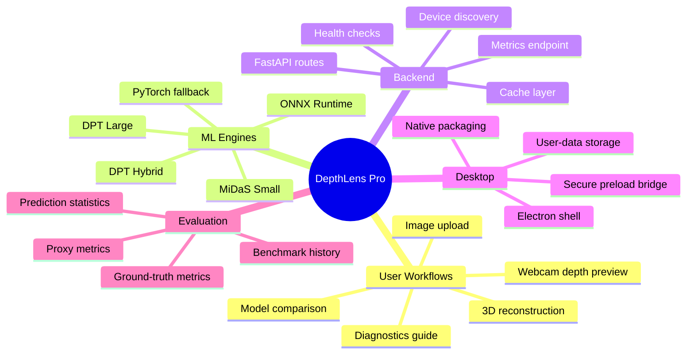
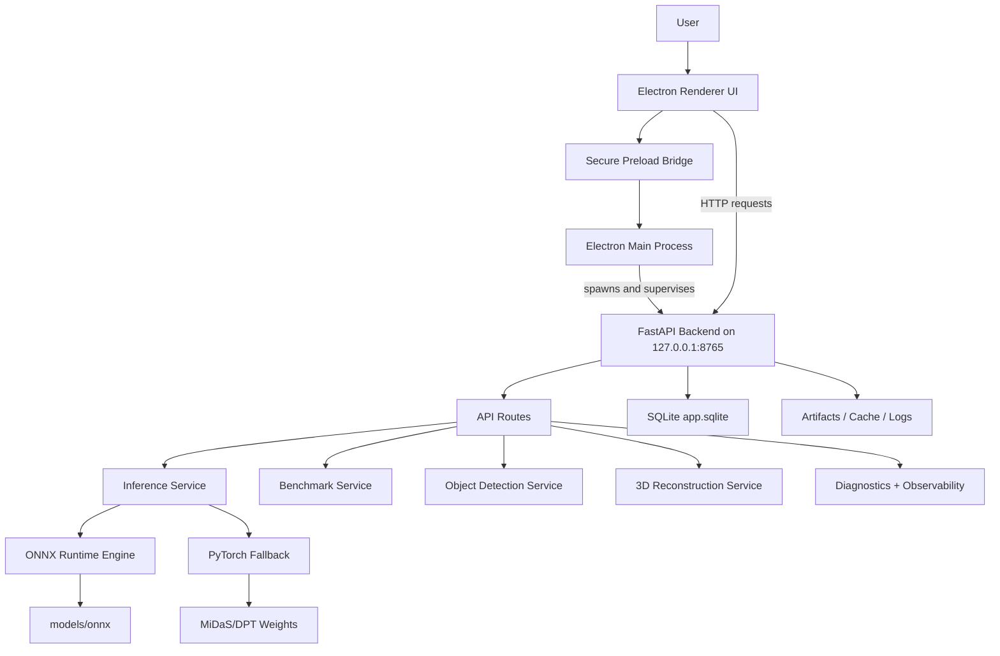
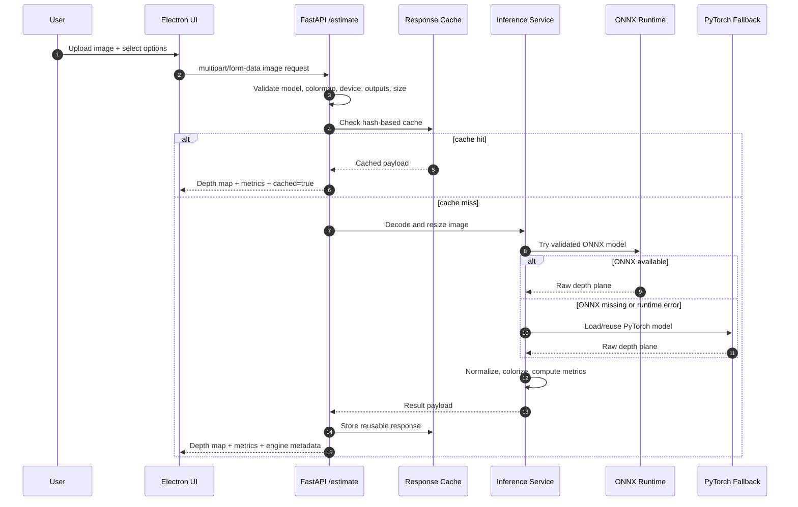
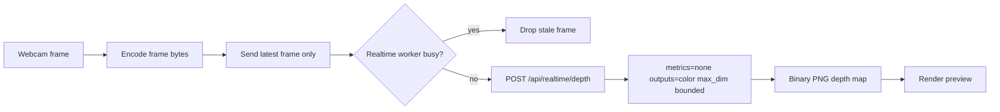
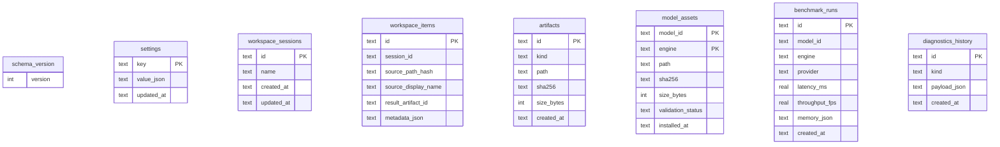
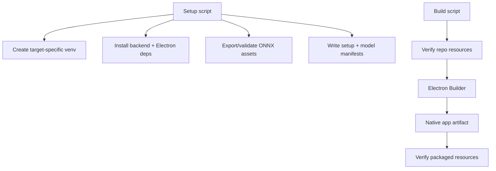
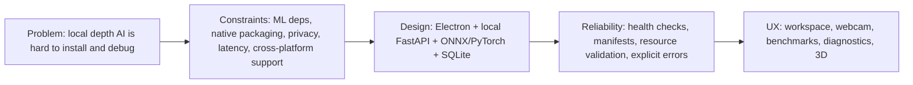

<div align="center">

# DepthLens Pro

### Local AI vision lab for depth maps, realtime camera depth, benchmarking, diagnostics, and 3D reconstruction

<p>
  
  
  
  
</p>

<p>
  
  
  
  
</p>

**DepthLens Pro turns ordinary 2D images and webcam frames into depth-aware visual outputs locally on your machine.** It combines an Electron desktop shell, a FastAPI inference service, MiDaS/DPT depth models, ONNX Runtime acceleration, PyTorch fallback, local diagnostics, persistent storage, and native app packaging.

</div>

---

## Table of contents

- [1. What DepthLens Pro does](#1-what-depthlens-pro-does)
- [2. Non-technical explanation](#2-non-technical-explanation)
- [3. Feature map](#3-feature-map)
- [4. Chronological user journey](#4-chronological-user-journey)
- [5. Supported platforms](#5-supported-platforms)
- [6. Quick start](#6-quick-start)
- [7. Development workflow](#7-development-workflow)
- [8. Architecture overview](#8-architecture-overview)
- [9. ML inference pipeline](#9-ml-inference-pipeline)
- [10. Realtime webcam pipeline](#10-realtime-webcam-pipeline)
- [11. API reference](#11-api-reference)
- [12. Model assets and validation](#12-model-assets-and-validation)
- [13. Persistence and local storage](#13-persistence-and-local-storage)
- [14. Packaging and native builds](#14-packaging-and-native-builds)
- [15. Observability, health, and diagnostics](#15-observability-health-and-diagnostics)
- [16. Security and privacy posture](#16-security-and-privacy-posture)
- [17. Testing and quality gates](#17-testing-and-quality-gates)
- [18. Big Tech interview readiness](#18-big-tech-interview-readiness)
- [19. Troubleshooting runbook](#19-troubleshooting-runbook)
- [20. Roadmap](#20-roadmap)

---

## 1. What DepthLens Pro does

DepthLens Pro is a **local desktop application for monocular depth estimation**. A monocular depth model predicts relative scene depth from a single RGB image. The app then converts that prediction into visual and measurable outputs such as color depth maps, grayscale depth maps, performance metrics, object-detection diagnostics, webcam previews, and approximate 3D point-cloud reconstructions.

In practical terms, the project lets a user:

| Capability | What the user sees | What the system does internally |
|---|---|---|
| Image depth estimation | Upload one image and receive a depth map | Decode image bytes, run MiDaS/DPT inference, normalize depth, colorize output |
| Realtime webcam depth | Live camera frames become depth previews | Send binary frames to a low-latency backend route with backpressure control |
| Performance comparison | Compare runtime behavior across engines/devices | Benchmark PyTorch and ONNX Runtime execution paths |
| Ground-truth evaluation | Upload GT depth and inspect objective metrics | Align prediction to GT and compute depth-estimation metrics |
| Object diagnostics | Understand detector availability and detections | Run local TorchVision-based detection diagnostics |
| Approximate 3D reconstruction | Export point-cloud style outputs | Convert estimated depth into sampled 3D points |
| Desktop packaging | Launch a native app | Bundle Electron, frontend, backend, venv, and model assets |

---

## 2. Non-technical explanation

Imagine a normal photograph as a flat postcard. Humans can still guess what is near and what is far because of context: walls, roads, faces, shadows, perspective, and object size. DepthLens Pro gives the computer a similar ability.

It answers questions like:

- Which parts of this image are probably closer?
- Which parts are farther away?
- How does the predicted depth change across the image?
- Can we visualize this as colors, grayscale, metrics, or a rough 3D structure?
- How fast can different engines run this model on this machine?

The app is designed as a **local AI tool**, so the core workflow runs on the user's own computer instead of sending images to a remote server by default.

---

## 3. Feature map



### Highlights

- **Local-first AI:** depth estimation happens through the bundled local backend.
- **Multiple depth models:** `midas_small`, `dpt_hybrid`, and `dpt_large` are registered centrally.
- **ONNX-first with fallback:** the backend tries ONNX Runtime when assets are valid and falls back to PyTorch when necessary.
- **Realtime route:** webcam frames use `POST /api/realtime/depth`, returning binary PNG output instead of heavy base64 JSON.
- **Ground-truth metrics:** supports richer evaluation when GT depth data is provided.
- **Packaged app verification:** native builds require validated resources and ONNX assets.
- **Interview-ready system design:** the codebase demonstrates local AI packaging, process lifecycle, diagnostics, concurrency limits, caching, and fault handling.

---

## 4. Chronological user journey

This section explains the project in the order a new user or interviewer should understand it.

### Step 1: Install prerequisites

DepthLens Pro expects a supported operating system, Git, Node/npm, and Python. The setup script selects a supported Python version and creates a project virtual environment.

### Step 2: Clone the project

```bash
git clone https://github.com/AyushmanRaha/DepthLensPro.git
cd DepthLensPro
```

### Step 3: Run setup

macOS/Linux:

```bash
./scripts/setup
```

Windows PowerShell:

```powershell
.\scripts\setup.ps1
```

NPM alias:

```bash
npm run setup:native
```

Setup performs the important first-time work:

- detects OS and CPU architecture;
- rejects unsupported native targets early;
- verifies Git, Python, Node, and npm;
- creates or repairs the repo-root `venv`;
- installs backend dependencies;
- installs Electron dependencies;
- exports or validates required ONNX assets;
- pre-caches PyTorch fallback assets where applicable;
- writes model validation metadata to `models/manifest.json`;
- writes target-specific setup metadata to `setup-manifest.json`.

### Step 4: Build the native app

macOS/Linux:

```bash
./scripts/build
```

Windows PowerShell:

```powershell
.\scripts\build.ps1
```

NPM alias:

```bash
npm run build:native
```

Build verifies that the current platform matches setup, validates backend/frontend/model resources, requires all ONNX files for native/release flows, runs Electron Builder, and verifies packaged resources after packaging.

### Step 5: Launch

macOS/Linux:

```bash
./scripts/launch
```

Windows PowerShell:

```powershell
.\scripts\launch.ps1
```

NPM alias:

```bash
npm run launch:native
```

The launch script prints the exact artifact path. If a built app does not exist, it tells you to run the build step first.

### Step 6: Use the app

A typical user flow is:

1. Open DepthLens Pro.
2. Wait for the local depth engine status to become ready.
3. Choose a model and device.
4. Upload an image or open webcam mode.
5. Inspect the depth map, metrics, model status, and diagnostics.
6. Optionally benchmark engines or generate a 3D reconstruction.

---

## 5. Supported platforms

| Platform | Architecture | Status | Notes |
|---|---:|---|---|
| macOS | arm64 / Apple Silicon | Supported | First-class macOS target |
| macOS | x64 / Intel | Unsupported | Intentionally blocked |
| macOS | universal | Unsupported | Intentionally blocked |
| Windows | x64 | Supported | Native NSIS build target |
| Windows | arm64 | Supported | Native NSIS build target |
| Linux | x64 | Supported | Native AppImage target |
| Linux | arm64 / aarch64 | Supported | Native AppImage target |

The platform matrix is intentionally strict because the packaged app includes native resources such as a target-specific Python virtual environment and ML runtime dependencies.

---

## 6. Quick start

### Requirements

| Requirement | Recommended version / behavior |
|---|---|
| Git | Required to clone the repository |
| Python | 3.10-3.12; 3.11-3.12 preferred |
| Node.js + npm | Required for Electron app dependencies |
| Disk space | Enough for Python packages, Electron build output, and model assets |
| Network | Required during setup to install dependencies and fetch/export model assets |

### One-command-style native flow

```bash
# 1. clone
git clone https://github.com/AyushmanRaha/DepthLensPro.git
cd DepthLensPro

# 2. setup
./scripts/setup

# 3. build
./scripts/build

# 4. launch
./scripts/launch
```

Windows equivalent:

```powershell
git clone https://github.com/AyushmanRaha/DepthLensPro.git
cd DepthLensPro
.\scripts\setup.ps1
.\scripts\build.ps1
.\scripts\launch.ps1
```

---

## 7. Development workflow

DepthLens Pro can be run in development mode when you want to iterate on the backend or UI.

### Root-level commands

```bash
npm run doctor
npm run setup
npm run backend:dev
npm run frontend:dev
npm run stop:backend
```

### Backend tests

```bash
venv/bin/python -m pytest backend/tests
```

### Electron tests and resource checks

```bash
cd electron-app
npm test
npm run verify:resources:native
npm run verify:packaged
```

### Useful health checks while backend is running

```bash
cd electron-app
npm run backend:live
npm run backend:ready
npm run backend:health
npm run backend:devices
```

### Project structure

```text
DepthLensPro/
├── backend/                 # FastAPI app, ML inference, diagnostics, persistence
│   ├── api/                 # HTTP routes and live probes
│   ├── services/            # Inference, benchmarks, assets, storage, observability
│   ├── scripts/             # ONNX export and validation helpers
│   ├── tests/               # Backend and packaging tests
│   ├── app.py               # Backward-compatible ASGI entrypoint
│   └── main.py              # FastAPI lifecycle and middleware
├── electron-app/            # Electron main process, preload bridge, packaging config
│   ├── src/                 # Electron-side helpers and security policy
│   ├── scripts/             # Resource and package verification scripts
│   ├── main.js              # Native app lifecycle and backend process management
│   ├── preload.js           # Narrow renderer IPC API
│   └── package.json         # Electron Builder targets and app scripts
├── frontend/                # Static renderer UI
│   ├── index.html           # Main interface and navigation panels
│   ├── style.css            # Visual design system
│   └── *.js                 # UI logic, camera, charts, API calls
├── models/                  # Generated/validated model assets; binaries are not committed
│   └── onnx/                # Required ONNX runtime files after setup
├── scripts/                 # Cross-platform setup/build/launch/doctor scripts
├── package.json             # Root orchestration scripts
└── README.md
```

---

## 8. Architecture overview

DepthLens Pro uses a hybrid architecture:

- **Electron** owns the desktop window, native dialogs, process lifecycle, storage path handoff, and packaging.
- **Frontend** renders the user experience using static HTML/CSS/JS.
- **FastAPI** exposes local HTTP routes for inference, diagnostics, model status, benchmarks, and storage-backed operations.
- **ML services** run MiDaS/DPT models through ONNX Runtime when possible and PyTorch as fallback.
- **SQLite + artifact directories** store app settings, benchmark history, model asset metadata, diagnostics history, cache files, and generated artifacts.



### Why this architecture works well

| Design choice | Reason |
|---|---|
| Local FastAPI backend | Separates ML-heavy Python runtime from desktop UI concerns |
| Electron shell | Provides native app packaging and cross-platform desktop behavior |
| Narrow preload bridge | Avoids exposing raw Electron IPC to renderer code |
| ONNX + PyTorch | ONNX improves deployment/performance; PyTorch keeps fallback flexibility |
| Target-specific venv | Makes packaging deterministic for native ML dependencies |
| Health and readiness routes | Makes startup and support issues diagnosable |
| SQLite persistence | Simple local storage without requiring external infrastructure |

---

## 9. ML inference pipeline

The standard `/estimate` route accepts an uploaded image and returns depth outputs plus metadata.



### Supported depth models

| Canonical ID | Display name | Architecture | Input size | Runtime support | Recommended use |
|---|---|---|---:|---|---|
| `midas_small` | MiDaS Small | MiDaS small / EfficientNet-Lite | 256×256 | PyTorch + ONNX | Fastest option and best for realtime previews |
| `dpt_hybrid` | DPT Hybrid | DPT Hybrid / ViT-Hybrid | 384×384 | PyTorch + ONNX | Balanced quality/performance |
| `dpt_large` | DPT Large | DPT Large / ViT-Large | 384×384 | PyTorch + ONNX | Heaviest model; use stronger hardware for speed |

### Output modes

| Output | Description |
|---|---|
| `color` | Colorized PNG depth map using an OpenCV colormap |
| `gray` | Grayscale depth map |
| `color,gray` | Returns both visual forms |

### Metrics modes

| Mode | Purpose |
|---|---|
| `none` | Fastest response; skip metrics |
| `fast` | Lightweight statistics for interactive use |
| `full` | Expanded proxy metrics and richer analysis |

### Implemented metric families

| Metric family | Examples |
|---|---|
| Prediction statistics | min, max, mean, standard deviation, median, entropy, histogram |
| Proxy metrics | MAE, RMSE, Log RMSE, SILog, PSNR, SSIM, gradient error, edge density |
| Ground-truth metrics | Abs Rel, Sq Rel, GT MAE, GT RMSE, GT Log RMSE, δ thresholds, GT PSNR, GT SSIM, Surface Normal Error, Ordinal Error |
| Optional metrics | LPIPS is reported as unavailable unless the optional dependency/model is packaged |

---

## 10. Realtime webcam pipeline

Realtime webcam depth has a dedicated route because a webcam stream should not behave like repeated full analysis uploads.

```http
POST /api/realtime/depth
```

The route accepts binary image bytes and returns a binary PNG depth frame. It avoids expensive extras by default and reports latency through response headers.



### Realtime behavior

| Mechanism | Why it matters |
|---|---|
| Binary request/response | Avoids base64 overhead in hot path |
| Latest-frame policy | Prevents old webcam frames from piling up |
| Backpressure errors | Uses `REALTIME_BACKPRESSURE` so the UI can drop frames safely |
| Bounded `max_dim` | Keeps live inference responsive |
| Latency headers | Helps separate backend, transport, and rendering costs |

### Realtime headers

| Header | Meaning |
|---|---|
| `X-DepthLens-Latency-Ms` | Model/inference latency reported by backend |
| `X-DepthLens-End-To-End-Ms` | End-to-end backend route time |
| `X-DepthLens-Engine` | Engine used for the frame |
| `Cache-Control: no-store` | Realtime frames are not cacheable |

---

## 11. API reference

DepthLens Pro exposes local backend routes primarily for the Electron renderer. They are also useful for debugging and development.

### Health and diagnostics

| Method | Route | Purpose |
|---|---|---|
| `GET` | `/live` | Lightweight liveness probe used during app startup |
| `GET` | `/ready` | Dependency readiness without loading every model |
| `GET` | `/health` | Full diagnostics: devices, cache, ONNX, readiness, telemetry |
| `GET` | `/devices` | Available compute devices and primary device |
| `GET` | `/onnx/status` | ONNX path/provider diagnostics |
| `GET` | `/metrics` | Prometheus-style metrics text |
| `GET` | `/observability` | Observability snapshot |
| `GET` | `/api/observability` | Same observability snapshot under API namespace |

### Models and capabilities

| Method | Route | Purpose |
|---|---|---|
| `GET` | `/models` | Supported model registry payload |
| `GET` | `/colormaps` | Supported colormap names |
| `GET` | `/api/capabilities` | Platform support, models, ONNX status, detector status, storage, realtime status |
| `GET` | `/api/models/status` | Shallow model asset status from manifest/files |
| `POST` | `/api/models/validate` | Deep validation: ONNX checker/runtime/session checks |

### Inference and analysis

| Method | Route | Purpose |
|---|---|---|
| `POST` | `/estimate` | Standard image depth estimation |
| `POST` | `/api/realtime/depth` | Low-latency webcam depth route |
| `GET` | `/benchmark` | Benchmark selected model/device |
| `GET` | `/api/benchmark` | Same benchmark route under API namespace |
| `POST` | `/detect` | Local object detection |
| `POST` | `/api/detect` | Same detection route under API namespace |
| `GET` | `/api/detect/status` | Detector runtime diagnostics |
| `POST` | `/reconstruct` | Approximate point-cloud reconstruction |
| `POST` | `/api/reconstruct` | Same reconstruction route under API namespace |

### Example: standard image estimation

```bash
curl -X POST http://127.0.0.1:8765/estimate \
  -F "file=@example.jpg" \
  -F "model=midas_small" \
  -F "device=auto" \
  -F "colormap=inferno" \
  -F "metrics=fast" \
  -F "outputs=color,gray"
```

### Example: benchmark

```bash
curl "http://127.0.0.1:8765/api/benchmark?model=midas_small&device=auto&iterations=3"
```

---

## 12. Model assets and validation

Model binaries are intentionally **not committed** to the repository. Setup installs or exports required assets into `models/` and records validation metadata.

Required ONNX files:

```text
models/onnx/midas_small.onnx
models/onnx/dpt_hybrid.onnx
models/onnx/dpt_large.onnx
```

### Manifest responsibilities

`models/manifest.json` records information such as:

- model ID;
- engine;
- filename and path;
- file size;
- SHA-256 checksum;
- required flag;
- input shape;
- validation status;
- runtime/provider validation metadata;
- install/export timestamp.

### Validation checks

| Check | Why it matters |
|---|---|
| File exists | Prevents packaged app from launching with missing assets |
| Non-empty file | Catches broken downloads or failed exports |
| Minimum expected size | Catches suspiciously incomplete assets |
| Checksum when available | Detects corruption |
| ONNX checker | Verifies graph structure |
| ONNX Runtime session creation | Verifies runtime compatibility |
| Dummy inference in deep mode | Confirms the model can actually run |

### Runtime policy

DepthLens Pro prefers validated ONNX Runtime execution when available. If ONNX is missing or unavailable in a development flow, PyTorch fallback can still serve inference. Native/release flows are stricter: required ONNX assets must be present and validated by setup/build verification.

---

## 13. Persistence and local storage

Electron passes its user-data directory to the backend through `DEPTHLENS_USER_DATA_DIR`. The backend initializes a SQLite database and app-managed directories there.



### Storage roots

| OS | Storage root |
|---|---|
| macOS | `~/Library/Application Support/DepthLens Pro` |
| Windows | `%APPDATA%\DepthLens Pro` |
| Linux | `~/.config/DepthLens Pro` |
| Backend-only/dev default | `~/.depthlenspro` unless `DEPTHLENS_USER_DATA_DIR` is set |

### Artifact directories

```text
artifacts/depth-maps/
artifacts/reconstructions/
artifacts/thumbnails/
cache/
logs/
```

Raw user images are not persisted by default. The app stores settings, generated artifacts, diagnostics, benchmark history, model metadata, and cache/log files under the app-managed local storage directory.

---

## 14. Packaging and native builds

DepthLens Pro packages a native Electron application with backend resources and a target-specific Python virtual environment.



### Important Electron scripts

```bash
cd electron-app
npm run build:mac:arm64
npm run build:win:arm64
npm run build:win:x64
npm run build:linux:arm64
npm run build:linux:x64
npm run build:all:supported
npm run verify:resources:native
npm run verify:packaged
```

### Build targets

| Platform | Artifact style | Architectures |
|---|---|---|
| macOS | DMG | arm64 |
| Windows | NSIS installer | x64, arm64 |
| Linux | AppImage | x64, arm64 |

### Packaged resources

Electron Builder includes:

- `electron-app/main.js` and `preload.js`;
- renderer source/assets;
- `backend/`;
- repo-root `venv/`;
- `frontend/`;
- `models/`.

The venv must be built on the target OS/architecture. Do not reuse a macOS arm64 venv for Windows or Linux builds.

---

## 15. Observability, health, and diagnostics

DepthLens Pro is built to explain failures instead of hiding them behind a generic error.

### Diagnostic surfaces

| Surface | What it reports |
|---|---|
| Engine status UI | Whether the local backend is starting, ready, degraded, or unavailable |
| `/live` | Lightweight startup liveness |
| `/ready` | Dependency readiness |
| `/health` | Devices, loaded models, cache, ONNX, memory/disk telemetry, warmup status |
| `/api/capabilities` | Platform, model, detector, storage, realtime, low-power capability payload |
| `/api/detect/status` | Torch/TorchVision detector status and fallback details |
| `/api/models/status` | Model asset presence and validation summary |
| `/metrics` | Prometheus-style operational counters/gauges |
| Electron logs | Native startup, backend process, port, and resource diagnostics |

### Stable error-code examples

| Error code | Typical meaning |
|---|---|
| `ESTIMATE_TIMEOUT` | Standard depth inference exceeded timeout |
| `INVALID_METRICS_MODE` | Metrics option was not `none`, `fast`, or `full` |
| `INVALID_OUTPUTS` | Output request was not `color`, `gray`, or both |
| `INFERENCE_DEPENDENCY_UNAVAILABLE` | Required inference dependency is not importable/ready |
| `MODEL_FILE_MISSING` | A required model file is absent |
| `MODEL_CHECKSUM_FAILED` | Model file integrity check failed |
| `ONNX_PROVIDER_UNAVAILABLE` | Requested ONNX Runtime provider is unavailable |
| `DETECTOR_MODEL_MISSING` | Object detector model asset is missing |
| `GT_METRIC_NOT_IMPLEMENTED` | Requested GT metric is unavailable/not implemented |
| `GT_REQUIRED` | GT mode was requested without a GT file |
| `REALTIME_BACKPRESSURE` | Realtime worker is busy; UI should drop stale frame |
| `UNSUPPORTED_ARCH` | Current native target is intentionally unsupported |
| `SETUP_INCOMPLETE` | Setup metadata or required resources are missing |

---

## 16. Security and privacy posture

DepthLens Pro is local-first, but it still needs secure desktop boundaries.

### Local privacy

- The backend binds to `127.0.0.1`, not a public network interface.
- Core image inference is handled locally.
- Raw user images are not persisted by default.
- Generated artifacts, settings, diagnostics, and benchmark history are stored locally.

### Electron safety choices

| Choice | Purpose |
|---|---|
| Narrow preload bridge | Exposes only specific safe APIs to renderer code |
| No raw `ipcRenderer` exposure | Reduces renderer attack surface |
| Local URL allowlist behavior | Prevents accidental navigation to unsafe app contexts |
| Private backend PID files | Tracks owned backend process safely |
| Single-instance lock | Avoids multiple app instances fighting over one backend port |
| Resource verification | Prevents packaged app from silently launching with missing backend/model files |

### Content security policy

The renderer uses a Content Security Policy that limits default sources, object loading, image/media sources, and backend connectivity to local app/backend contexts.

---

## 17. Testing and quality gates

DepthLens Pro uses tests and verification scripts to catch failures before a packaged app is shipped.

### Main checks

```bash
venv/bin/python -m pytest backend/tests
cd electron-app && npm test
cd electron-app && npm run verify:resources:native
cd electron-app && npm run verify:packaged
```

### What the checks protect

| Area | Protected by |
|---|---|
| Backend API behavior | Pytest tests |
| Electron security/config policy | Node tests |
| Native resource layout | `verify:resources:native` |
| Packaged app contents | `verify:packaged` |
| ONNX assets | setup/build validation |
| Platform support | setup/build target checks |

The test suite is designed to use mocks/stubs for heavyweight ML paths where practical, so normal tests should not require GPU, Redis, Docker, Playwright browsers, CUDA, MPS, XPU, or external services.

---

## 18. Big Tech interview readiness

This repository is structured so the project can be explained in product, system-design, machine-learning, backend, desktop, and reliability interviews.

### 30-second product pitch

DepthLens Pro is a local desktop AI vision lab. It takes ordinary images or webcam frames, predicts relative depth using MiDaS/DPT models, visualizes the result, evaluates quality when ground truth is available, compares ONNX/PyTorch performance, and packages everything into a native app with diagnostics and local persistence.

### Engineering one-liner

An Electron renderer communicates with a local FastAPI service that runs depth inference through validated ONNX Runtime sessions with PyTorch fallback, stores local diagnostics in SQLite, and packages target-specific Python/model resources into deterministic native builds.

### System-design narrative



### Interview talking points

| Topic | What to say |
|---|---|
| Product thinking | The app turns complex ML workflows into a local desktop experience for both technical and non-technical users |
| System design | The UI and ML runtime are separated so JavaScript desktop code does not need to own Python ML complexity |
| ML systems | ONNX is preferred for validated runtime execution; PyTorch remains a robust fallback path |
| Reliability | Startup probes, health routes, explicit error codes, and packaged resource verification make failures actionable |
| Performance | Realtime mode uses binary transport, bounded frame size, latest-frame behavior, and backpressure |
| Security | Renderer access is limited through a preload bridge and backend is local-only |
| Portability | Native builds are constrained to known-good OS/architecture pairs |
| Operability | Diagnostics include devices, model assets, ONNX runtime, detector status, telemetry, and cache information |

### Algorithmic and data-structure decisions

| Decision | Complexity / tradeoff | Why it is reasonable |
|---|---|---|
| Hash-based response cache | O(n) over image bytes for hashing | Avoids repeated inference for identical request options |
| Small in-memory depth cache | Bounded entries + TTL | Speeds repeated output/metric variants without unbounded memory growth |
| Per-model/device locks | Serializes unsafe forward passes for same runtime object | Protects non-reentrant ML backends |
| Async route offload | Threadpool keeps FastAPI event loop responsive | Separates HTTP concurrency from blocking ML work |
| Realtime semaphore/backpressure | Drops stale work instead of queueing it | Better UX for live video where old frames are useless |
| Platform allowlist | Rejects unknown native targets early | Reduces packaging/support risk |

### Failure-mode analysis

| Failure | Mitigation |
|---|---|
| Missing ONNX file | Setup/build validation and model status route |
| Corrupt model asset | Manifest validation, checksum, ONNX checker, runtime session test |
| Backend port occupied | Electron detects port owner and only cleans up safely owned stale processes |
| Unsupported architecture | Setup/build/app startup reject target with explicit reason |
| Heavy benchmark blocks webcam | Realtime path has separate backpressure controls and docs warn against concurrent heavy workloads |
| Detector unavailable | `/api/detect/status` reports Torch/TorchVision/weights/device details |
| Dependency import failure | `/ready`, Electron startup output tail, and setup doctor identify missing dependencies |

### STAR-format project story

**Situation:** Local AI depth-estimation demos are often scripts that are difficult for non-technical users to install, package, benchmark, or debug.

**Task:** Build a desktop app that makes depth estimation usable as a product while still exposing enough diagnostics for engineering evaluation.

**Action:** Split the system into Electron UI, FastAPI backend, ONNX/PyTorch inference service, SQLite persistence, target-specific native packaging, model manifest validation, health routes, realtime webcam backpressure, and explicit error codes.

**Result:** The project demonstrates end-to-end ownership across ML inference, desktop distribution, API design, reliability, observability, local privacy, and user experience.

### Common interview questions this repo can answer

<details>
<summary><strong>Why not run the model directly inside Electron?</strong></summary>

Python has the strongest ecosystem for PyTorch, ONNX Runtime, OpenCV, NumPy, and ML model tooling. Keeping inference in FastAPI lets Electron focus on desktop lifecycle and UI while Python owns ML complexity.

</details>

<details>
<summary><strong>Why have both ONNX and PyTorch?</strong></summary>

ONNX Runtime is useful for validated deployment and performance benchmarking. PyTorch fallback improves resilience during development or on systems where ONNX assets/providers are unavailable.

</details>

<details>
<summary><strong>How does the realtime webcam path avoid lag?</strong></summary>

It sends binary image bytes, bounds resolution, skips heavy metrics, allows only limited in-flight work, and drops stale frames when the realtime worker is busy.

</details>

<details>
<summary><strong>How would this scale beyond one local machine?</strong></summary>

The same backend API boundaries could be deployed as a remote service with GPU workers, job queues, object storage, authentication, and distributed tracing. The current local version intentionally optimizes for privacy, packaging, and deterministic desktop behavior.

</details>

<details>
<summary><strong>What would you improve next?</strong></summary>

Add a manifest-backed ONNX object detector, richer packaged model integrity metadata, automated release CI across supported targets, a screenshot gallery, and optional remote execution for teams with shared GPU infrastructure.

</details>

---

## 19. Troubleshooting runbook

### Missing ONNX files

Run setup and build again:

```bash
./scripts/setup
./scripts/build
```

Windows:

```powershell
.\scripts\setup.ps1
.\scripts\build.ps1
```

Do not repair a packaged app by manually running raw backend export commands. Reinstall or rebuild through the supported flow.

### Corrupt model manifest or model file

Delete the corrupt file under `models/onnx/` and rerun setup. Build verification fails if required ONNX assets are missing or corrupt.

### Backend does not start

1. Run the doctor command:

   ```bash
   npm run doctor
   ```

2. Check backend readiness:

   ```bash
   cd electron-app
   npm run backend:ready
   npm run backend:health
   ```

3. Inspect Electron logs printed in the startup error. The app reports the attempted Python path, backend directory, frontend directory, model directory, and recent backend output.

### Port 8765 is busy

DepthLens Pro tries to detect whether the process on the backend port belongs to DepthLens Pro. It only terminates stale backend processes when ownership can be established safely. If another process owns the port, close that process or set a different backend port for development.

```bash
DEPTHLENS_BACKEND_PORT=8770 npm run frontend:dev
```

### Detector unavailable

Open the detector diagnostics:

```bash
curl "http://127.0.0.1:8765/api/detect/status?device=auto"
```

Re-run setup if Torch, TorchVision, or detector weights are missing. On Apple Silicon, detector behavior may prefer CPU fallback for reliability.

### Unsupported macOS x64

Use Apple Silicon macOS arm64, Windows x64/arm64, or Linux x64/arm64. macOS x64/universal native builds are intentionally blocked.

### Setup incomplete

Run setup for your current platform. `setup-manifest.json` is target-specific, so switching OS or architecture requires running setup again.

### High CPU, thermals, or fan noise

- Use `midas_small` for realtime webcam preview.
- Lower webcam FPS/resolution.
- Avoid running benchmark, detector, and webcam inference at the same time.
- Limit runtime threads with environment variables.

### Useful environment variables

| Variable | Purpose |
|---|---|
| `DEPTHLENS_BACKEND_PORT` | Override local backend port |
| `DEPTHLENS_USER_DATA_DIR` | Override local app storage root |
| `DEPTHLENS_LOW_POWER_MODE=1` | Prefer conservative realtime/runtime settings |
| `DEPTHLENS_REALTIME_MAX_IN_FLIGHT` | Realtime inference in-flight cap; default is `1` |
| `DEPTHLENS_NORMAL_MAX_IN_FLIGHT` | Normal request concurrency cap; default is `2` |
| `INFERENCE_MAX_CONCURRENCY` | Backend inference semaphore size |
| `ORT_INTRA_OP_NUM_THREADS` | ONNX Runtime intra-op threads |
| `ORT_INTER_OP_NUM_THREADS` | ONNX Runtime inter-op threads |
| `DEPTHLENS_SKIP_WARMUP=1` | Skip optional model warmup |
| `DEPTHLENS_ONNX_DIR` | Override ONNX lookup directory |
| `DEPTHLENSPRO_MODEL_DIR` | Override model asset directory |

---

## 20. Roadmap

Potential next milestones:

- Add a screenshot/demo gallery to this README.
- Add release badges once CI release workflows are available.
- Add signed/notarized macOS release flow.
- Add manifest-backed ONNX object detector to replace TorchVision detector dependency.
- Add optional GPU worker mode for remote/team deployments.
- Add more reconstruction export formats and quality controls.
- Add automated packaged-app smoke tests across all supported target architectures.

---

<div align="center">

**DepthLens Pro is a local-first, interview-ready AI desktop system: product experience, ML inference, backend APIs, diagnostics, persistence, packaging, and reliability in one repository.**

</div>
