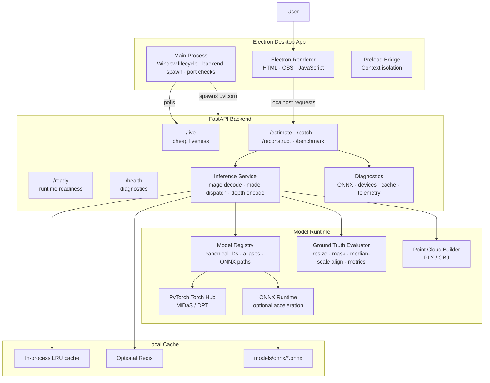
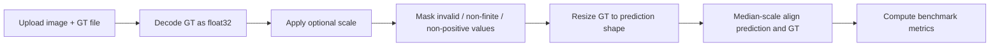

<div align="center">

# DepthLens Pro

### Local-first monocular depth estimation for desktop workflows

Turn ordinary 2D images into depth maps, compare neural depth models, benchmark ONNX acceleration, evaluate against ground truth, and export approximate 3D point clouds — all from a desktop app running on your own machine.

<br/>

[](electron-app/package.json)
[](backend/api/live.py)
[](electron-app/package.json)
[](backend/requirements.txt)
[](scripts/doctor.py)

[](backend/requirements.txt)
[](backend/requirements.txt)
[](#security)
[](LICENSE)

<br/>

**No cloud uploads. No API keys. No subscription.**  
Images are processed through a local Electron + FastAPI + PyTorch/ONNX pipeline.

</div>

---

## Table of Contents

| Section | What it covers |
|---|---|
| [Overview](#overview) | What the app does and who it is useful for |
| [Highlights](#highlights) | Core capabilities at a glance |
| [Feature Tour](#feature-tour) | Workspace, webcam, comparison, experiments, performance, and 3D tools |
| [Architecture](#architecture) | How Electron, FastAPI, PyTorch, ONNX, and cache layers work together |
| [Quick Start](#quick-start) | Fast setup for local use |
| [Installation Guide](#installation-guide) | Native, development, backend-only, Docker, and ONNX setup |
| [Configuration](#configuration) | Environment variables and runtime settings |
| [API Reference](#api-reference) | HTTP endpoints, request fields, and response behavior |
| [Models, Colormaps & Metrics](#models-colormaps--metrics) | Supported MiDaS/DPT models and evaluation modes |
| [Ground Truth Evaluation](#ground-truth-evaluation) | GT file support and benchmark metric flow |
| [Testing & CI](#testing--ci) | Local checks and GitHub Actions pipeline |
| [Production & Packaging](#production--packaging) | ARM64 native builds and Docker deployment |
| [Troubleshooting](#troubleshooting) | Common setup/runtime problems and fixes |
| [Security](#security) | Local-first design, renderer isolation, and process safeguards |
| [Project Structure](#project-structure) | Repository map |
| [Contributing](#contributing) | Development and PR checklist |

---

## Overview

**DepthLens Pro** is a desktop application for generating **monocular depth maps** from regular images.

In plain English: give the app a photo, choose a model, and it predicts which parts of the scene are closer or farther away. The output can be used for visual effects, depth-aware editing, computer vision experiments, point-cloud previews, and model benchmarking.

Technically, the app combines:

- **Electron** for the desktop shell
- **FastAPI** for the local inference API
- **PyTorch Torch Hub** for MiDaS/DPT model execution
- **ONNX Runtime** for optional accelerated inference
- **OpenCV / NumPy / Pillow** for image processing and evaluation
- **Redis or in-memory cache** for repeated inference acceleration
- **Docker Compose** for backend + Redis deployment

> DepthLens Pro predicts **relative depth**, not real-world metric distance. It is useful for visual depth understanding and approximate geometry, not survey-grade measurement.

---

## Highlights

| Capability | What it means |
|---|---|
| 🖼️ **Image-to-depth generation** | Upload one or more images and export colorized or grayscale depth maps |
| ⚙️ **Model selection** | Choose MiDaS Small, DPT Hybrid, or DPT Large depending on speed/quality needs |
| 🧠 **Device selection** | Use auto device detection or choose CPU/GPU-style backends when available |
| 🎨 **Colormap control** | Visualize depth using Inferno, Plasma, Viridis, Magma, Turbo, Jet, Hot, or Bone |
| 📷 **Live webcam depth** | Process webcam frames locally at a controlled FPS |
| 📊 **Model comparison** | Run all supported models on the same image and compare outputs side-by-side |
| ⚡ **PyTorch vs ONNX benchmark** | Measure latency, throughput, memory, provider status, and speedup |
| 🧪 **Experiment exports** | Save validation runs as JSON or CSV |
| 📏 **Ground truth evaluation** | Compare predictions against PNG/TIFF/NPY depth labels with median-scale alignment |
| 🧊 **3D point clouds** | Export approximate colored point clouds as PLY or OBJ |
| 🔒 **Local-first privacy** | Images are processed on `127.0.0.1`; no cloud inference is required |

---

## Feature Tour

### 1. Workspace — Generate Depth Maps

The main workspace is designed for the normal image-processing flow:

1. Select a compute device.
2. Pick a model.
3. Choose a colormap.
4. Drop images into the queue.
5. Generate and download results.

Supported upload formats include common image types such as **PNG, JPG, WEBP, and BMP**, up to **20 MB per image**.

The workspace also includes a live session dashboard:

| Metric | Meaning |
|---|---|
| Images processed | Successful inference runs in the current session |
| Average / min / max latency | Server-side model timing |
| Cache hits | Repeated image/model/colormap requests served without re-inference |
| Errors | Failed image-processing attempts |
| Throughput | Images processed per minute |
| Total inference time | Cumulative model execution time |

---

### 2. Ground Truth Mode

Ground Truth mode lets you upload **one image + one depth label file** and calculate benchmark metrics.

Supported GT formats:

- `.png`
- `.tif`
- `.tiff`
- `.npy`

Rules:

- GT file size limit: **20 MB**
- Single-channel depth is preferred
- GT is resized to the prediction resolution
- Median-scale alignment is applied before metrics are calculated

This makes the app useful not only for generating visual depth maps, but also for checking how predictions compare against known depth data.

---

### 3. Webcam — Live Depth Streaming

The Webcam tab turns a live camera feed into repeated depth predictions.

Controls include:

| Control | Options |
|---|---|
| Start / stop camera | Request camera permission and begin local capture |
| Pause inference | Keep camera active while stopping model calls |
| Target FPS | 1, 2, 3, or 5 FPS |
| Frame max dimension | 256, 384, or 512 px |
| Visual smoothing | Off, Low, Medium, or High |
| Capture | Download the latest depth frame as PNG |

The live view shows:

- RGB camera frame
- Latest depth output
- Backend latency
- End-to-end latency
- Processed FPS
- Skipped frames
- Active model, device, and colormap

---

### 4. Compare — Run All Models on One Image

The Compare tab helps answer a practical question:

> Should I use the fastest model, the balanced model, or the highest-detail model?

Upload one image, click **Run All Models**, and the app generates outputs from:

- MiDaS Small
- DPT Hybrid
- DPT Large

The comparison view includes side-by-side previews, latency badges, and a chart for switching between available metrics.

---

### 5. Performance — PyTorch vs ONNX Runtime

The Performance tab benchmarks the normal PyTorch path against optional ONNX Runtime execution using a synthetic 384×384 frame.

Reported fields include:

| Field | Description |
|---|---|
| PyTorch avg latency | Average Torch Hub model execution time |
| ONNX avg latency | Average ONNX Runtime session time |
| Speedup | PyTorch latency divided by ONNX latency |
| ONNX throughput | Synthetic frames per second |
| Process RSS | Resident memory after benchmark |
| Execution status | Runtime/provider result or fallback status |

ONNX weights are **not committed** to the repository. They can be generated locally when needed.

If ONNX files are missing or invalid, the app keeps working through the PyTorch fallback path.

---

### 6. Experiments — Reproducible Validation Runs

The Experiments tab records structured results from the current workspace queue.

You can:

- Name a run
- Execute queued images
- Include optional ground-truth metrics
- Export results as JSON or CSV

Typical exported fields include:

| Field | Description |
|---|---|
| `filename` | Source image |
| `model` | Canonical model ID |
| `device` | Device used for inference |
| `latency_ms` | Backend inference time |
| `abs_rel` | Absolute relative error, when GT is available |
| `gt_rmse` | RMSE against ground truth |
| `delta_1` | δ < 1.25 accuracy |
| `status` | Success, warning, or failure state |

---

### 7. 3D Reconstruction

The 3D tab converts an image and its predicted depth into an approximate colored point cloud.

Supported export formats:

- `PLY`
- `OBJ`

Available controls:

| Option | Purpose |
|---|---|
| Max dimension | Resize input before reconstruction |
| Max points | Limit point-cloud size |
| Preview points | Limit in-app WebGL preview size |
| Sampling | Grid or random point sampling |
| Coordinate system | Y-up or camera coordinates |
| Include RGB colors | Store source-image colors per point |
| Focal scale | Approximate projection control |
| Depth scale | Scale relative Z-depth |
| Near/far percentiles | Clip extreme depth values |

> Monocular point clouds are approximate. For metric reconstruction, camera calibration and metric depth data are required.

---

### 8. Guide — Offline In-App Reference

The Guide tab provides an offline explanation of the workflow, metrics, model choices, and troubleshooting steps. This is useful when running the packaged app without needing external documentation open.

---

## Architecture

DepthLens Pro is split into a desktop shell, local API server, inference runtime, and cache/storage layer.



### Layer Responsibilities

| Layer | Key files | Responsibility |
|---|---|---|
| Electron main process | `electron-app/main.js` | Single-instance lock, backend startup, PID metadata, port discovery, safe shutdown |
| Renderer UI | `frontend/index.html`, `frontend/script.js`, `frontend/style.css` | Workspace tabs, charts, uploads, previews, 3D viewer, status UI |
| Preload bridge | `electron-app/preload.js` | Safe bridge between Electron and renderer |
| Security policy | `electron-app/src/security-policy.js` | Navigation allowlist for local app and backend URLs |
| Process policy | `electron-app/src/backend-process-policy.js` | Verifies DepthLens-owned backend processes before lifecycle actions |
| FastAPI app | `backend/main.py`, `backend/api/` | Routes, CORS, JSON logging, exception handling, lifecycle hooks |
| Inference service | `backend/services/inference.py` | Image decoding, model execution, depth normalization, colorization, encoding |
| Model registry | `backend/model_registry.py` | Supported models, aliases, ONNX filenames, path resolution |
| Cache service | `backend/services/cache_service.py` | Redis integration, memory fallback, TTL/LRU behavior |
| Diagnostics | `backend/services/diagnostics.py`, `backend/services/onnx_diagnostics.py` | Runtime readiness, providers, device checks |
| Reconstruction | `backend/services/reconstruction.py` | Point-cloud generation and export serialization |
| Ground truth | `backend/services/ground_truth.py` | GT decoding, alignment, masking, benchmark metrics |

---

## Quick Start

### Prerequisites

| Tool | Version | Why it is needed |
|---|---:|---|
| Git | Any recent version | Clone the repository |
| Python | 3.10 – 3.12 | FastAPI backend and ML runtime |
| Node.js | LTS recommended | Electron desktop app |
| npm | Comes with Node.js | Install Electron dependencies |
| Docker | Optional | Backend + Redis container flow |

Check your tools:

```bash
git --version
python3 --version
node --version
npm --version
```

---

### Fastest Local Setup

```bash
git clone https://github.com/AyushmanRaha/DepthLensPro.git
cd DepthLensPro

# Install Python + Node dependencies.
# ONNX export is skipped for the first run to keep setup faster.
npm run setup

# Terminal 1: start local FastAPI backend
npm run backend:dev

# Terminal 2: open Electron desktop app
npm run frontend:dev
```

Verify the backend:

```bash
curl http://127.0.0.1:8765/live
curl http://127.0.0.1:8765/ready
```

Expected `/live` response shape:

```json
{
  "status": "ok",
  "service": "DepthLens Pro API",
  "version": "3.1.0",
  "state": "idle"
}
```

> First model use may download model weights through the PyTorch/Torch Hub cache if they are not already present on your machine. Your uploaded images are still processed locally.

---

## Installation Guide

DepthLens Pro supports multiple ways to run depending on what you are trying to do.

| Path | Best for | What runs |
|---|---|---|
| A. Native desktop app | Normal desktop use on supported ARM64 systems | Packaged Electron app + local backend |
| B. Local development | Editing UI/backend code | Manual backend + Electron dev shell |
| C. Backend only | API testing, scripts, CI, integrations | FastAPI server only |
| D. Docker Compose | Containerized backend with Redis | Backend container + Redis container |
| E. ONNX acceleration | Faster inference experiments | Locally generated `.onnx` weights |

---

### A. Native Desktop App

Native packaged builds are currently restricted to:

- macOS Apple Silicon
- Windows ARM64
- Linux ARM64

Build commands:

```bash
# macOS ARM64
npm run build:mac:arm64

# Linux ARM64
npm run build:linux:arm64

# Windows ARM64
npm run build:win:arm64
```

Platform-specific outputs:

| Platform | Output |
|---|---|
| macOS | `electron-app/dist/mac-arm64/DepthLens Pro.app` and `.dmg` |
| Windows | `electron-app/dist/win-arm64-unpacked/` and NSIS installer |
| Linux | `electron-app/dist/*arm64*.AppImage` |

The build scripts verify packaged resources before and after packaging.

Unsupported desktop packaging targets are intentionally blocked:

```bash
npm run build:mac:x64
npm run build:mac:universal
npm run build:win:x64
npm run build:linux:x64
```

---

### B. Local Development

Run the backend and desktop shell in separate terminals.

```bash
# Terminal 1
npm run backend:dev

# Terminal 2
npm run frontend:dev
```

Useful checks:

```bash
curl http://127.0.0.1:8765/live
curl http://127.0.0.1:8765/ready
curl http://127.0.0.1:8765/health
```

Electron helper scripts:

```bash
cd electron-app

npm run backend:live
npm run backend:ready
npm run backend:health
npm run backend:devices
npm run kill:backend
```

---

### C. Backend Only

Use this when you only need the HTTP API.

```bash
npm run setup
npm run backend:dev
```

Or call Uvicorn directly:

```bash
venv/bin/python -m uvicorn backend.app:app --host 127.0.0.1 --port 8765
```

Backend base URL:

```text
http://127.0.0.1:8765
```

---

### D. Docker Compose

Docker Compose starts the backend and Redis.

```bash
docker compose up --build
```

Run in the background:

```bash
docker compose up --build -d
```

Stop containers:

```bash
docker compose down
```

Stop and remove the Redis volume:

```bash
docker compose down -v
```

Verify:

```bash
curl http://127.0.0.1:8765/live
```

Docker defaults include:

| Setting | Default |
|---|---:|
| Backend port | `8765` |
| Redis port | `6379` inside the Compose network |
| CPU limit | `4.0` |
| Memory limit | `8G` |
| Shared memory | `8gb` |
| Backend user | non-root `depthlens` |

---

### E. Optional ONNX Acceleration

ONNX Runtime is optional. The app works without ONNX files by falling back to PyTorch.

Generate ONNX files locally:

```bash
# Export the default MiDaS Small ONNX file
venv/bin/python backend/scripts/export_onnx.py --model midas_small --force

# Export all supported models
venv/bin/python backend/scripts/export_onnx.py --all --force

# Validate existing ONNX files
npm run verify:onnx
```

Check ONNX status through the running backend:

```bash
curl http://127.0.0.1:8765/onnx/status
```

Expected ONNX location:

```text
models/onnx/
├── midas_small.onnx
├── dpt_hybrid.onnx
└── dpt_large.onnx
```

---

## Configuration

Settings are read from environment variables or an optional `.env` file in the repository root.

### Safe Local `.env`

```env
HOST=127.0.0.1
PORT=8765
LOG_LEVEL=INFO
DEBUG=false

REDIS_HOST=127.0.0.1
REDIS_PORT=6379
REDIS_DB=0
CACHE_TTL_SECONDS=3600
CACHE_MAX_ENTRIES=256

DEPTHLENS_PRELOAD_MODEL=false
DEPTHLENS_WARMUP_MODEL=MiDaS_small
DEPTHLENS_WARMUP_DEVICE=auto
DEPTHLENS_MAX_DIM=1536
DEPTHLENS_DEFAULT_METRICS=fast
DEPTHLENS_DEFAULT_OUTPUTS=color
```

### Server

| Variable | Default | Description |
|---|---|---|
| `HOST` | `127.0.0.1` locally, `0.0.0.0` in Docker | ASGI bind host |
| `PORT` | `8765` | ASGI port |
| `LOG_LEVEL` | `INFO` | `DEBUG`, `INFO`, `WARNING`, `ERROR`, or `CRITICAL` |
| `DEBUG` | `false` | Enables FastAPI debug behavior |
| `WEB_CONCURRENCY` | `1` | Uvicorn worker count in Docker |

### Cache

| Variable | Default | Description |
|---|---|---|
| `REDIS_URL` | unset | Full Redis URL override |
| `REDIS_HOST` | `127.0.0.1` | Redis host |
| `REDIS_PORT` | `6379` | Redis port |
| `REDIS_DB` | `0` | Redis logical database |
| `REDIS_PASSWORD` | unset | Optional Redis password |
| `REDIS_SOCKET_TIMEOUT_SECONDS` | `1.5` | Redis connect/read timeout |
| `REDIS_MAX_CONNECTIONS` | `20` | Redis connection pool limit |
| `CACHE_TTL_SECONDS` | `3600` | Cache entry lifetime |
| `CACHE_MAX_ENTRIES` | `256` | In-memory cache entry limit |

### Inference

| Variable | Default | Description |
|---|---|---|
| `DEPTHLENS_PRELOAD_MODEL` | `false` | Warm a model after API startup |
| `DEPTHLENS_WARMUP_MODEL` | `MiDaS_small` | Model to warm when preload is enabled |
| `DEPTHLENS_WARMUP_DEVICE` | `auto` | Device to warm on |
| `DEPTHLENS_SKIP_WARMUP` | unset | Set to `1` to skip warmup |
| `DEPTHLENS_MAX_DIM` | `1536` | Default max long image edge |
| `DEPTHLENS_DEFAULT_METRICS` | `fast` | `none`, `fast`, or `full` |
| `DEPTHLENS_DEFAULT_OUTPUTS` | `color` | `color`, `gray`, or `color,gray` |
| `INFERENCE_MAX_CONCURRENCY` | `2` | Max concurrent inference operations |
| `ORT_INTRA_OP_NUM_THREADS` | CPU-dependent / Docker `2` | ONNX intra-op threads |
| `ORT_INTER_OP_NUM_THREADS` | `1` | ONNX inter-op threads |

### Paths

| Variable | Default | Description |
|---|---|---|
| `DEPTHLENS_BACKEND_PORT` | `8765` | Electron backend port hint |
| `DEPTHLENSPRO_MODEL_DIR` | unset | Custom model directory |
| `DEPTHLENS_ONNX_DIR` | unset | Custom ONNX directory |
| `ONNX_WEIGHTS_DIR` | unset | Legacy ONNX directory |
| `DEPTHLENS_AUTO_EXPORT_ONNX` | `false` | Auto-export ONNX during benchmark flow when supported |

### CI / Test Flags

| Variable | Purpose |
|---|---|
| `TESTING=1` | Lightweight test mode; skips warmup |
| `CI=1` | CI-mode marker |
| `CODEX_ENV=1` | Automation/test environment marker |

---

## API Reference

Base URL:

```text
http://127.0.0.1:8765
```

### Endpoint Overview

| Method | Path | Purpose |
|---|---|---|
| `GET` | `/` | Service name and API version |
| `GET` | `/live` | Lightweight liveness check |
| `GET` | `/ready` | Runtime dependency readiness |
| `GET` | `/health` | Full diagnostics: devices, cache, ONNX, memory, disk |
| `GET` | `/devices` | Available compute devices |
| `GET` | `/models` | Supported model registry |
| `GET` | `/colormaps` | Supported colormap names |
| `GET` | `/onnx/status` | ONNX file/provider diagnostics |
| `GET` | `/benchmark` | PyTorch vs ONNX benchmark |
| `GET` | `/api/benchmark` | Frontend-compatible benchmark alias |
| `GET` | `/cache/metrics` | Cache telemetry |
| `DELETE` | `/cache` | Clear cache |
| `POST` | `/estimate` | Single-image depth estimation |
| `POST` | `/batch` | Batch depth estimation, up to 10 images |
| `POST` | `/api/reconstruct` | 3D point-cloud reconstruction |
| `POST` | `/reconstruct` | Reconstruction alias |

---

### `POST /estimate`

Generates a depth map for one image.

#### Form Fields

| Field | Type | Default | Description |
|---|---|---|---|
| `file` | file | required | Input image, max 20 MB |
| `model` | string | `MiDaS_small` | `MiDaS_small`, `DPT_Hybrid`, or `DPT_Large` |
| `colormap` | string | `inferno` | Any supported colormap |
| `device` | string | `auto` | `auto`, `cpu`, `mps`, `cuda:0`, `xpu:0`, etc. when available |
| `metrics` | string | `fast` | `none`, `fast`, or `full` |
| `outputs` | string | `color` | `color`, `gray`, or `color,gray` |
| `max_dim` | integer | `1536` via config | Resize long edge before inference |
| `gt_file` | file | optional | PNG/TIFF/NPY ground-truth depth file |
| `gt_required` | boolean | `false` | Fail request if GT is missing |
| `gt_scale` | float | optional | Scale factor applied to GT values |
| `gt_invalid_value` | float | optional | Sentinel value to mask from GT |

#### Example

```bash
curl -X POST http://127.0.0.1:8765/estimate \
  -F "file=@photo.jpg" \
  -F "model=MiDaS_small" \
  -F "colormap=inferno" \
  -F "device=auto" \
  -F "metrics=fast" \
  -F "outputs=color"
```

#### Response Includes

| Field | Description |
|---|---|
| `depth_map` | Base64 PNG color depth map |
| `grayscale` | Base64 PNG grayscale depth map, when requested |
| `metrics` | Prediction, proxy, and/or GT metrics |
| `latency_ms` | Inference latency |
| `model_id` | Canonical model ID |
| `device_used` | Resolved runtime device |
| `engine_used` | PyTorch or ONNX/fallback path |
| `cached` | Whether the response came from cache |
| `resolution` | Output dimensions |
| `gt_metadata` | GT processing details when GT is used |

---

### `POST /batch`

Runs depth estimation on multiple images.

Rules:

- Maximum batch size: **10 images**
- Each file must be an image
- Each file must be under **20 MB**
- Ground-truth files are not part of the batch route

Example:

```bash
curl -X POST http://127.0.0.1:8765/batch \
  -F "files=@image_1.jpg" \
  -F "files=@image_2.jpg" \
  -F "model=MiDaS_small" \
  -F "colormap=inferno" \
  -F "device=auto"
```

Response shape:

```json
{
  "results": [],
  "errors": [],
  "total": 2,
  "succeeded": 2,
  "failed": 0
}
```

---

### `POST /api/reconstruct`

Generates an approximate point cloud from a source image.

| Field | Type | Default | Description |
|---|---|---|---|
| `file` | file | required | Source image, max 20 MB |
| `model` | string | `MiDaS_small` | Depth model |
| `device` | string | `auto` | Runtime device |
| `colormap` | string | `inferno` | Depth visualization colormap |
| `max_dim` | integer | optional | Resize before processing |
| `export_format` | string | `ply` | `ply` or `obj` |
| `max_points` | integer | `120000` | Export point budget |
| `preview_points` | integer | `5000` | In-app preview budget |
| `focal_scale` | float | `1.2` | Approximate camera projection scale |
| `depth_scale` | float | `1.0` | Relative depth multiplier |
| `depth_near_percentile` | float | `2.0` | Near clipping percentile |
| `depth_far_percentile` | float | `98.0` | Far clipping percentile |
| `sampling` | string | `grid` | `grid` or `random` |
| `include_rgb` | boolean | `true` | Include source image colors |
| `coordinate_system` | string | `y_up` | `y_up` or `camera` |

Example:

```bash
curl -X POST http://127.0.0.1:8765/api/reconstruct \
  -F "file=@photo.jpg" \
  -F "model=MiDaS_small" \
  -F "export_format=ply" \
  -F "max_points=120000"
```

---

### `GET /benchmark`

Benchmarks PyTorch and ONNX paths.

```bash
curl "http://127.0.0.1:8765/benchmark?model=MiDaS_small&device=auto&iterations=3"
```

Query parameters:

| Parameter | Default | Description |
|---|---|---|
| `model` | `MiDaS_small` | Model to benchmark |
| `device` | `auto` | Runtime device |
| `iterations` | `3` | Number of timing iterations |

---

## Models, Colormaps & Metrics

### Supported Models

| Canonical ID | Display name | Architecture | Input size | Recommended use |
|---|---|---|---:|---|
| `midas_small` | MiDaS Small | MiDaS small / EfficientNet-Lite | 256×256 | Fast previews, CPU use, webcam |
| `dpt_hybrid` | DPT Hybrid | DPT Hybrid / ViT-Hybrid | 384×384 | Balanced quality and speed |
| `dpt_large` | DPT Large | DPT Large / ViT-Large | 384×384 | Highest detail; GPU recommended |

Model names are normalized automatically. For example:

```text
MiDaS_small
MiDaS Small
midas_small
midas-small
```

all resolve to:

```text
midas_small
```

---

### Which Model Should I Use?

| Goal | Recommended model |
|---|---|
| Fastest result | MiDaS Small |
| Webcam/live preview | MiDaS Small |
| Balanced visual quality | DPT Hybrid |
| Maximum detail | DPT Large |
| CPU-only machine | MiDaS Small |
| GPU machine | DPT Hybrid or DPT Large |

---

### Colormaps

Supported colormaps:

```text
inferno · plasma · viridis · magma · jet · hot · bone · turbo
```

Guidance:

| Colormap | Use when |
|---|---|
| `inferno` | You want high contrast and a good default |
| `viridis` | You want a perceptually uniform, colorblind-safer option |
| `plasma` | You want a bright presentation style |
| `magma` | You want a softer dark-to-light depth map |
| `turbo` | You want strong visual separation |
| `jet` | You need a classic rainbow map |
| `hot` | You want heat-map style output |
| `bone` | You want a subtle grayscale-like map |

---

### Metrics Modes

| Mode | Description |
|---|---|
| `none` | Skip metrics and return output images quickly |
| `fast` | Return lightweight prediction statistics |
| `full` | Return prediction stats plus proxy diagnostics |

### Metric Groups

| Group | Examples | Requires GT? |
|---|---|---|
| Prediction stats | min, max, mean, std, median, histogram, entropy, coverage | No |
| Proxy metrics | SSIM, SILog, PSNR, gradient error, edge density, MAE, RMSE | No |
| Ground-truth metrics | Abs Rel, Sq Rel, GT RMSE, log RMSE, δ thresholds | Yes |
| Reported unavailable | GT SSIM, GT PSNR, ordinal error, surface normal error, LPIPS | Depends; not currently implemented |

---

## Ground Truth Evaluation

DepthLens Pro supports GT-based evaluation for one image at a time.

### Supported GT Formats

| Format | Notes |
|---|---|
| PNG | Single-channel preferred |
| TIFF / TIF | Single-channel preferred |
| NPY | Numeric depth array |
| EXR / PFM | Not currently supported |

### GT Processing Flow



Why median-scale alignment matters:

MiDaS-style monocular depth is usually **relative**. That means the model predicts depth structure, but not exact meter-scale distance. Median alignment makes relative predictions comparable to metric GT labels for benchmark-style evaluation.

---

## Testing & CI

### Run Local Checks

```bash
black --check .
ruff check .
mypy backend/
pytest

cd electron-app
npm test
cd ..
```

Or as a single command:

```bash
black --check . && ruff check . && mypy backend/ && pytest && cd electron-app && npm test && cd ..
```

### Useful Test Commands

```bash
# Backend tests only
pytest backend/tests/

# One test file
pytest backend/tests/test_routes.py -v

# Electron lightweight tests
cd electron-app && npm test
```

### CI Pipeline

GitHub Actions runs on pushes and pull requests to `main` or `master`.

Pipeline steps:

```text
Checkout
  → Set up Python 3.12
    → Install backend dependencies
      → Black check
        → Ruff check
          → mypy backend/
            → pytest
              → Electron lightweight tests
```

The test suite is designed to validate API behavior, cache behavior, setup hardening, ONNX fallback paths, reconstruction logic, packaging checks, and Electron security policies without requiring a GPU.

---

## Production & Packaging

### Native ARM64 Builds

```bash
# macOS Apple Silicon
scripts/build-native-macos.sh --without-onnx

# Windows ARM64
.\scripts\build-native-windows.ps1 --without-onnx

# Linux ARM64
scripts/build-native-linux.sh --without-onnx
```

Each native build flow performs:

1. Platform setup
2. Resource verification
3. Electron packaging
4. Packaged resource verification

### Docker Backend

Build only:

```bash
docker build -t depthlenspro-backend:latest .
```

Run backend + Redis:

```bash
docker compose up --build
```

Run in background:

```bash
docker compose up --build -d
```

The Docker image:

- Uses Python 3.12 slim
- Installs dependencies into a virtual environment
- Runs as a non-root `depthlens` user
- Exposes port `8765`
- Starts `uvicorn backend.app:app`

---

## Troubleshooting

### Backend Offline

Check liveness:

```bash
curl http://127.0.0.1:8765/live
```

Run diagnostics:

```bash
python scripts/diagnose_backend.py
```

Common fixes:

```bash
npm run backend:dev
npm run stop:backend
```

---

### `/live` Works but `/ready` Fails

`/live` only means the HTTP process is responding.  
`/ready` checks whether inference dependencies are importable.

Try:

```bash
npm run setup
venv/bin/python -m pip check
curl http://127.0.0.1:8765/ready
```

---

### Inference Controls Are Disabled

Usually this means the UI is waiting for backend readiness.

Check:

```bash
curl http://127.0.0.1:8765/live
curl http://127.0.0.1:8765/ready
curl http://127.0.0.1:8765/health
```

Then restart:

```bash
npm run stop:backend
npm run backend:dev
```

---

### ONNX Benchmark Is Unavailable

Validate ONNX files:

```bash
npm run verify:onnx
```

Check backend ONNX diagnostics:

```bash
curl http://127.0.0.1:8765/onnx/status
```

Generate ONNX weights:

```bash
venv/bin/python backend/scripts/export_onnx.py --model midas_small --force
```

The app still works without ONNX by using PyTorch fallback.

---

### Port `8765` Is Already in Use

Diagnose:

```bash
python scripts/diagnose_backend.py
```

macOS/Linux:

```bash
lsof -nP -iTCP:8765 -sTCP:LISTEN
```

Windows PowerShell:

```powershell
Get-NetTCPConnection -LocalPort 8765 -State Listen
```

Use a different port:

```bash
DEPTHLENS_BACKEND_PORT=8770 npm run frontend:dev
venv/bin/python -m uvicorn backend.app:app --host 127.0.0.1 --port 8770
```

---

### Packaged App Missing Resources

Verify resources before packaging:

```bash
npm run verify:resources
```

Verify packaged output:

```bash
cd electron-app

npm run verify:packaged:mac
npm run verify:packaged:win
npm run verify:packaged:linux
```

---

### macOS Duplicate App Instances

```bash
cd electron-app

npm run scan:apps
npm run clean:dist
npm run clean:install
```

---

### PowerShell Blocks Scripts

Use the npm wrapper:

```powershell
npm run setup:win
```

or run with execution policy bypass:

```powershell
powershell -ExecutionPolicy Bypass -File scripts/setup-windows.ps1
```

---

## Security

DepthLens Pro is designed as a local-first desktop ML tool.

### Security Design

| Area | Approach |
|---|---|
| Local inference | Requests go to `127.0.0.1`; no hosted inference service is required |
| Renderer isolation | Electron context isolation is used |
| Navigation policy | Renderer navigation is restricted to the local frontend file and local backend URL |
| External links | HTTPS and mail links are treated separately from app/backend navigation |
| Backend process ownership | Electron checks command/process metadata before killing backend processes |
| Single instance | Electron prevents multiple desktop instances from fighting over backend state |
| PID metadata | Backend PID metadata is stored in private user-data files |
| Cache serialization | Cache service avoids unsafe arbitrary object deserialization patterns |
| Error handling | Client-facing 500 responses are sanitized; details remain in server logs |
| Secrets | Default local flow does not require API keys or credentials |

### Privacy Notes

- Uploaded images are processed locally.
- The backend listens on localhost by default.
- Docker mode exposes the backend according to your Docker port mapping.
- First-time PyTorch model loading may download model weights if they are not already cached.
- ONNX files are generated locally and stored under `models/onnx/` unless overridden.

### Reporting Vulnerabilities

Please do **not** open a public issue for security-sensitive reports.

Include:

- Description of the issue
- Steps to reproduce
- Affected component
- Possible impact
- Suggested mitigation, if known

See [`SECURITY.md`](SECURITY.md) for the full policy.

---

## Project Structure

```text
DepthLensPro/
├── backend/
│   ├── api/
│   │   ├── live.py                  # / and /live routes
│   │   └── routes.py                # API, inference, benchmark, cache, reconstruction routes
│   ├── services/
│   │   ├── benchmarks.py            # PyTorch vs ONNX benchmarking
│   │   ├── cache_service.py         # Redis + in-memory cache
│   │   ├── diagnostics.py           # Readiness diagnostics
│   │   ├── ground_truth.py          # GT decode, alignment, metrics
│   │   ├── inference.py             # Core image-to-depth pipeline
│   │   ├── onnx_diagnostics.py      # ONNX status/provider checks
│   │   └── reconstruction.py        # PLY/OBJ point-cloud generation
│   ├── scripts/
│   │   └── export_onnx.py           # ONNX export and validation
│   ├── tests/                       # Backend test suite
│   ├── utils/
│   │   └── hardware.py              # Device discovery and provider mapping
│   ├── app.py                       # ASGI compatibility entry
│   ├── config.py                    # Pydantic settings
│   ├── depth_models.py              # PyTorch/ONNX model wrappers
│   ├── main.py                      # FastAPI app factory and lifecycle
│   ├── model_metadata.py            # Lightweight model/colormap metadata
│   ├── model_registry.py            # Canonical model registry and ONNX paths
│   └── requirements.txt
│
├── electron-app/
│   ├── assets/                      # Desktop icons/assets
│   ├── scripts/                     # Packaging, verification, lifecycle helpers
│   ├── src/
│   │   ├── backend-process-policy.js # Backend ownership checks
│   │   └── security-policy.js        # Navigation/external URL policy
│   ├── main.js                      # Electron main process
│   ├── preload.js                   # Secure preload bridge
│   └── package.json                 # Electron app metadata and build config
│
├── frontend/
│   ├── index.html                   # App shell and all workspace panels
│   ├── script.js                    # Frontend behavior
│   ├── style.css                    # UI styling
│   └── welcome-anim.js              # Welcome animation
│
├── models/
│   └── onnx/                        # Generated ONNX files, not committed
│
├── scripts/
│   ├── doctor.py                    # Cross-platform setup doctor
│   ├── diagnose_backend.py          # Backend/port diagnostics
│   ├── setup-macos.sh
│   ├── setup-linux.sh
│   ├── setup-windows.ps1
│   ├── build-native-macos.sh
│   ├── build-native-linux.sh
│   └── build-native-windows.ps1
│
├── Dockerfile
├── docker-compose.yml
├── package.json                     # Root scripts
├── pyproject.toml                   # Black, Ruff, pytest config
├── mypy.ini
├── LICENSE
└── README.md
```

---

## Contributing

Contributions are welcome.

Before opening a pull request, run:

```bash
black --check .
ruff check .
mypy backend/
pytest

cd electron-app
npm test
cd ..
```

### PR Checklist

- Keep the change focused
- Add or update tests for behavior changes
- Preserve existing API response shapes unless a breaking change is intentional
- Update documentation when setup, routes, or runtime behavior changes
- Avoid unrelated formatting-only changes
- Verify packaged-resource checks when touching Electron packaging

---

## License

DepthLens Pro is licensed under the **MIT License**.

See [`LICENSE`](LICENSE) for details.

---

## Acknowledgements

DepthLens Pro builds on excellent open-source projects:

| Project | Role |
|---|---|
| [Intel ISL MiDaS](https://github.com/isl-org/MiDaS) | MiDaS/DPT depth estimation models |
| [PyTorch](https://pytorch.org) | Primary ML runtime |
| [ONNX Runtime](https://onnxruntime.ai) | Optional accelerated inference |
| [FastAPI](https://fastapi.tiangolo.com) | Local HTTP API |
| [Electron](https://www.electronjs.org) | Desktop application shell |
| [OpenCV](https://opencv.org) | Image processing and visualization |
| [NumPy](https://numpy.org) | Numeric array processing |
| [Pillow](https://python-pillow.org) | Image and GT file decoding |
| [Redis](https://redis.io) | Optional cache backend |
| [Chart.js](https://www.chartjs.org) | UI charts and visual telemetry |

---

<div align="center">

**Made with care by [Ayushman Raha](https://github.com/AyushmanRaha)**

`com.ayushmanraha.depthlens-pro`

</div>
