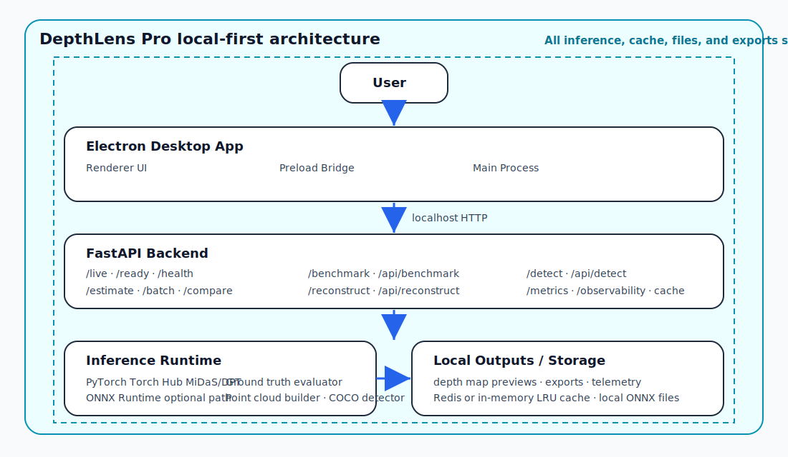
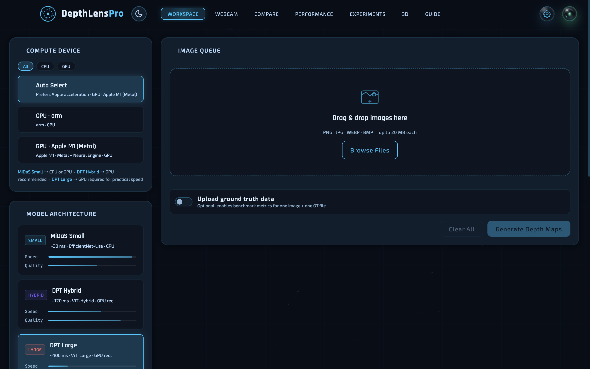
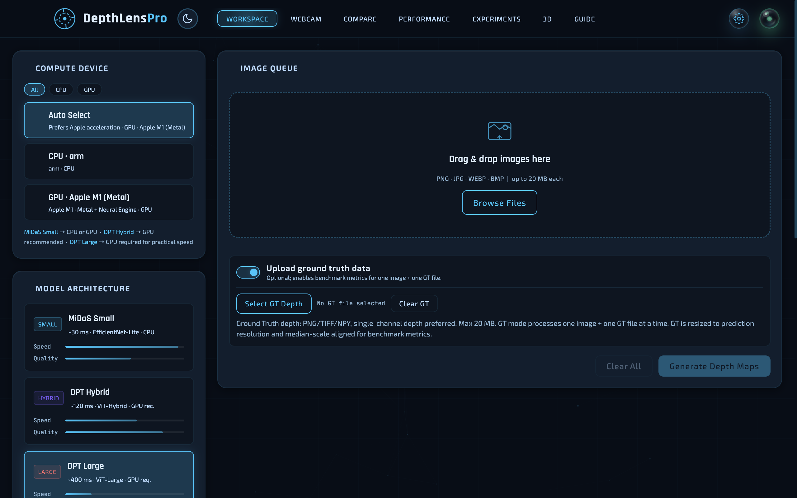
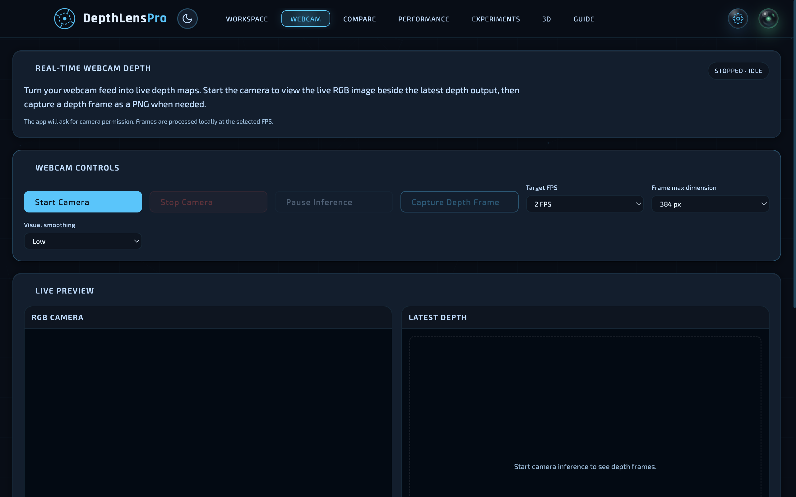
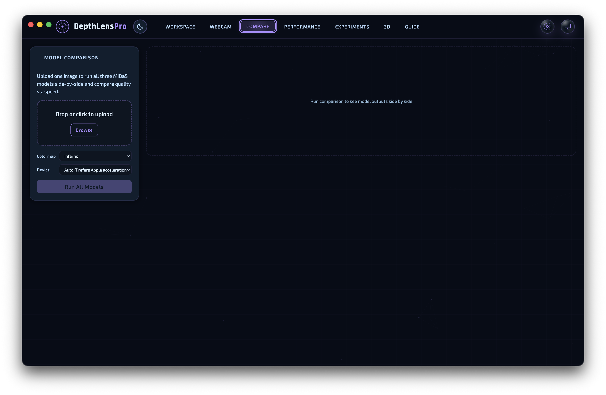
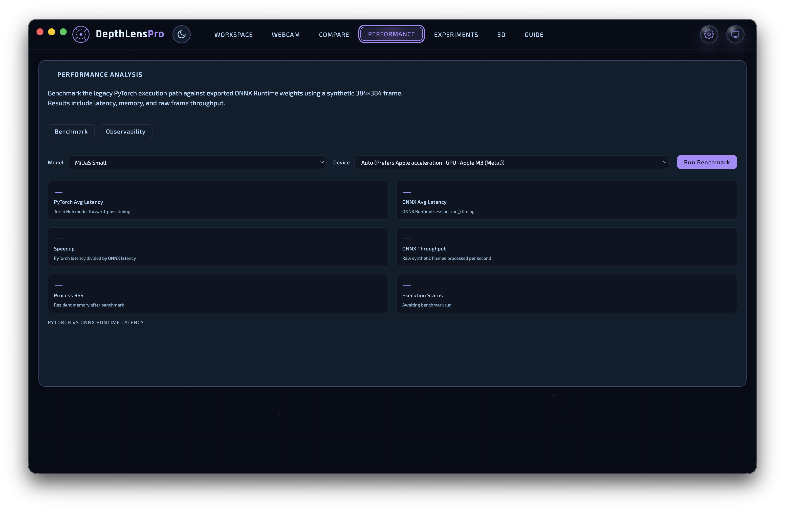
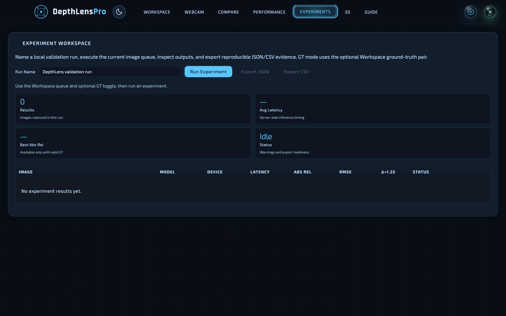
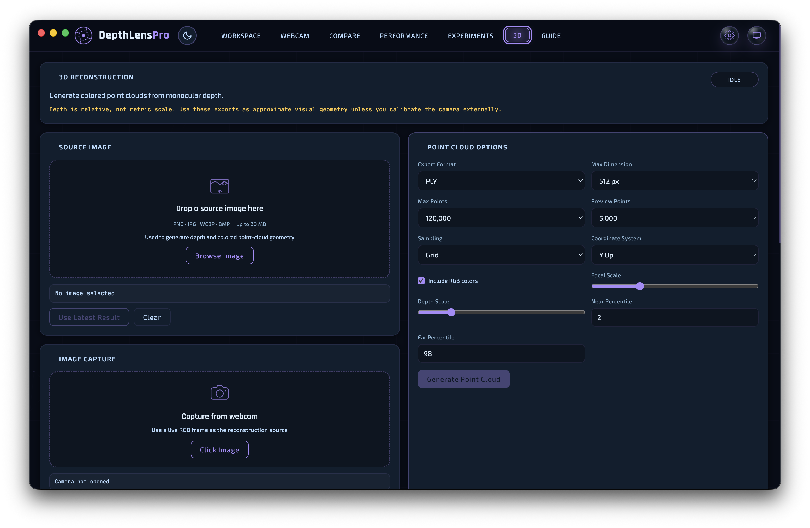
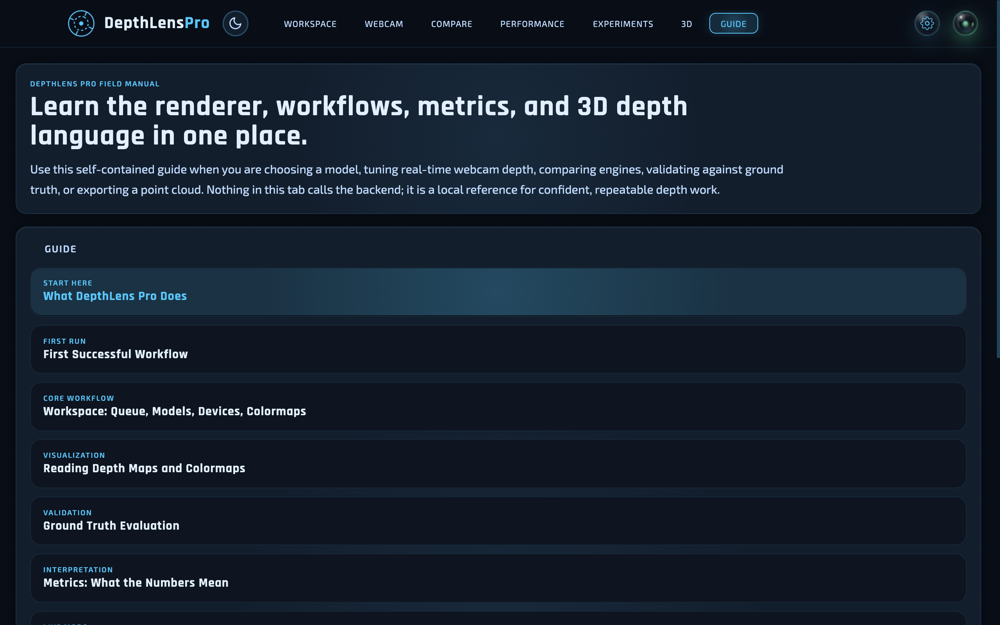

<div align="center">

# DepthLens Pro

### Local-first monocular depth estimation for desktop workflows

Turn ordinary 2D images into depth maps, compare neural depth models, benchmark optional ONNX Runtime acceleration, evaluate against ground truth, and export approximate 3D point clouds — all from a desktop app running on your own machine.

<br/>

[](electron-app/package.json)
[](backend/api/live.py)
[](electron-app/package.json)
[](backend/requirements.txt)
[](backend/requirements.txt)
[](scripts/doctor.py)
[](backend/requirements.txt)
[](backend/requirements.txt)
[](#security-and-privacy)
[](LICENSE)

<br/>

**No cloud uploads. No API keys. No subscription.**  
Images are processed through a local Electron + FastAPI + PyTorch/ONNX Runtime pipeline.

<p align="center">
  <a href="#what-depthlens-pro-does"><strong>Overview</strong></a> ·
  <a href="#quick-start"><strong>Quick Start</strong></a> ·
  <a href="#installation-and-build-matrix"><strong>Build Matrix</strong></a> ·
  <a href="#docs-and-deep-dives"><strong>Docs</strong></a> ·
  <a href="#api-quick-reference"><strong>API</strong></a>
</p>

## Demo

### Quick Preview

<video src="https://github.com/user-attachments/assets/6baef599-df4c-4d48-9fa5-7cbe43a08449" controls muted playsinline width="100%">
  Your browser does not support the video tag.
</video>

### Full Demo

[Watch the full-quality 3:45 demo video](https://github.com/AyushmanRaha/DepthLensPro/releases/download/v1.0-demo/demo.mp4)

</div>

---

## Table of Contents

- [What DepthLens Pro does](#what-depthlens-pro-does)
- [Why it is technically strong](#why-it-is-technically-strong)
- [What I built vs third-party components](#what-i-built-vs-third-party-components)
- [Model and detector specifications](#model-and-detector-specifications)
- [Architecture at a glance](#architecture-at-a-glance)
- [Feature tour](#feature-tour)
- [Quick Start](#quick-start)
- [Choose your setup path](#choose-your-setup-path)
- [Installation and build matrix](#installation-and-build-matrix)
- [ONNX acceleration note](#onnx-acceleration-note)
- [Docs and deep dives](#docs-and-deep-dives)
- [API quick reference](#api-quick-reference)
- [Testing and CI](#testing-and-ci)
- [Security and privacy](#security-and-privacy)
- [Project structure](#project-structure)
- [Contributing](#contributing)
- [License](#license)
- [Acknowledgements](#acknowledgements)

---

## What DepthLens Pro does

**DepthLens Pro** is a local-first desktop application for monocular depth estimation: it predicts a relative depth map from a single RGB image. The app combines an Electron desktop shell, a local FastAPI inference service, PyTorch MiDaS/DPT models, optional ONNX Runtime execution, and local export workflows.

DepthLens Pro supports:

- Depth-map generation for PNG, JPG, WEBP, and BMP images.
- Side-by-side model comparisons across MiDaS Small, DPT Hybrid, and DPT Large.
- Optional ONNX Runtime benchmarks and provider diagnostics.
- Ground truth evaluation with PNG/TIFF/NPY depth labels.
- Approximate colored point-cloud exports as PLY or OBJ.
- Local observability through Prometheus metrics and in-app telemetry.

> **Depth interpretation:** DepthLens Pro predicts **relative depth**, not real-world metric distance. It is useful for visual depth understanding, model comparison, and approximate geometry; it is not a replacement for calibrated metric depth sensors.

To know more, read [How Monocular Depth Estimation Works](docs/how-depth-estimation-works.md).

---

## Why it is technically strong

| Capability | Production-oriented behavior |
|---|---|
| Local-first desktop ML system | Runs the UI, API, inference runtime, cache fallback, and exports on the local machine. |
| FastAPI inference service | Provides typed routes for estimation, batch processing, benchmarking, reconstruction, diagnostics, health, and readiness. |
| Lazy model loading and device-aware execution | Loads models on demand, detects CPU/CUDA/MPS/XPU availability, and protects model forward passes with concurrency controls. |
| Optional ONNX Runtime acceleration | Keeps PyTorch as the standard path while supporting locally generated ONNX files and provider diagnostics. |
| Redis/in-memory cache fallback | Uses Redis when configured and falls back to a bounded in-process LRU cache when Redis is unavailable. |
| Ground truth evaluation | Supports GT resizing, masking, median-scale alignment, and standard depth-estimation metrics. |
| 3D point-cloud export | Converts relative depth into approximate PLY/OBJ point clouds using a pinhole projection model. |
| Observability and Prometheus metrics | Exposes runtime snapshots, metrics, traces, cache events, crash analytics, and benchmark history without logging raw images. |
| Secure Electron bridge and backend process lifecycle | Uses context isolation, a narrow preload API, localhost-only navigation policy, port checks, PID metadata, and packaged-resource verification. |

Read the full design rationale in [System Design Decisions](docs/system-design-decisions.md).

---

## What I built vs third-party components

DepthLens Pro is an application-engineering project built around established monocular depth-estimation models. It does not claim to train a new depth model from scratch; it focuses on making depth estimation usable as a local-first desktop workflow.

| Area | Built in this project | Third-party / pretrained foundation |
|---|---|---|
| Desktop product | Electron shell, local backend lifecycle, workspace UI, compare workflow, experiments, reconstruction workflow, guide, and packaging checks. | Electron runtime and ecosystem. |
| Backend API | FastAPI routes for estimation, comparison, batch processing, benchmarking, reconstruction, diagnostics, cache controls, health, readiness, and observability. | FastAPI and Starlette. |
| Inference orchestration | Model selection, device routing, PyTorch/ONNX dispatch, preprocessing integration, output selection, metrics modes, fallback behavior, and request-level validation. | Intel ISL MiDaS/DPT pretrained models, PyTorch, and ONNX Runtime. |
| Caching and telemetry | Redis/in-memory fallback strategy, cache metrics, Prometheus-style metrics, frontend telemetry snapshots, and sanitized error handling. | Redis and local process/runtime metrics. |
| 3D export workflow | Approximate point-cloud generation controls, PLY/OBJ export flow, preview sampling, and coordinate-system options. | NumPy/OpenCV-style image and array processing. |
| Testing and packaging | Lightweight backend tests, Electron contract tests, CI gates, setup/build scripts, and packaged-resource verification. | GitHub Actions, pytest, npm tooling, Pillow, and first-party Canvas 2D chart helpers. |


---


## Model and detector specifications

DepthLens Pro exposes three MiDaS/DPT depth backbones through one registry and can optionally use locally generated ONNX Runtime graphs for the same model IDs.

| Model | Runtime ID / ONNX file | Input | Best fit |
|---|---|---:|---|
| MiDaS Small | `midas_small` / `midas_small.onnx` | 256×256 | Fast previews, CPU-friendly runs, and quick comparisons. |
| DPT Hybrid | `dpt_hybrid` / `dpt_hybrid.onnx` | 384×384 | Balanced quality/speed when a GPU or fast CPU is available. |
| DPT Large | `dpt_large` / `dpt_large.onnx` | 384×384 | Highest-detail option; best treated as GPU-preferred for practical latency. |

ONNX files are optional for standard PyTorch use and are validated locally before ONNX builds. The 3D tab’s camera capture preview uses a separate local TorchVision COCO detector, `fasterrcnn_mobilenet_v3_large_320_fpn`, on downscaled RGB frames to surface object labels before capture; it does not replace the depth model used for point-cloud reconstruction.

---

## Architecture at a glance

<p align="center">
  
</p>

| Layer | Responsibility |
|---|---|
| Electron main process | Window lifecycle, backend spawn, port checks, PID metadata, settings persistence, packaged-resource validation. |
| Preload bridge | Narrow context-isolated API for backend URL, dialogs, and platform information. |
| Renderer UI | Workspace, webcam, compare, performance, experiments, 3D reconstruction, guide, charts, and exports. |
| FastAPI backend | Health/readiness routes, inference endpoints, diagnostics, metrics, JSON logging, async lifespan hooks. |
| Runtime services | PyTorch/ONNX dispatch, image preprocessing, depth normalization, GT metrics, reconstruction, observability. |
| Local cache/resources | Optional Redis, in-memory LRU fallback, locally generated ONNX files, packaged Python/backend/frontend resources. |

To know more, read [System Architecture Deep Dive](docs/system-architecture.md).

---

## Feature tour

### Workspace — Generate Depth Maps

<p align="center"></p>

- Upload images, choose device/model/colormap, generate depth maps, and download results.
- Tracks processed images, latency, cache hits, errors, throughput, and cumulative inference time.
- Supports automatic `max_dim` downscaling without modifying the original file.

Read more in [Models, Colormaps & Metrics](docs/models-colormaps-metrics.md).

### Ground Truth Mode

<p align="center"></p>

- Processes one image and one depth-label file together.
- Supports PNG, TIFF, and safe NPY loading with invalid-pixel masking and unit scaling.
- Applies nearest-neighbor GT resizing and median-scale alignment before metrics.

Read more in [Ground Truth Evaluation](docs/ground-truth-evaluation.md) and [Understanding Depth Metrics](docs/depth-metrics.md).

### Webcam — Live Depth Streaming

<p align="center"></p>

- Runs controlled local webcam inference at 1–5 FPS.
- Provides frame max-dimension limits and optional temporal smoothing.
- Shows backend latency, end-to-end latency, effective FPS, skipped frames, and active runtime settings.

Read more in [Terminal-Only Development](docs/terminal-only-development.md) for lightweight runtime verification.

### Compare — Run All Models on One Image

<p align="center"></p>

- Runs MiDaS Small, DPT Hybrid, and DPT Large on the same image.
- Displays side-by-side previews and latency badges.
- Charts latency, SSIM, SILog, PSNR, gradients, edge density, entropy, and dynamic range.

Read more in [Models, Colormaps & Metrics](docs/models-colormaps-metrics.md).

### Performance — PyTorch vs ONNX Runtime

<p align="center"></p>

- Benchmarks PyTorch and optional ONNX Runtime with a deterministic synthetic frame.
- Reports latency, speedup, throughput, RSS memory, provider status, and fallback state.
- Continues to run PyTorch benchmarks even when ONNX files are absent.

Read more in [Setup and Build](docs/setup-and-build.md) and [Production Packaging](docs/production-packaging.md).

### Experiments — Reproducible Validation Runs

<p align="center"></p>

- Records structured workspace results into named validation runs.
- Includes optional ground truth metrics when GT mode is enabled.
- Exports JSON or CSV without base64 previews.

Read more in [Testing and CI](docs/testing-and-ci.md).

### 3D Reconstruction

<p align="center"></p>

- Converts RGB + predicted depth into approximate colored point clouds.
- Supports PLY and OBJ export with point budgets and preview downsampling.
- Exposes focal scale, depth scale, near/far percentile clipping, and coordinate-system controls.

Read more in [Models, Colormaps & Metrics](docs/models-colormaps-metrics.md).

### Guide — Offline In-App Reference

<p align="center"></p>

- Provides an offline accordion reference for workflows, metrics, models, 3D controls, and troubleshooting.
- Does not require the backend to be online.
- Complements the deeper Markdown documentation in `docs/`.

Read more in [Troubleshooting](docs/troubleshooting.md).

---

## Quick Start

Run commands from the repository root unless a command explicitly says otherwise.

```bash
git clone https://github.com/AyushmanRaha/DepthLensPro.git
cd DepthLensPro
npm run setup
npm run backend:dev
npm run frontend:dev
```

Verify the local backend in another terminal:

```bash
curl http://127.0.0.1:8765/live
curl http://127.0.0.1:8765/ready
```

Expected `/live` shape:

```json
{
  "status": "ok",
  "busy": false,
  "state": "idle",
  "service": "DepthLens Pro API",
  "version": "1.0.0"
}
```

For terminal-only setup details, read [Terminal-Only Development](docs/terminal-only-development.md).

---

## Choose your setup path

| Goal | Recommended path | Details |
|---|---|---|
| Run/edit locally | Terminal-only development | `npm run setup:<platform>`, then `npm run backend:dev` and `npm run frontend:dev`; see [Terminal-Only Development](docs/terminal-only-development.md). |
| Build a packaged desktop app | Native app build | Use the platform matrix below; full details in [Setup and Build](docs/setup-and-build.md). |
| Use only the local API | Backend-only | `npm run setup`, `npm run backend:dev`, then call `127.0.0.1:8765`; see [API Reference](docs/api-reference.md). |
| Use standard PyTorch | Standard setup | ONNX files are not required; use `setup:mac`, `setup:win`, or `setup:linux`. |
| Use ONNX acceleration | ONNX setup/build | Generate and validate all required local ONNX files before packaging; see [Setup and Build](docs/setup-and-build.md). |
| Run backend + Redis in containers | Docker Compose | `docker compose up --build`; see [Production Packaging](docs/production-packaging.md). |

---

## Installation and build matrix

**Commands are run from the repository root. On Windows, run them in PowerShell.**

| Platform | Standard native build | ONNX native build |
|---|---|---|
| macOS Apple Silicon only arm64 | `npm run setup:mac` → `npm run verify:resources` → `npm run build:mac:arm64` → `npm run launch:mac` | `npm run setup:mac:onnx` → `npm run verify:onnx:required` → `npm run build:mac:arm64:onnx` → `npm run launch:mac` |
| macOS x64 / universal | Not supported; build scripts fail with a clear unsupported-architecture message. | Not supported. |
| Windows ARM64 | `npm run setup:win` → `npm run verify:resources` → `npm run build:win:arm64` → `npm run launch:win` | `npm run setup:win:onnx` → `npm run verify:onnx:required` → `npm run build:win:arm64:onnx` → `npm run launch:win` |
| Windows x64 | `npm run setup:win` → `npm run verify:resources` → `npm run build:win:x64` → `npm run launch:win` | `npm run setup:win:onnx` → `npm run verify:onnx:required` → `npm run build:win:x64:onnx` → `npm run launch:win` |
| Linux ARM64 | `npm run setup:linux` → `npm run verify:resources` → `npm run build:linux:arm64` → `npm run launch:linux` | `npm run setup:linux:onnx` → `npm run verify:onnx:required` → `npm run build:linux:arm64:onnx` → `npm run launch:linux` |
| Linux x64 | `npm run setup:linux` → `npm run verify:resources` → `npm run build:linux:x64` → `npm run launch:linux` | `npm run setup:linux:onnx` → `npm run verify:onnx:required` → `npm run build:linux:x64:onnx` → `npm run launch:linux` |
| Backend-only/API | `npm run setup` → `npm run backend:dev` → `curl http://127.0.0.1:8765/live` | ONNX validation optional unless using ONNX endpoints. |
| Docker | `docker compose up --build` → `docker compose down` | Container usage follows the documented backend workflow. |

Platform support summary: macOS Apple Silicon only is supported through `npm run build:mac`, while Intel Mac / macOS x64 is not supported. Windows arm64 and x64 are supported, and Linux arm64 and x64 are supported. The macOS packaged app is expected at `dist/mac-arm64/DepthLens Pro.app`, and packaged-resource validation uses `verify-packaged-resources.js`.

For full platform prerequisites, setup reports, diagnostics, resource verification, package-size preflight, and no-silent-download policy, read [Setup and Build](docs/setup-and-build.md).

---

## ONNX acceleration note

> **ONNX is optional for standard PyTorch usage.** Standard builds do not require ONNX files. ONNX builds require local generation and validation of all requested ONNX model files before packaging.
>
> ONNX export and benchmarking can use sustained CPU/GPU resources, high RAM, and large model files. Use a powerful, well-cooled machine with active cooling/fans, sufficient free disk space, and adequate memory. Avoid long export or benchmark runs on thermally constrained laptops or systems with limited cooling headroom.

---

## Docs and deep dives

| Document | What it contains |
|---|---|
| [How Monocular Depth Estimation Works](docs/how-depth-estimation-works.md) | Image preprocessing, PyTorch/ONNX inference, normalization, colorization, caching. |
| [System Architecture Deep Dive](docs/system-architecture.md) | Mermaid diagram, layer responsibilities, request flow, concurrency model. |
| [System Design Decisions](docs/system-design-decisions.md) | Caching, fallback, packaging, local-first tradeoffs, runtime policies. |
| [Setup and Build](docs/setup-and-build.md) | Platform setup, native builds, ONNX builds, diagnostics, resource verification. |
| [Terminal-Only Development](docs/terminal-only-development.md) | Dev-mode verification without packaged apps. |
| [Configuration](docs/configuration.md) | Environment variables and runtime settings. |
| [API Reference](docs/api-reference.md) | Full endpoint fields, curl examples, response shapes. |
| [Models, Colormaps & Metrics](docs/models-colormaps-metrics.md) | Model IDs, colormaps, metric modes, output interpretation. |
| [Ground Truth Evaluation](docs/ground-truth-evaluation.md) | GT formats, masking, scaling, median alignment. |
| [Understanding Depth Metrics](docs/depth-metrics.md) | Metric definitions and practical interpretation. |
| [Testing and CI](docs/testing-and-ci.md) | Lightweight tests, stubs, CI policy, command matrix. |
| [Production Packaging](docs/production-packaging.md) | Packaged startup readiness, native artifacts, Docker, ONNX variants. |
| [Troubleshooting](docs/troubleshooting.md) | Common setup/runtime failures and fixes. |
| [Security](docs/security.md) | Local-first privacy, Electron isolation, process safeguards. |
| [Project Structure](docs/project-structure.md) | Full repository tree and module descriptions. |
| [Debugging](docs/debugging.md) | Maintainer debugging notes. |
| [Maintenance](docs/maintenance.md) | Maintenance workflows. |

---

## API quick reference

| Endpoint | Method | Purpose |
|---|---:|---|
| `/` | GET | Service name and API version. |
| `/live` | GET | Lightweight process liveness check used by packaged startup. |
| `/ready` | GET | Runtime readiness diagnostics; supports quick/deep checks. |
| `/health` | GET | Full backend health and dependency diagnostics. |
| `/estimate` | POST | Generate a depth map for one image with selected model/device/outputs. |
| `/batch` | POST | Process multiple images in one request. |
| `/compare` | POST | Run supported models on one image and compare outputs. |
| `/api/compare` | POST | Frontend-compatible compare alias. |
| `/benchmark` | GET | Benchmark PyTorch against optional ONNX Runtime. |
| `/api/benchmark` | GET | Frontend-compatible benchmark alias. |
| `/reconstruct` | POST | Generate approximate point-cloud data/export artifacts. |
| `/api/reconstruct` | POST | Frontend-compatible reconstruction alias. |
| `/detect` | POST | Run local object detection for RGB Camera / 3D workflows. |
| `/api/detect` | POST | Frontend-compatible object-detection alias. |
| `/devices` | GET | Report detected compute devices. |
| `/models` | GET | Return supported model registry metadata. |
| `/colormaps` | GET | Return supported colormap names. |
| `/onnx/status` | GET | Report ONNX file/provider readiness. |
| `/cache/metrics` | GET | Return active cache telemetry. |
| `/cache` | DELETE | Clear the active inference cache. |
| `/cache/clear` | POST | Clear the cache for browser/client flows that prefer POST. |
| `/metrics` | GET | Prometheus metrics exposition. |
| `/api/observability` | GET | Local JSON telemetry snapshot for the UI. |
| `/observability` | GET | Observability snapshot alias. |

Read the full endpoint documentation in [API Reference](docs/api-reference.md).

---

## Testing and CI

```bash
python -m py_compile backend/api/live.py backend/main.py
python -m pytest backend/tests/test_lightweight_live.py
npm --prefix electron-app test
npm run verify:resources
rg -n "4\\.0\\.0|3\\.1\\.0"
```

The test strategy favors lightweight unit tests and stubs for Torch, ONNX Runtime, Redis, model downloads, and platform-specific packaging behavior. Read the full policy in [Testing and CI](docs/testing-and-ci.md).

---

## Security and privacy

| Area | Approach |
|---|---|
| Local-first processing | Images are sent only to the local backend on `127.0.0.1` unless the user intentionally configures otherwise. |
| Electron isolation | Context isolation and a narrow preload bridge limit renderer access to native APIs. |
| Navigation policy | The app allows local frontend files and localhost backend URLs only. |
| Backend lifecycle | Electron owns backend spawn, liveness polling, PID metadata, and controlled shutdown. |
| Telemetry hygiene | Observability avoids raw images, base64 payloads, filenames, local paths, image hashes, and cache keys. |
| GT/NPY safety | NPY ground-truth loading uses `allow_pickle=False`. |

Read the full security design in [Security](docs/security.md).

---

## Project structure

```text
DepthLensPro/
├── backend/        # FastAPI app, routes, services, model registry, tests
├── electron-app/   # Electron main/preload code, packaging scripts, Electron tests
├── frontend/       # Browser UI, tabs, charts, 3D viewer, guide
├── docs/           # Deep-dive documentation, screenshots, architecture diagram
├── models/         # Local model/ONNX resource location; generated files are not committed
├── scripts/        # Setup, build, launch, and diagnostics scripts
└── docker-compose.yml
```

Read the full module map in [Project Structure](docs/project-structure.md).

---

## Contributing

- Keep changes small and reviewable.
- Preserve existing API response shapes unless a breaking change is explicitly discussed.
- Prefer lightweight tests with mocks/stubs over real model downloads or GPU benchmarks.
- Update README and docs when setup, routes, runtime behavior, or security properties change.
- Run resource verification when touching Electron packaging scripts.

---

## License

DepthLens Pro is licensed under the **MIT License**. See [`LICENSE`](LICENSE) for the full terms.

---

## Acknowledgements

DepthLens Pro builds on excellent open-source projects:

| Project | Role |
|---|---|
| [Intel ISL MiDaS](https://github.com/isl-org/MiDaS) | MiDaS/DPT monocular depth estimation models |
| [PyTorch](https://pytorch.org) | Primary ML runtime and Torch Hub model loading |
| [ONNX Runtime](https://onnxruntime.ai) | Optional accelerated inference across CPU, CUDA, CoreML, OpenVINO |
| [FastAPI](https://fastapi.tiangolo.com) | Local HTTP API with async support and automatic OpenAPI docs |
| [Electron](https://www.electronjs.org) | Desktop application shell with context isolation |
| [OpenCV](https://opencv.org) | Image decoding, resizing, colourisation, and GT alignment |
| [NumPy](https://numpy.org) | Depth array arithmetic and GT metric computation |
| [Pillow](https://python-pillow.org) | PNG/TIFF/NPY GT file decoding |
| [Redis](https://redis.io) | Optional distributed cache backend |
| Browser Canvas 2D API | First-party local chart rendering for latency and benchmark panels |

<div align="center">

**Made with care by [Ayushman Raha](https://github.com/AyushmanRaha)**

`com.ayushmanraha.depthlens-pro`

</div>
