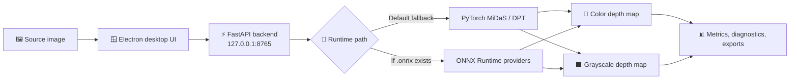
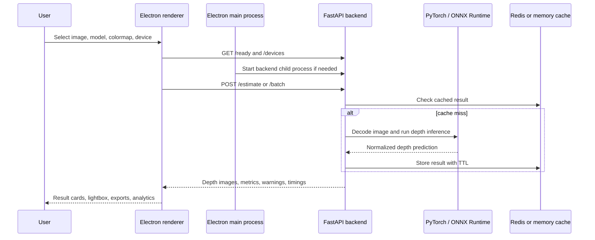

<div align="center">

# 🌌 DepthLens Pro

### Local-first AI desktop app for turning ordinary 2D images into depth maps, diagnostics, and exportable experiment results.

[](electron-app/package.json)
[](backend/main.py)
[](scripts/doctor.py)
[](backend/model_registry.py)
[](#-license)

<br />

```text
Image upload → FastAPI inference → PyTorch / ONNX Runtime → Color + gray depth maps → Desktop analytics
```

</div>

---

## 🎯 Project identity & pitch

**DepthLens Pro** is for creators, researchers, students, and interview reviewers who need a polished local desktop workflow for monocular depth estimation without sending images to a cloud service.

### Key features

- **Depth generation workspace** — upload one image or a batch, choose model/device/colormap, and export colorized or grayscale depth maps.
- **Model-aware inference backend** — canonical MiDaS/DPT registry with alias normalization, PyTorch fallback, optional ONNX acceleration, and safe device resolution.
- **Ground-truth evaluation** — compare predictions against `.png`, `.tif/.tiff`, or `.npy` ground-truth depth files with aligned benchmark metrics.
- **Operational diagnostics** — `/live`, `/ready`, `/health`, `/devices`, `/onnx/status`, benchmarks, cache metrics, memory, disk, and acceleration probes.
- **Desktop-grade packaging** — Electron lifecycle management, sandboxed renderer, ARM-native build scripts, and packaged-resource verification.

### Visual anchor



---

## 🛠️ Tech stack & architecture

| Layer | Technology | Role |
|---|---|---|
| Desktop shell | Electron | Native app window, backend child-process lifecycle, packaging |
| Renderer | HTML, CSS, JavaScript | Upload workflow, model/device controls, analytics, experiments |
| API | FastAPI + Uvicorn | Local inference API, health checks, benchmark and cache endpoints |
| AI runtime | PyTorch, TorchVision, MiDaS/DPT | Default monocular depth-estimation execution path |
| Optional acceleration | ONNX Runtime | Static ONNX graph execution when model files and providers are available |
| Image/data stack | OpenCV headless, Pillow, NumPy | Decode, transform, colorize, evaluate, and serialize image outputs |
| Cache | Redis or in-memory fallback | Response/cache metrics and resilient local development behavior |
| Quality | Pytest, Ruff, Black, Mypy, Node tests | Backend, packaging, security-policy, and resource checks |

**Why this stack:** Electron + FastAPI keeps the product easy to demo as a desktop application while preserving a clean, testable HTTP boundary for inference and diagnostics. PyTorch provides reliable model fallback, while ONNX Runtime is optional so local setup remains usable even when large exported model files are absent.

### System flow



### Architecture design and engineering

- **Local-first security boundary:** the desktop talks to a loopback FastAPI server; the renderer is sandboxed with `contextIsolation` enabled and `nodeIntegration` disabled.
- **Graceful degradation:** CPU is always the safe baseline; accelerators and ONNX providers are discovered at runtime and never assumed.
- **Operational transparency:** startup, readiness, ONNX status, device inventory, cache metrics, and backend health are first-class API concepts.
- **Packaging reliability:** native build scripts run setup, clean stale output, verify resources before packaging, and verify packaged resources after packaging.
- **Reviewable code layout:** backend services, API routes, desktop shell, static frontend, models, scripts, and tests are separated by responsibility.

---

## 📦 Repository map

```text
DepthLensPro/
├── backend/                 # FastAPI app, routes, services, model registry, tests
│   ├── api/                 # /live, /ready, /estimate, /batch, health, cache, benchmark routes
│   ├── services/            # inference, cache, diagnostics, ONNX status, benchmarks, GT metrics
│   ├── tests/               # lightweight pytest suite with mocks/stubs
│   └── utils/               # hardware/device discovery and provider mapping
├── electron-app/            # Electron main/preload, packaging scripts, desktop tests
├── frontend/                # Renderer HTML/CSS/JS, welcome animation, workspace UI
├── models/onnx/             # Optional exported ONNX model files live here
├── scripts/                 # Cross-platform setup, doctor, diagnosis, native build scripts
├── Dockerfile               # Backend container image
├── docker-compose.yml       # Backend + Redis runtime for service-style deployment
├── .env.example             # Local configuration template
└── README.md                # You are here
```

---

## 🚀 Getting started / runbook

> **Goal:** get the desktop app or backend running locally with clear copy-paste commands, predictable troubleshooting, and no accidental large model downloads unless you explicitly opt in.

### 0) Choose your run mode

| Mode | Best for | Starts Electron? | Requires ONNX files? | Command family |
|---|---|---:|---:|---|
| **Desktop development** | Product demo, UI work, interviews | ✅ | No | `npm run setup` + backend/UI dev commands |
| **Backend API only** | API testing, backend development | No | No | `npm run backend:dev` |
| **Native packaged app** | End-user style installable artifact | ✅ | Optional | `npm run build:*:arm64` |
| **Docker backend** | Service-style backend + Redis | No | No | `docker compose up --build` |

> **Important:** PyTorch inference works without ONNX files. ONNX export can download large model weights, so setup skips it by default in non-interactive environments.

### 1) Prerequisites

Install these before running setup.

| Tool | Required version | Notes |
|---|---:|---|
| Git | Any modern version | Used for cloning and branch workflows |
| Python | **3.10–3.12** | Python 3.12 is recommended; setup validates stdlib modules such as `venv`, `ssl`, and `ensurepip` |
| Node.js + npm | Modern LTS recommended | Used for Electron, packaging scripts, and renderer tests |
| Architecture | ARM desktop targets for native packaging | macOS `arm64`, Linux `aarch64/arm64`, Windows ARM64 |
| Docker | Optional | Only needed for Docker backend + Redis flow |

Check your versions:

```bash
git --version
python3 --version
node --version
npm --version
```

On Windows PowerShell:

```powershell
git --version
py -3.12 --version
node --version
npm --version
```

### 2) Clone the repository

Use your fork URL if you are contributing; otherwise clone the upstream repository.

```bash
git clone https://github.com/AyushmanRaha/DepthLensPro.git
cd DepthLensPro
git status --short
```

Recommended contributor branch flow:

```bash
git checkout -b docs/readme-refresh
git status --branch --short
```

If you already have the repo:

```bash
cd DepthLensPro
git fetch --all --prune
git checkout main
git pull --ff-only
git checkout -b docs/readme-refresh
```

### 3) Create local environment configuration

Copy the example file first. The defaults are intentionally local and safe.

```bash
cp .env.example .env
```

Windows PowerShell:

```powershell
Copy-Item .env.example .env
```

Recommended development values when you want fast startup and no model-download surprises:

```bash
cat > .env <<'EOF_ENV'
CODEX_ENV=0
TESTING=0
DEPTHLENS_SKIP_WARMUP=1
DEPTHLENS_DISABLE_MODEL_DOWNLOADS=1
DEPTHLENS_CACHE_BACKEND=memory
REDIS_URL=
REDIS_HOST=127.0.0.1
REDIS_PORT=6379
ONNX_WEIGHTS_DIR=./models/onnx
ORT_INTRA_OP_NUM_THREADS=2
ORT_INTER_OP_NUM_THREADS=1
INFERENCE_MAX_CONCURRENCY=2
MAX_UPLOAD_SIZE_MB=20
EOF_ENV
```

What the common keys mean:

| Key | Typical local value | Purpose |
|---|---|---|
| `DEPTHLENS_SKIP_WARMUP` | `1` for fast dev startup | Skips optional background model warmup |
| `DEPTHLENS_DISABLE_MODEL_DOWNLOADS` | `1` in CI/interviews | Prevents intentional model download paths during lightweight checks |
| `DEPTHLENS_CACHE_BACKEND` | `memory` | Script-level/local convention; backend still falls back to memory automatically if Redis is unavailable |
| `REDIS_URL` / `REDIS_HOST` / `REDIS_PORT` | blank / local defaults | Optional Redis cache configuration |
| `ONNX_WEIGHTS_DIR` | `./models/onnx` | Where optional `.onnx` files are discovered |
| `INFERENCE_MAX_CONCURRENCY` | `2` | Limits concurrent inference work |
| `MAX_UPLOAD_SIZE_MB` | `20` | Documents the route upload-size expectation |

### 4) Install dependencies with the project setup script

The root setup script runs the repository doctor, creates or repairs `venv/`, installs backend dependencies, installs Electron dependencies, creates `models/onnx`, and verifies resources.

#### macOS Apple Silicon

```bash
npm run setup:mac -- --without-onnx
```

Equivalent direct script:

```bash
scripts/setup-macos.sh --without-onnx
```

#### Linux ARM

```bash
npm run setup:linux -- --without-onnx
```

Equivalent direct script:

```bash
scripts/setup-linux.sh --without-onnx
```

#### Windows ARM PowerShell

```powershell
npm run setup:win -- --without-onnx
```

Equivalent direct script:

```powershell
.\scripts\setup-windows.ps1 --without-onnx
```

#### Generic development setup

Use this when you are not packaging a native ARM app and only want the development environment:

```bash
npm run setup -- --without-onnx
```

If you intentionally want to export or validate ONNX assets, opt in explicitly:

```bash
npm run setup -- --with-onnx --onnx-models midas_small
```

Export every supported ONNX graph only when you have time, disk space, and network access:

```bash
npm run setup -- --with-onnx --onnx-models all
```

Validate existing ONNX files without exporting new ones:

```bash
npm run verify:onnx
```

### 5) Run the backend API locally

Start FastAPI from the repository root:

```bash
npm run backend:dev
```

Equivalent direct command:

```bash
venv/bin/python -m uvicorn backend.app:app --host 127.0.0.1 --port 8765
```

Windows PowerShell equivalent:

```powershell
.\venv\Scripts\python.exe -m uvicorn backend.app:app --host 127.0.0.1 --port 8765
```

Expected behavior:

- Backend listens on `http://127.0.0.1:8765`.
- `/live` should respond quickly even while heavier readiness checks are still warming.
- First real inference can be slower because PyTorch may lazily initialize and load a selected model.

Health-check the running backend from another terminal:

```bash
curl http://127.0.0.1:8765/live
curl http://127.0.0.1:8765/ready
curl http://127.0.0.1:8765/devices
curl http://127.0.0.1:8765/health
```

If you prefer npm wrappers:

```bash
cd electron-app
npm run backend:live
npm run backend:ready
npm run backend:devices
npm run backend:health
```

### 6) Run the Electron desktop app in development

Open a second terminal. Keep the backend terminal running if you started it manually.

```bash
npm run frontend:dev
```

Equivalent:

```bash
cd electron-app
npm run start:dev
```

Desktop startup flow:

1. Electron opens the desktop shell.
2. The main process can manage the backend lifecycle in packaged-style flows.
3. The renderer calls `/ready` before enabling inference controls.
4. The renderer loads `/health`, `/devices`, and `/cache/metrics` for diagnostics.
5. You can drag and drop an image, choose model/device/colormap, and generate outputs.

### 7) Native packaged builds

Native packaging is intentionally ARM-focused.

#### macOS Apple Silicon package

```bash
npm run build:mac:arm64 -- --without-onnx
```

Open the generated app:

```bash
open "electron-app/dist/mac-arm64/DepthLens Pro.app"
```

Build with `midas_small` ONNX required:

```bash
npm run build:mac:arm64 -- --with-onnx --onnx-models midas_small
```

#### Linux ARM AppImage

```bash
npm run build:linux:arm64 -- --without-onnx
```

Run the generated AppImage from `electron-app/dist/`:

```bash
chmod +x electron-app/dist/*.AppImage
./electron-app/dist/*.AppImage
```

#### Windows ARM installer

```powershell
npm run build:win:arm64 -- --without-onnx
```

Then install the generated NSIS installer from:

```powershell
Get-ChildItem .\electron-app\dist\
```

### 8) Docker backend + Redis flow

Use Docker only when you explicitly want a containerized backend and Redis cache.

```bash
docker compose up --build
```

Check liveness:

```bash
curl http://127.0.0.1:8765/live
```

Stop services:

```bash
docker compose down
```

Remove Redis volume as well:

```bash
docker compose down -v
```

### 9) First inference API smoke test

Use any small local image. Replace `sample.jpg` with your file path.

```bash
curl -X POST "http://127.0.0.1:8765/estimate" \
  -F "file=@sample.jpg" \
  -F "model=midas_small" \
  -F "colormap=inferno" \
  -F "device=auto" \
  -F "metrics=fast" \
  -F "outputs=color,gray"
```

Batch inference accepts up to 10 images:

```bash
curl -X POST "http://127.0.0.1:8765/batch" \
  -F "files=@image-1.jpg" \
  -F "files=@image-2.jpg" \
  -F "model=midas_small" \
  -F "colormap=viridis" \
  -F "device=auto"
```

### 10) Troubleshooting guide

<details open>
<summary><strong>Backend port is already in use</strong></summary>

Stop the managed backend helper:

```bash
npm run stop:backend
```

Or find the process manually:

```bash
lsof -i :8765
```

Then terminate the stale process and restart:

```bash
npm run backend:dev
```

</details>

<details>
<summary><strong>Setup picked the wrong Python</strong></summary>

Run the doctor first:

```bash
npm run doctor
```

Use the platform setup script again after installing Python 3.12:

```bash
npm run setup -- --without-onnx
```

Windows users should verify the Python launcher:

```powershell
py -0p
py -3.12 --version
```

</details>

<details>
<summary><strong>Electron opens but inference controls stay disabled</strong></summary>

Check readiness and devices:

```bash
curl http://127.0.0.1:8765/ready
curl http://127.0.0.1:8765/devices
```

Common causes:

- Backend is not running on `127.0.0.1:8765`.
- Dependencies were not installed into `venv/`.
- Model downloads were disabled and the selected model is not already available for first inference.
- An accelerator was selected but is unavailable; choose `auto` or `cpu`.

</details>

<details>
<summary><strong>ONNX is unavailable</strong></summary>

ONNX is optional. PyTorch fallback is expected to work without `.onnx` files.

Inspect ONNX diagnostics:

```bash
curl http://127.0.0.1:8765/onnx/status
```

Validate existing ONNX assets:

```bash
npm run verify:onnx
```

Export only the smallest supported ONNX model when you explicitly want acceleration:

```bash
npm run setup -- --with-onnx --onnx-models midas_small
```

</details>

<details>
<summary><strong>Redis is unavailable</strong></summary>

For local development, no Redis process is required; if Redis is unreachable, the backend logs the failure and falls back to in-memory cache:

```bash
npm run backend:dev
```

For Docker Compose, Redis starts as a service dependency:

```bash
docker compose up --build
```

</details>

<details>
<summary><strong>Upload fails with a 413 or image decode error</strong></summary>

Use a smaller image or lower the long edge before upload. The API route enforces a 20 MB upload limit and only accepts files OpenCV can decode as images.

Check file size:

```bash
ls -lh sample.jpg
```

</details>

<details>
<summary><strong>Native build fails because architecture is unsupported</strong></summary>

Native packaging scripts target ARM platforms only. Check your architecture:

```bash
python3 -c "import platform; print(platform.system(), platform.machine())"
```

Supported native package targets:

- macOS Apple Silicon: `Darwin arm64`
- Linux ARM: `Linux aarch64` or `Linux arm64`
- Windows ARM64

</details>

---

## 🧪 Testing & quality assurance

Run the same lightweight quality gates used by CI:

```bash
black --check .
ruff check .
mypy backend/
pytest
cd electron-app && npm test
```

Single-command backend + desktop quick check after setup:

```bash
npm run doctor
cd electron-app && npm test
```

Test coverage emphasis:

- Backend routes, inference formatting, model registry, hardware fallback, ONNX guardrails, cache service, ground-truth metrics, warmup, Docker Compose config, and setup doctor behavior.
- Electron security policy and packaged-resource verification.
- Lightweight mocks/stubs are preferred over GPU benchmarks, Redis requirements, Playwright browsers, or large model downloads.

---

## 📐 Production & deployment

| Topic | Status |
|---|---|
| Live hosted link | Not applicable; this is a local-first desktop/API project. |
| Backend production command | `uvicorn backend.app:app --host 0.0.0.0 --port 8765` or the Docker `CMD`. |
| Native desktop build | ARM scripts are available for macOS, Linux, and Windows. |
| Docker support | `Dockerfile` and `docker-compose.yml` are available for backend + Redis. |
| ONNX assets | Optional; place exported files in `models/onnx/` or set `ONNX_WEIGHTS_DIR`. |

Supported native packaging targets:

| Platform | Architecture | Build command |
|---|---|---|
| macOS | Apple Silicon `arm64` | `npm run build:mac:arm64 -- --without-onnx` |
| Linux | `arm64` / `aarch64` | `npm run build:linux:arm64 -- --without-onnx` |
| Windows | ARM64 | `npm run build:win:arm64 -- --without-onnx` |

---

## 🔌 API surface

| Endpoint | Purpose |
|---|---|
| `GET /` | Service name and API version |
| `GET /live` | Lightweight liveness, PID, uptime, busy/idle state |
| `GET /ready` | Inference readiness and dependency diagnostics |
| `GET /health` | Full diagnostics: devices, loaded models, cache, ONNX, memory, disk, warmup, timings |
| `GET /devices` | Available compute devices and primary default device |
| `GET /onnx/status` | ONNX model paths, provider availability, selected providers, export hints |
| `GET /models` | Supported model registry payload |
| `GET /colormaps` | Supported colormap names |
| `GET /benchmark` / `GET /api/benchmark` | Runtime benchmark diagnostics |
| `POST /estimate` | Single-image depth estimation |
| `POST /batch` | Batch depth estimation, capped at 10 images |
| `GET /cache/metrics` | Cache backend, hit/miss, TTL, keyspace, failure metrics |
| `DELETE /cache` | Clear cache entries |

Supported canonical model IDs:

```text
midas_small
dpt_hybrid
dpt_large
```

Supported colormaps:

```text
inferno, plasma, viridis, magma, jet, hot, bone, turbo
```

---

## 🧭 Open source etiquette

- Read `CONTRIBUTING.md` before opening a pull request.
- Keep pull requests small, focused, and easy to review.
- Include or update tests when behavior changes.
- Avoid requiring Redis, Docker, CUDA, MPS, XPU, Playwright browsers, external services, or large model downloads for normal lightweight checks.
- Report security concerns privately according to `SECURITY.md`.

---

## 🔐 Security notes

DepthLens Pro is designed as a local application. The backend binds to loopback for local development, Electron uses a sandboxed renderer posture, and API errors are sanitized so implementation details stay in backend logs. Treat uploaded images and model assets as local user data.

---

## 📄 License

This repository is licensed under the **MIT License**.

---

<div align="center">

**DepthLens Pro — local depth perception for images, demos, experiments, and engineering reviews.**

</div>
