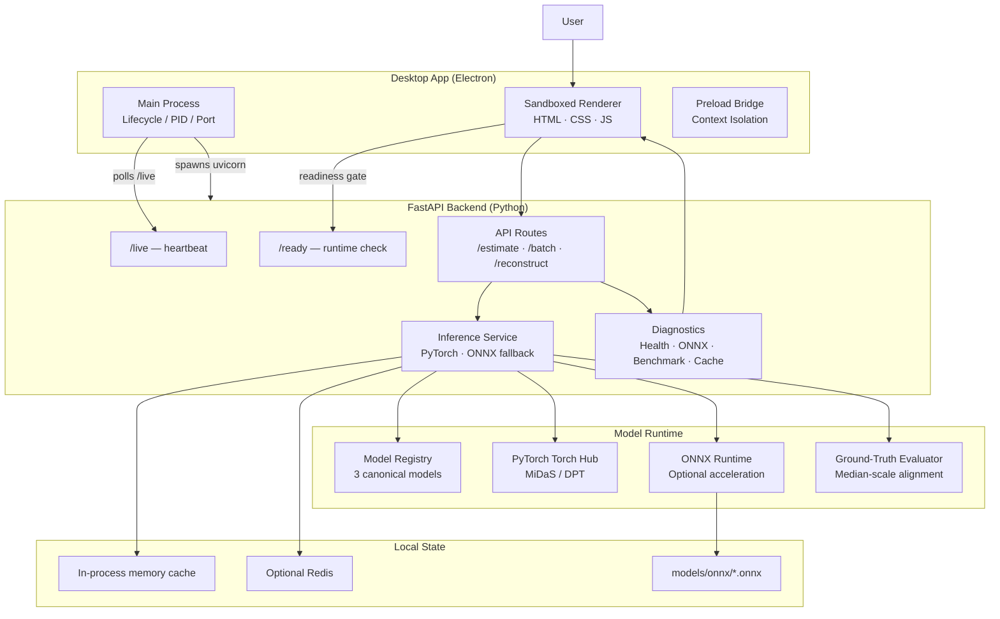

<div align="center">

<br/>

```
██████╗ ███████╗██████╗ ████████╗██╗  ██╗██╗     ███████╗███╗   ██╗███████╗
██╔══██╗██╔════╝██╔══██╗╚══██╔══╝██║  ██║██║     ██╔════╝████╗  ██║██╔════╝
██║  ██║█████╗  ██████╔╝   ██║   ███████║██║     █████╗  ██╔██╗ ██║███████╗
██║  ██║██╔══╝  ██╔═══╝    ██║   ██╔══██║██║     ██╔══╝  ██║╚██╗██║╚════██║
██████╔╝███████╗██║        ██║   ██║  ██║███████╗███████╗██║ ╚████║███████║
╚═════╝ ╚══════╝╚═╝        ╚═╝   ╚═╝  ╚═╝╚══════╝╚══════╝╚═╝  ╚═══╝╚══════╝
                              P  R  O
```

### *Turn any photo into a depth map — entirely on your machine.*

<br/>

[](electron-app/package.json)
[](backend/requirements.txt)
[](pyproject.toml)
[](backend/requirements.txt)
[](LICENSE)

[](#production--deployment)
[](models/onnx/README.md)
[](#architecture)

<br/>

> **DepthLens Pro** is a desktop-grade monocular depth estimation workstation.  
> Upload images, pick a model, and get colour-coded depth maps — no cloud, no API keys, no data leaving your machine.

<br/>

</div>

---

## Table of Contents

| Section | What you'll find |
|---|---|
| [✨ What is DepthLens Pro?](#-what-is-depthlens-pro) | Product overview in plain English |
| [🖼️ Feature Tour](#️-feature-tour) | Every workspace explained |
| [🏗️ Architecture](#️-architecture) | How the pieces fit together |
| [⚡ Quick Start](#-quick-start) | Running in under 5 minutes |
| [🛠️ Installation Guide](#️-installation-guide) | Full setup for all platforms |
| [⚙️ Configuration Reference](#️-configuration-reference) | Every environment variable |
| [📡 API Reference](#-api-reference) | Every HTTP endpoint |
| [🤖 Models & Metrics](#-models--metrics) | MiDaS family, colormaps, GT evaluation |
| [🧪 Testing & CI](#-testing--ci) | Running the test suite |
| [🚀 Production & Packaging](#-production--packaging) | Docker and native builds |
| [🔍 Troubleshooting](#-troubleshooting) | Common problems solved |
| [🔒 Security](#-security) | Local-first security posture |
| [🤝 Contributing](#-contributing) | PR checklist |

---

## ✨ What is DepthLens Pro?

DepthLens Pro converts ordinary 2D images into detailed depth maps using the **MiDaS/DPT family of neural networks** — all running locally on your hardware.

### Who is it for?

| Audience | Use Case |
|---|---|
| 🎨 **Creators & Artists** | Generate depth-aware effects, 2.5D parallax, fog, and blur |
| 🛠️ **Developers** | Prototype depth-perception features without cloud dependencies |
| 🔬 **ML Researchers** | Benchmark MiDaS models, evaluate against ground truth, export ONNX graphs |
| 📊 **Portfolio Reviewers** | Inspect a production-style desktop ML system end-to-end |

### Why local-first?

- **Privacy** — your images never leave your machine
- **Speed** — no network round-trips; GPU acceleration when available
- **Reproducibility** — same weights, same results, every time
- **No subscriptions** — fully open-source under MIT

### What makes it "Pro"?

```
Standard depth tool:  upload image → get depth map
DepthLens Pro:        upload image → choose model + device + colormap
                      → get depth map + metrics + ONNX benchmark
                      → export 3D point cloud + ground truth evaluation
                      → webcam live depth + experiments + guide
```

---

## 🖼️ Feature Tour

> **Note:** A hero screenshot/GIF can be dropped at `docs/assets/depthlens-pro-hero.png` once captured from the desktop app.

### Workspace — Core Depth Estimation

The main workspace is a drag-and-drop queue with real-time progress tracking. Drop one image or a hundred; the engine processes them in order with per-file status, latency reporting, and a live session dashboard.

```
┌─────────────────────────────────┐  ┌─────────────────────────────────┐
│  COMPUTE DEVICE                 │  │  IMAGE QUEUE                    │
│  ○ Auto Select (best available) │  │  ┌──────────────────────────┐   │
│  ○ GPU · Apple M3 (Metal)       │  │  │ photo_001.jpg   ✓ 31ms   │   │
│  ○ CPU · System processor       │  │  │ photo_002.jpg   ↻ Running│   │
│                                 │  │  │ photo_003.jpg   ○ Pending│   │
│  MODEL ARCHITECTURE             │  │  └──────────────────────────┘   │
│  ┌─────────┬─────────┬────────┐ │  │                                 │
│  │ SMALL   │ HYBRID  │ LARGE  │ │  │  ████████████░░░░░  65%  ETA 4s │
│  │ ~30ms   │ ~120ms  │ ~400ms │ │  └─────────────────────────────────┘
│  └─────────┴─────────┴────────┘ │
│                                 │  ┌──────────────── RESULTS ────────┐
│  COLORMAP                       │  │  [depth_photo_001] [depth_photo_]│
│  ● Inferno  ○ Plasma  ○ Viridis │  │  Inferno · MiDaS · 31ms · 1024² │
└─────────────────────────────────┘  └─────────────────────────────────┘
```

**Session Dashboard** tracks in real-time:
- Total images processed, average / min / max latency
- Cache hits (identical image+model combos skip re-inference)
- Errors, throughput (img/min), cumulative inference time

---

### Webcam — Live Depth Streaming

Point your webcam at a scene and watch depth maps update in real time, side-by-side with the RGB feed.

| Control | Options |
|---|---|
| Target FPS | 1 / 2 / 3 / 5 fps (cap protects the backend) |
| Frame max dimension | 256 / 384 / 512 px |
| Visual smoothing | Off / Low (α=0.25) / Medium / High |
| Capture | Download the latest depth frame as PNG |

All camera frames are processed locally at `http://127.0.0.1:8765/estimate` — nothing leaves `localhost`.

---

### Compare — Side-by-Side Model Comparison

Upload one image, click **Run All Models**, and see MiDaS Small, DPT Hybrid, and DPT Large rendered side-by-side with latency badges and metric scores.

An interactive chart lets you switch between five metrics (Latency, SSIM, SILog, PSNR, Edge Density) to make an evidence-based model choice.

---

### Performance — PyTorch vs ONNX Benchmark

Benchmarks the PyTorch Torch Hub path against the optional ONNX Runtime path on a synthetic 384×384 frame:

```
┌──────────────────────────────────────────────────────┐
│  PyTorch Avg Latency    ONNX Avg Latency    Speedup  │
│     142.3 ms               38.1 ms          3.73×    │
│                                                       │
│  ONNX Throughput    Process RSS    Execution Status  │
│    26.24 fps          1842 MB      CoreMLExecutionProvider │
└──────────────────────────────────────────────────────┘
```

If ONNX weights are missing, the panel explains exactly which export command to run.

---

### Experiments — Reproducible Validation Runs

Name a run, execute the queue (with optional ground-truth pairs), and export structured results as **JSON** or **CSV**:

| Column | Description |
|---|---|
| `filename` | Source image name |
| `model` | Canonical model ID |
| `engine` | PyTorch / ONNX Runtime |
| `latency_ms` | Server-side inference time |
| `abs_rel` | Absolute relative error vs GT |
| `gt_rmse` | RMSE vs ground truth |
| `delta_1` | δ < 1.25 threshold accuracy |
| `fallback` | Whether ONNX fell back to PyTorch |

---

### 3D Reconstruction

Converts a depth map into a coloured PLY or OBJ point cloud, viewable directly inside the app with a WebGL-backed canvas (drag to rotate, wheel to zoom).

> ⚠️ Monocular depth is **relative**, not metric-scale. Point clouds are approximate geometry, not survey-grade models. Use MiDaS Small or DPT Hybrid for first experiments.

Export options: format (PLY/OBJ), max points (up to 500k), sampling strategy (grid/random), focal scale, depth scale, near/far percentile clipping, RGB vertex colours, coordinate system (Y-up or camera).

---

### Guide — In-App Documentation

A fully offline, scrollable reference tab. Covers the complete workflow, all metrics, model selection guidance, troubleshooting steps, and a technical glossary — no internet required.

---

## 🏗️ Architecture

DepthLens Pro is split into discrete layers so each can fail independently and report useful diagnostics.



### Layer Responsibilities

| Layer | Files | What it owns |
|---|---|---|
| **Electron main** | `electron-app/main.js` | Single-instance lock, port selection, backend child-process lifecycle, PID metadata, safe shutdown |
| **Security policy** | `electron-app/src/security-policy.js`, `backend-process-policy.js` | Context isolation, navigation whitelist, owned-process verification |
| **Renderer UI** | `frontend/index.html`, `script.js`, `style.css` | All 7 workspace tabs, charts, 3D viewer, engine-status orb |
| **FastAPI app** | `backend/main.py`, `backend/api/` | JSON logging, CORS, liveness, readiness, all HTTP routes |
| **Inference service** | `backend/services/inference.py` | Image decode, model dispatch, depth cache, colorize, encode |
| **Model registry** | `backend/model_registry.py` | Canonical IDs, alias normalisation, ONNX path resolution |
| **Cache service** | `backend/services/cache_service.py` | Redis + memory fallback, versioned JSON serialisation |
| **Diagnostics** | `backend/services/diagnostics.py`, `onnx_diagnostics.py`, `benchmarks.py` | Health payloads, ONNX validation, latency matrices |

---

## ⚡ Quick Start

> **Fastest path to a depth map** — under 5 minutes on a clean machine.

### Prerequisites

| Tool | Version | Purpose |
|---|---|---|
| Git | Any | Clone the repo |
| Python | 3.10 – 3.12 | Backend runtime |
| Node.js | LTS recommended | Electron app |
| Docker *(optional)* | Any | Container deployment |

**Check your tools:**
```bash
git --version && python3 --version && node --version && npm --version
```

### 3-step setup (macOS / Linux)

```bash
# 1. Clone
git clone https://github.com/<owner>/DepthLensPro.git && cd DepthLensPro

# 2. Install everything (skip ONNX weights for the first run)
scripts/setup-macos.sh --without-onnx      # macOS ARM
# scripts/setup-linux.sh --without-onnx   # Linux ARM

# 3. Start the backend, then open the Electron dev shell
npm run backend:dev &   # Terminal 1 — keep running
npm run frontend:dev    # Terminal 2 — opens the app
```

**Windows ARM (PowerShell):**
```powershell
git clone https://github.com/<owner>/DepthLensPro.git; cd DepthLensPro
.\scripts\setup-windows.ps1 --without-onnx
npm run backend:dev     # Terminal 1
npm run frontend:dev    # Terminal 2
```

**Verify the backend is alive:**
```bash
curl http://127.0.0.1:8765/live
# → {"status":"ok","service":"DepthLens Pro API","version":"3.1.0",...}
```

---

## 🛠️ Installation Guide

### Choose Your Path

| Path | When to use | What starts |
|---|---|---|
| **A — Native Desktop App** | Normal daily use, ARM machine | Electron + auto-managed FastAPI |
| **B — Local Development** | Editing code, debugging | Manual FastAPI + Electron dev shell |
| **C — Backend Only** | API work, tests, CI | FastAPI only |
| **D — Docker Compose** | Containerised service + Redis | Backend container + Redis container |

> **ARM-only note:** The native packaging scripts enforce ARM64 (Apple Silicon, Windows ARM, Linux ARM). Intel/x64 native packages are intentionally blocked. The backend runs anywhere Python's dependencies install successfully.

---

### Path A — Native Desktop App

#### macOS Apple Silicon

```bash
scripts/build-native-macos.sh --without-onnx
open "electron-app/dist/mac-arm64/DepthLens Pro.app"
```

If upgrading from an older version:
```bash
rm -rf "/Applications/DepthLens Pro.app"   # remove stale copy first
open "electron-app/dist/mac-arm64/DepthLens Pro.app"
```

#### Windows ARM64

```powershell
.\scripts\build-native-windows.ps1 --without-onnx
& ".\electron-app\dist\win-arm64-unpacked\DepthLens Pro.exe"
```

#### Linux ARM64

```bash
scripts/build-native-linux.sh --without-onnx
chmod +x electron-app/dist/*arm64*.AppImage
./electron-app/dist/*arm64*.AppImage
```

**Startup checklist:**
- Splash advances after `/live` responds
- Header engine-status orb shows green (online)
- Inference controls become enabled after `/ready` passes

---

### Path B — Local Development (Recommended for Contributors)

```bash
# Terminal 1 — backend with hot-reload logs visible
npm run backend:dev

# Terminal 2 — verify it's live, then open Electron
curl http://127.0.0.1:8765/live
curl http://127.0.0.1:8765/ready
npm run frontend:dev
```

---

### Path C — Backend Only

```bash
npm run setup
npm run backend:dev

# Or call uvicorn directly
venv/bin/python -m uvicorn backend.app:app --host 127.0.0.1 --port 8765
```

---

### Path D — Docker Compose

```bash
# Start backend + Redis
docker compose up --build

# Background mode
docker compose up --build -d

# Verify
curl http://127.0.0.1:8765/live

# Tear down
docker compose down          # keep Redis volume
docker compose down -v       # remove Redis volume too
```

> Docker may pull large PyTorch layers on first build. Use native setup for faster iteration when containers aren't required.

---

### Optional: ONNX Acceleration

ONNX Runtime can provide a significant speedup over PyTorch (often 2–5×). Weights are not committed — generate them yourself:

```bash
# Export MiDaS Small (fastest, most compatible)
scripts/setup-macos.sh --with-onnx --onnx-models midas_small --onnx-strict

# Export manually
venv/bin/python backend/scripts/export_onnx.py --model midas_small --force

# Validate existing files
npm run verify:onnx

# Check status via API (backend must be running)
curl http://127.0.0.1:8765/onnx/status
```

If ONNX weights are missing or invalid, inference **automatically falls back to PyTorch** — nothing breaks.

---

### Common Setup Issues

| Symptom | Likely Cause | Fix |
|---|---|---|
| `python3` picks wrong version | Unsupported Python in PATH | The setup script searches 3.10–3.12 automatically |
| `pip check` fails | Interrupted install or stale venv | Delete `venv/` and re-run setup |
| App says "resources missing" | Packaged build incomplete | Run `npm run verify:resources`, rebuild |
| `/live` ok but `/ready` fails | Missing `torch`, `cv2`, `PIL`, etc. | Re-run setup, then `venv/bin/python -m pip check` |
| ONNX Performance Analysis unavailable | `.onnx` files not exported | Use PyTorch fallback, or export with command above |
| Redis unavailable | Not running locally | Normal — memory fallback activates automatically |
| zsh `command not found: #` | Interactive comments off | `setopt interactivecomments` |
| PowerShell blocks scripts | Execution policy | Use `npm run setup:win` wrapper |
| Linux venv creation fails | Missing `python3.12-venv` | `apt install python3.12-venv` then retry |

---

## ⚙️ Configuration Reference

All settings are read from **environment variables** or an optional `.env` file in the repo root.

**Safe starter `.env` for local development:**
```env
HOST=127.0.0.1
PORT=8765
LOG_LEVEL=INFO
DEBUG=false
REDIS_HOST=127.0.0.1
REDIS_PORT=6379
REDIS_DB=0
CACHE_TTL_SECONDS=3600
CACHE_MAX_ENTRIES=256
DEPTHLENS_PRELOAD_MODEL=false
DEPTHLENS_WARMUP_MODEL=MiDaS_small
DEPTHLENS_WARMUP_DEVICE=auto
DEPTHLENS_MAX_DIM=1536
DEPTHLENS_DEFAULT_METRICS=fast
DEPTHLENS_DEFAULT_OUTPUTS=color
```

### Full Variable Reference

#### Server

| Variable | Default | Description |
|---|---|---|
| `HOST` | `127.0.0.1` (local) / `0.0.0.0` (Docker) | ASGI bind address |
| `PORT` | `8765` | ASGI port |
| `LOG_LEVEL` | `INFO` | `DEBUG` / `INFO` / `WARNING` / `ERROR` |
| `DEBUG` | `false` | FastAPI debug mode |
| `WEB_CONCURRENCY` | `1` | Uvicorn worker count (Docker) |

#### Redis Cache

| Variable | Default | Description |
|---|---|---|
| `REDIS_URL` | *(unset)* | Full connection URL override |
| `REDIS_HOST` | `127.0.0.1` | Redis host |
| `REDIS_PORT` | `6379` | Redis port |
| `REDIS_DB` | `0` | Logical database index |
| `REDIS_PASSWORD` | *(unset)* | Optional password |
| `REDIS_SOCKET_TIMEOUT_SECONDS` | `1.5` | Connect/read timeout |
| `REDIS_MAX_CONNECTIONS` | `20` | Connection pool size |
| `CACHE_TTL_SECONDS` | `3600` | Entry TTL (1 hour) |
| `CACHE_MAX_ENTRIES` | `256` | In-memory cache limit |

#### Inference

| Variable | Default | Description |
|---|---|---|
| `DEPTHLENS_PRELOAD_MODEL` | `false` | Warm a model after startup |
| `DEPTHLENS_WARMUP_MODEL` | `MiDaS_small` | Which model to warm |
| `DEPTHLENS_WARMUP_DEVICE` | `auto` | Which device to warm on |
| `DEPTHLENS_SKIP_WARMUP` | *(unset)* | Set to `1` in tests/CI |
| `DEPTHLENS_MAX_DIM` | `1536` | Max long edge (px) before resize |
| `DEPTHLENS_DEFAULT_METRICS` | `fast` | `none` / `fast` / `full` |
| `DEPTHLENS_DEFAULT_OUTPUTS` | `color` | `color` / `gray` / `color,gray` |
| `INFERENCE_MAX_CONCURRENCY` | `2` | Concurrent inference semaphore |
| `ORT_INTRA_OP_NUM_THREADS` | CPU-dependent | ONNX intra-op thread count |
| `ORT_INTER_OP_NUM_THREADS` | `1` | ONNX inter-op thread count |

#### Paths

| Variable | Default | Description |
|---|---|---|
| `DEPTHLENS_BACKEND_PORT` | `8765` | Electron / diagnose port hint |
| `DEPTHLENSPRO_MODEL_DIR` | *(unset)* | Custom model directory |
| `DEPTHLENS_ONNX_DIR` | *(unset)* | Custom ONNX directory |
| `ONNX_WEIGHTS_DIR` | *(unset)* | Legacy ONNX directory |
| `DEPTHLENS_AUTO_EXPORT_ONNX` | `false` | Auto-export on benchmark request |

#### CI / Testing

| Variable | Description |
|---|---|
| `TESTING=1` | Disables model warmup, lightweight mode |
| `CI=1` | CI-mode flag |
| `CODEX_ENV=1` | Codex/automation flag |

---

## 📡 API Reference

**Base URL (local):** `http://127.0.0.1:8765`

### Endpoints at a Glance

| Method | Path | Category | Description |
|---|---|---|---|
| `GET` | `/` | Info | Service name and version |
| `GET` | `/live` | Health | Cheap liveness heartbeat |
| `GET` | `/ready` | Health | Import / runtime readiness check |
| `GET` | `/health` | Diagnostics | Full diagnostics (devices, cache, ONNX, memory, disk) |
| `GET` | `/devices` | Diagnostics | Available compute devices |
| `GET` | `/models` | Info | Model registry payload |
| `GET` | `/colormaps` | Info | Supported colormap names |
| `GET` | `/onnx/status` | Diagnostics | ONNX weight + provider diagnostics |
| `GET` | `/benchmark` | Benchmark | PyTorch vs ONNX latency matrix |
| `GET` | `/api/benchmark` | Benchmark | Frontend-compatible alias |
| `GET` | `/cache/metrics` | Cache | Hit/miss/keyspace telemetry |
| `DELETE` | `/cache` | Cache | Clear all cache entries |
| `POST` | `/estimate` | Inference | Single-image depth estimation |
| `POST` | `/batch` | Inference | Batch estimation (up to 10 images) |
| `POST` | `/api/reconstruct` | 3D | Point cloud reconstruction |
| `POST` | `/reconstruct` | 3D | Alias for `/api/reconstruct` |

---

### `POST /estimate` — Single Image

**Form fields:**

| Field | Type | Default | Notes |
|---|---|---|---|
| `file` | upload | **required** | `image/*`, max 20 MB |
| `model` | string | `MiDaS_small` | `MiDaS_small`, `DPT_Hybrid`, `DPT_Large` |
| `colormap` | string | `inferno` | See colormaps list |
| `device` | string | `auto` | `auto`, `cpu`, `cuda:0`, `mps`, `xpu:0` |
| `metrics` | string | `fast` | `none` / `fast` / `full` |
| `outputs` | string | `color` | `color` / `gray` / `color,gray` |
| `max_dim` | integer | 1536 | Max long edge before resize |
| `gt_file` | upload | *(optional)* | `.png`/`.tif`/`.tiff`/`.npy`, max 20 MB |
| `gt_required` | boolean | `false` | Fail if no GT file supplied |
| `gt_scale` | float | *(optional)* | Scale applied to GT depth values |
| `gt_invalid_value` | float | *(optional)* | GT sentinel value to mask |

**Example:**
```bash
curl -X POST http://127.0.0.1:8765/estimate \
  -F "file=@photo.jpg" \
  -F "model=MiDaS_small" \
  -F "colormap=inferno" \
  -F "device=auto" \
  -F "metrics=fast" \
  -F "outputs=color"
```

**Response fields include:** `depth_map` (base64 PNG), `grayscale` (base64 PNG), `metrics`, `latency_ms`, `model_id`, `device_used`, `engine_used`, `cached`, `resolution`, `gt_metadata`.

---

### `POST /api/reconstruct` — 3D Point Cloud

| Field | Type | Default | Notes |
|---|---|---|---|
| `file` | upload | **required** | `image/*`, max 20 MB |
| `model` | string | `MiDaS_small` | Same validation as `/estimate` |
| `device` | string | `auto` | |
| `colormap` | string | `inferno` | |
| `export_format` | string | `ply` | `ply` or `obj` |
| `max_points` | integer | `120000` | Point budget (max 500k) |
| `preview_points` | integer | `5000` | JSON preview budget (max 20k) |
| `focal_scale` | float | `1.2` | Approximate pinhole focal length multiplier |
| `depth_scale` | float | `1.0` | Z-scale after percentile stabilisation |
| `depth_near_percentile` | float | `2.0` | Near clip percentile |
| `depth_far_percentile` | float | `98.0` | Far clip percentile |
| `sampling` | string | `grid` | `grid` or `random` |
| `include_rgb` | boolean | `true` | Vertex colours from source image |
| `coordinate_system` | string | `y_up` | `y_up` or `camera` |

---

### `GET /benchmark`

```bash
curl "http://127.0.0.1:8765/benchmark?model=midas_small&device=auto&iterations=3"
```

Returns PyTorch and ONNX latency/throughput/memory matrices plus a comparison speedup ratio.

---

## 🤖 Models & Metrics

### Supported Models

| ID | Display Name | Architecture | Input Size | Best Device | Notes |
|---|---|---|---|---|---|
| `midas_small` | MiDaS Small | EfficientNet-Lite | 256×256 | CPU or GPU | Fastest; great for webcam and quick tests |
| `dpt_hybrid` | DPT Hybrid | ViT-Hybrid | 384×384 | GPU preferred | Balanced quality/speed |
| `dpt_large` | DPT Large | ViT-Large | 384×384 | GPU required | Highest detail; slow on CPU |

All model name variants are normalised — `MiDaS Small`, `midas_small`, `MiDaS_small` all resolve to `midas_small`.

### Colormaps

`inferno` · `plasma` · `viridis` · `magma` · `jet` · `hot` · `bone` · `turbo`

### Metrics Modes

| Mode | What gets computed |
|---|---|
| `none` | Skips all metric computation; returns availability metadata only |
| `fast` | Lightweight prediction stats (min, max, mean, std, entropy, histogram) |
| `full` | All of `fast` + proxy diagnostics (SSIM, SILog, PSNR, gradient, edge density) |

### Metric Groups

| Group | Examples | Requires GT? |
|---|---|---|
| **Prediction stats** | `min`, `max`, `mean`, `std`, `median`, `dynamic_range`, `entropy`, `coverage`, `histogram` | No |
| **Proxy metrics** | `ssim`, `silog`, `psnr`, `gradient_error`, `mae`, `rmse`, `edge_density` | No |
| **GT metrics** | `abs_rel`, `sq_rel`, `gt_mae`, `gt_rmse`, `gt_log_rmse`, `delta_1`, `delta_2`, `delta_3` | Yes |
| **Unavailable** | `gt_ssim`, `gt_psnr`, `ordinal_error`, `surface_normal_error`, `lpips` | Reported as not implemented |

### Ground Truth Evaluation

Supported GT formats: `.png`, `.tif`, `.tiff`, `.npy` (up to 20 MB)

The backend:
1. Decodes GT as `float32`
2. Filters finite positive pixels; applies optional `gt_scale` and `gt_invalid_value`
3. Resizes GT to prediction shape with **nearest-neighbour** sampling (no synthetic depths)
4. Applies **median-scale alignment** to bridge relative prediction ↔ metric GT
5. Computes all GT benchmark metrics

> EXR and PFM ground-truth files are not currently supported.

---

## 🧪 Testing & CI

### Running Tests

```bash
# Full suite (matches CI exactly)
black --check . && ruff check . && mypy backend/ && pytest

# Electron lightweight tests
cd electron-app && npm test && cd ..

# Backend tests only
pytest backend/tests/

# Single test file
pytest backend/tests/test_routes.py -v
```

### CI Pipeline

Every push/PR runs on `ubuntu-latest` via GitHub Actions (`.github/workflows/ci.yml`):

```
Black formatting check
  → Ruff lint (E, F, W, I)
    → mypy strict type checking
      → pytest (backend unit + integration)
        → npm test (Electron security policy + resource verification)
```

### What's Tested

| Test File | Coverage |
|---|---|
| `test_routes.py` | All HTTP endpoints, error codes, caching, content types |
| `test_cache_service.py` | Redis/memory cache, pickle guard, thread safety, LRU eviction |
| `test_cleanup_regressions.py` | Inference architecture, ONNX fallback, health caching |
| `test_reconstruction_service.py` | Point cloud geometry, PLY/OBJ serialisation, sampling |
| `test_reconstruction_routes.py` | 3D API contract, upload validation |
| `test_ground_truth.py` | GT decode, alignment, metrics, scale conversion |
| `test_model_registry.py` | Alias normalisation, path resolution, env overrides |
| `test_onnx_guard.py` | Session creation guards, provider selection |
| `test_onnx_reliability.py` | Corrupt file quarantine, concurrent load, atomic export |
| `test_benchmarks.py` | Auto-export flow, concurrency locks |
| `test_hardware.py` | Device discovery, fallback, provider mapping |
| `test_electron_config.py` | Package.json structure, navigation policy, lifecycle |
| `test_warmup.py` | Warmup skip flags |
| `test_install_hardening.py` | Resource verification, packaged build checks |
| `test_lightweight_live.py` | `/live` latency < 1s, no heavy imports at startup |
| `test_docker_compose_config.py` | Compose static safety checks |
| `test_setup_doctor.py` | Python detection, version range, arg parsing |
| `test_diagnose_backend.py` | Diagnostic script functions |

All backend tests **mock `torch`, ONNX Runtime, Redis, and subprocess calls** — no GPU or network required.

---

## 🚀 Production & Packaging

### Native Desktop Apps (ARM64 only)

```bash
# macOS Apple Silicon
scripts/build-native-macos.sh --without-onnx
# Output: electron-app/dist/mac-arm64/DepthLens Pro.app  +  .dmg

# Windows ARM64
.\scripts\build-native-windows.ps1 --without-onnx
# Output: electron-app/dist/win-arm64-unpacked/  +  NSIS installer

# Linux ARM64
scripts/build-native-linux.sh --without-onnx
# Output: electron-app/dist/*arm64*.AppImage
```

Each build script runs in order:
1. `setup-<platform>.sh` — install/verify dependencies
2. `verify:resources:native` — confirm backend, frontend, venv, models are present
3. `electron-builder` — package the app
4. `verify:packaged:<platform>` — confirm packaged resources are intact

**Unsupported targets are hard-blocked:**
```bash
npm run build:mac:x64        # → exits with error
npm run build:mac:universal  # → exits with error
npm run build:win:x64        # → exits with error
npm run build:linux:x64      # → exits with error
```

### Docker (Backend + Redis)

```bash
# Build image only
docker build -t depthlenspro-backend:latest .

# Full stack with Redis
docker compose up --build

# Production-ish (background, 4 CPUs, 8 GB RAM limit)
docker compose up --build -d
```

The Docker image runs as a non-root `depthlens` user. Resource limits are defined in `docker-compose.yml` and can be overridden via environment variables.

### Packaging + Port Management

```bash
# Check what's on port 8765
python scripts/diagnose_backend.py

# macOS/Linux
lsof -nP -iTCP:8765 -sTCP:LISTEN

# Windows PowerShell
Get-NetTCPConnection -LocalPort 8765 -State Listen

# Kill only after confirming it's a stale DepthLens process
kill <pid>           # macOS/Linux
taskkill /PID <pid> /F   # Windows
```

To use a different port:
```bash
DEPTHLENS_BACKEND_PORT=8770 npm run frontend:dev
venv/bin/python -m uvicorn backend.app:app --host 127.0.0.1 --port 8770
```

---

## 🔍 Troubleshooting

### Backend is Offline

```bash
# Full diagnostic report
python scripts/diagnose_backend.py

# Manual checks
curl http://127.0.0.1:8765/live
curl http://127.0.0.1:8765/ready
```

**`/live` vs `/ready`:**
- `/live` = process is running and responding to HTTP
- `/ready` = all Python inference dependencies are importable

### Inference Controls Disabled

1. Check `/ready` — it reports which modules are missing
2. Re-run setup: `scripts/setup-macos.sh --without-onnx`
3. Verify pip: `venv/bin/python -m pip check`

### ONNX Issues

```bash
# Check what the backend sees
curl http://127.0.0.1:8765/onnx/status

# Validate files on disk
npm run verify:onnx

# Regenerate MiDaS Small ONNX
venv/bin/python backend/scripts/export_onnx.py --model midas_small --force
```

### Packaged App Missing Resources

```bash
npm run verify:resources

# Platform-specific packaged verification
cd electron-app
npm run verify:packaged:mac     # macOS
npm run verify:packaged:win     # Windows
npm run verify:packaged:linux   # Linux
```

### Duplicate App Instances (macOS)

```bash
cd electron-app
npm run scan:apps        # find all DepthLens Pro.app bundles
npm run clean:dist       # remove dist/
npm run clean:install    # remove /Applications/DepthLens Pro.app
```

### Stale Backends on Port 8765

```bash
npm run stop:backend     # graceful kill via Electron lifecycle helper
# or
cd electron-app && npm run kill:backend
```

---

## 🔒 Security

### Design Principles

| Area | Approach |
|---|---|
| **Renderer isolation** | Context isolation enabled; no Node.js integration in renderer |
| **Navigation policy** | Whitelist: only `file://` frontend and `http://127.0.0.1:<port>` backend |
| **Backend process ownership** | Electron tracks PIDs and verifies command-line before killing any process |
| **Cache serialisation** | Versioned JSON only; legacy pickle payloads are detected and rejected |
| **Error sanitisation** | Generic 500 envelopes to clients; full detail in structured server-side JSON logs |
| **No credentials required** | Default local setup uses no secrets, API keys, or auth tokens |

### Reporting Vulnerabilities

**Do not open a public GitHub issue.** Please report privately with:
- Description of the vulnerability
- Steps to reproduce or proof of concept
- Affected components
- Known mitigations

See [`SECURITY.md`](SECURITY.md) for the full policy.

---

## 🗂️ Project Structure

```
DepthLensPro/
├── backend/                    # FastAPI inference backend
│   ├── api/
│   │   ├── live.py             # /live and / routes
│   │   └── routes.py           # All other API routes
│   ├── services/
│   │   ├── benchmarks.py       # PyTorch vs ONNX latency
│   │   ├── cache_service.py    # Redis + memory cache
│   │   ├── diagnostics.py      # Readiness payload
│   │   ├── ground_truth.py     # GT decode, align, metrics
│   │   ├── inference.py        # Core depth pipeline
│   │   ├── onnx_diagnostics.py # ONNX session + provider checks
│   │   └── reconstruction.py   # Point cloud generation
│   ├── scripts/
│   │   └── export_onnx.py      # ONNX export + validation
│   ├── utils/
│   │   └── hardware.py         # Device discovery + ONNX providers
│   ├── tests/                  # Full pytest suite
│   ├── app.py                  # Backward-compat ASGI entry
│   ├── config.py               # Pydantic settings
│   ├── depth_models.py         # PyTorch + ONNX wrappers
│   ├── main.py                 # FastAPI factory + lifecycle
│   ├── model_metadata.py       # Lightweight aliases
│   ├── model_registry.py       # Canonical models + path resolution
│   └── requirements.txt
├── electron-app/               # Electron desktop shell
│   ├── main.js                 # Main process
│   ├── preload.js              # IPC bridge
│   ├── src/
│   │   ├── security-policy.js
│   │   └── backend-process-policy.js
│   └── scripts/                # Build, verify, lifecycle helpers
├── frontend/                   # Renderer (HTML/CSS/JS)
│   ├── index.html              # All 7 panels
│   ├── script.js               # App logic (~3k lines)
│   ├── style.css               # Complete stylesheet
│   └── welcome-anim.js         # Canvas depth-field animation
├── models/
│   └── onnx/                   # Generated .onnx files (not committed)
├── scripts/                    # Cross-platform setup + build + diagnose
│   ├── doctor.py               # Python finder + venv setup
│   ├── diagnose_backend.py     # Port + health diagnostics
│   ├── setup-macos.sh
│   ├── setup-linux.sh
│   ├── setup-windows.ps1
│   ├── build-native-macos.sh
│   ├── build-native-linux.sh
│   └── build-native-windows.ps1
├── Dockerfile
├── docker-compose.yml
├── pyproject.toml              # Black + Ruff + pytest config
└── mypy.ini                    # Strict mypy config
```

---

## 🤝 Contributing

We welcome pull requests! Please read the full guidelines in [`CONTRIBUTING.md`](CONTRIBUTING.md).

### Before Opening a PR

Run the complete local check suite (matches CI exactly):

```bash
black --check .
ruff check .
mypy backend/
pytest
cd electron-app && npm test && cd ..
```

### PR Guidelines

- **Keep changes focused** — separate backend refactors from UI changes
- **Preserve API shapes** — discuss breaking changes first
- **Include tests** — new behaviour or refactors need coverage
- **Update documentation** — if setup or operational behaviour changes, update this README and relevant docs
- **No unrelated style changes** — when fixing a bug, don't reformat unrelated files

---

## 📄 License

DepthLens Pro is licensed under the **MIT License**.  
See [`LICENSE`](LICENSE) for the full text.

---

## 🙏 Acknowledgements

DepthLens Pro is built on the shoulders of excellent open-source work:

| Project | Role |
|---|---|
| [Intel ISL MiDaS](https://github.com/isl-org/MiDaS) | MiDaS and DPT depth estimation models |
| [PyTorch](https://pytorch.org) | Primary ML runtime |
| [ONNX Runtime](https://onnxruntime.ai) | Optional inference acceleration |
| [FastAPI](https://fastapi.tiangolo.com) | Backend HTTP framework |
| [Electron](https://electronjs.org) | Desktop shell |
| [OpenCV](https://opencv.org) | Image decode, colorise, evaluate |
| [NumPy](https://numpy.org) | Array operations throughout |
| [Pillow](https://python-pillow.org) | GT file decode |
| [Redis](https://redis.io) | Optional distributed cache |
| [Chart.js](https://www.chartjs.org) | Benchmark and session charts |

---

<div align="center">

**Made with care by [Ayushman Raha](https://github.com/AyushmanRaha)**

*DepthLens Pro — `com.ayushmanraha.depthlens-pro`*

</div>
