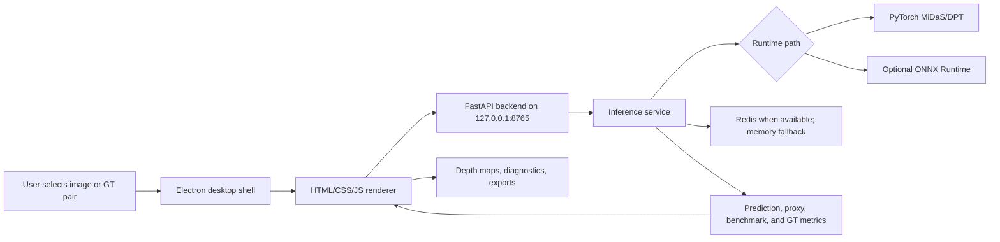
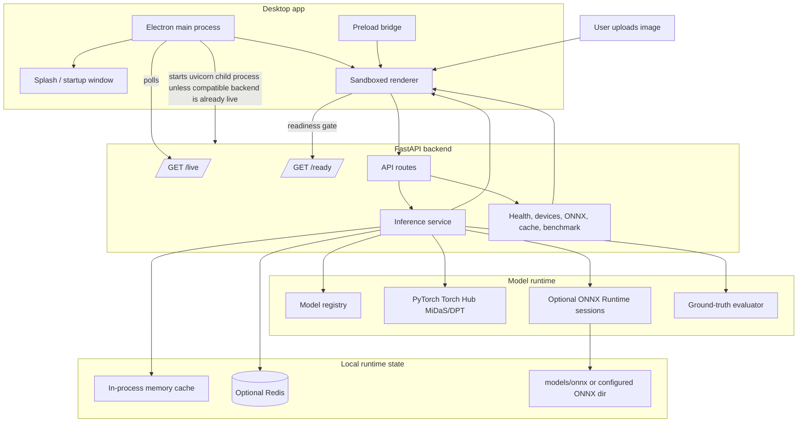

# DepthLens Pro

[](electron-app/package.json)
[](backend/requirements.txt)
[](pyproject.toml)
[](backend/requirements.txt)
[](models/onnx/README.md)
[](electron-app/package.json)

DepthLens Pro is a local-first desktop app for developers, creators, and ML portfolio reviewers who need to turn ordinary 2D images into depth maps with clear diagnostics, model controls, and reproducible local inference.

It pairs an Electron desktop shell with a FastAPI inference backend, PyTorch MiDaS/DPT models, optional ONNX Runtime acceleration, cache telemetry, benchmarking, and ground-truth evaluation tools. The repository is structured as a production-style desktop ML system: explicit setup scripts, health checks, resource verification, ARM-native packaging, Dockerized backend deployment, and CI-friendly tests that avoid heavyweight model downloads by default.

> Visual asset placeholder: no screenshot or GIF is currently committed. Add a hero image at `docs/assets/depthlens-pro-hero.png` after capturing the desktop app, then replace this callout with a Markdown image.



## Table of Contents

- [Project Identity & Pitch](#project-identity--pitch)
- [Key Features](#key-features)
- [Tech Stack](#tech-stack)
- [Why This Stack](#why-this-stack)
- [Architecture](#architecture)
- [How It Works](#how-it-works)
- [Quick Start / Runbook](#quick-start--runbook)
- [Configuration](#configuration)
- [Testing & Quality Assurance](#testing--quality-assurance)
- [Production & Deployment](#production--deployment)
- [API Reference](#api-reference)
- [Models, Metrics, and Ground Truth](#models-metrics-and-ground-truth)
- [Project Structure](#project-structure)
- [Troubleshooting](#troubleshooting)
- [Security](#security)
- [Contributing](#contributing)
- [License](#license)
- [Maintainer](#maintainer)
- [Acknowledgements](#acknowledgements)

## Project Identity & Pitch

DepthLens Pro is a desktop-grade monocular depth-estimation workstation that keeps images and inference local while exposing the operational signals developers expect from production ML software.

The repository demonstrates how to ship an AI-assisted desktop tool without hiding the engineering: Electron owns the user experience and backend process lifecycle, FastAPI owns inference and diagnostics, PyTorch provides the reliable model path, ONNX Runtime is optional acceleration, and every startup path has explicit verification commands.

## Key Features

- Local-first image-to-depth workflow with drag-and-drop upload, optional ground-truth pairing, result cards, preview lightbox, downloads, and persistent UI preferences.
- MiDaS-family model registry for `midas_small`, `dpt_hybrid`, and `dpt_large`, with aliases normalized to canonical IDs.
- Device-aware PyTorch inference with CPU fallback and runtime discovery for CUDA, MPS, and XPU where the local PyTorch installation supports them.
- Optional ONNX Runtime path for exported `.onnx` graphs, with diagnostics that explain missing, invalid, or provider-incompatible weights instead of breaking PyTorch inference.
- Health, readiness, cache, ONNX, benchmark, and model endpoints designed for desktop startup checks and developer debugging.
- Real-Time Webcam Depth MVP samples browser/Electron camera frames, sends capped-FPS JPEG uploads to the local FastAPI `/estimate` endpoint, and previews live depth maps without any frames leaving localhost. Start with MiDaS Small for the smoothest first demo.

## Tech Stack

| Layer | Technology | Source of truth | Role |
|---|---|---|---|
| Desktop shell | Electron `^42.3.0`, electron-builder `^26.8.1` | `electron-app/package.json` | Native window, sandboxed renderer, backend child-process lifecycle, ARM packaging. |
| Renderer | HTML, CSS, vanilla JavaScript, Chart.js CDN | `frontend/index.html`, `frontend/script.js`, `frontend/style.css` | Upload UI, diagnostics panels, benchmark charts, exports, local preferences. |
| Backend API | FastAPI `0.135.3`, Uvicorn `0.44.0` | `backend/requirements.txt`, `backend/main.py` | ASGI routes, JSON logging, CORS, liveness/readiness, inference endpoints. |
| ML runtime | PyTorch `2.11.0`, torchvision `0.26.0`, timm `1.0.26` | `backend/requirements.txt` | Primary MiDaS/DPT inference path via Torch Hub. |
| Optional acceleration | ONNX `1.20.1`, ONNX Runtime `1.24.3`, onnxscript `0.7.0` | `backend/requirements.txt`, `models/onnx/README.md` | Static-graph export, validation, benchmarking, provider diagnostics. |
| Image processing | OpenCV Headless `4.13.0.92`, NumPy `2.4.4`, Pillow `12.2.0` | `backend/requirements.txt` | Decode, resize, colorize, normalize, and evaluate images/GT files. |
| Cache | Redis Python client `6.4.0`, in-memory fallback | `backend/services/cache_service.py`, `docker-compose.yml` | Response cache with JSON serialization and Redis degradation handling. |
| Tooling | Black, Ruff, mypy, pytest, npm tests | `pyproject.toml`, `mypy.ini`, `.github/workflows/ci.yml` | Formatting, linting, static typing, backend unit tests, Electron policy tests. |
| Containers | Docker, Docker Compose, Redis | `Dockerfile`, `docker-compose.yml` | Backend-only deployment path with optional Redis service. |

## Why This Stack

Electron plus a static renderer keeps the desktop experience portable and easy to package, while FastAPI provides a clean local HTTP boundary between UI code and Python ML code. That boundary makes the app easier to test, diagnose, and run either as a native desktop app or as a backend-only service.

PyTorch remains the dependable inference path for MiDaS/DPT models. ONNX Runtime is treated as an optional optimization layer because exported graphs and providers are platform-sensitive; the backend reports ONNX readiness separately and falls back to PyTorch when ONNX assets are missing or invalid.

## Architecture

DepthLens Pro is split into explicit layers so desktop UX, backend lifecycle, model execution, cache behavior, and diagnostics can fail independently and report useful status.



| Boundary | Files | Responsibility |
|---|---|---|
| Electron main process | `electron-app/main.js`, `electron-app/scripts/backend-lifecycle.js` | Single-instance app lock, resource discovery, backend port selection, backend PID metadata, startup polling, safe shutdown. |
| Security policy | `electron-app/preload.js`, `electron-app/src/security-policy.js`, `electron-app/src/backend-process-policy.js` | Context isolation, no Node integration in the renderer, navigation filtering, and owned-process checks. |
| Renderer UI | `frontend/index.html`, `frontend/script.js`, `frontend/style.css` | Upload flow, model/device/colormap controls, GT mode, comparison workspace, experiments, benchmark panel, cache metrics, downloads. |
| API layer | `backend/main.py`, `backend/api/live.py`, `backend/api/routes.py` | FastAPI app, JSON logs, liveness, readiness, inference routes, cache endpoints, benchmark and diagnostics endpoints. |
| Inference services | `backend/services/inference.py`, `backend/depth_models.py` | Decode images, resolve models/devices, execute PyTorch or ONNX, normalize/colorize outputs, compute metrics, cache results. |
| Models and assets | `backend/model_registry.py`, `models/README.md`, `models/onnx/README.md` | Canonical model metadata, ONNX search paths, optional generated model assets. |
| Cache | `backend/services/cache_service.py`, `docker-compose.yml` | Redis-backed cache when reachable, memory fallback when Redis is absent or failing, safe JSON cache envelopes. |
| Diagnostics | `backend/services/diagnostics.py`, `backend/services/onnx_diagnostics.py`, `backend/services/benchmarks.py`, `scripts/diagnose_backend.py` | Health payloads, provider checks, ONNX validation, latency benchmarking, port and install diagnostics. |

## How It Works

1. Electron starts first for native desktop usage and creates a local-only backend URL, defaulting to `http://127.0.0.1:8765`.
2. If a valid DepthLens backend is already live, Electron reuses it; otherwise it launches Uvicorn against `backend.app:app` from the packaged or repo-root Python environment.
3. The renderer waits for `/ready` before enabling inference controls, then loads `/health`, `/devices`, `/models`, `/colormaps`, `/cache/metrics`, and `/onnx/status` for diagnostics.
4. `/estimate` decodes one image, normalizes model/device/output options, optionally decodes a GT depth file, runs inference, computes requested metrics, caches eligible responses, and returns base64 image outputs.
5. `/batch` applies the same inference path to up to 10 image uploads and reports per-file success or failure.
6. `/api/reconstruct` reuses the local inference/depth-cache path to export an approximate colored PLY/OBJ point cloud from relative monocular depth.
7. `/benchmark` compares the PyTorch path against ONNX Runtime when an exported ONNX graph and compatible provider are available.

## Quick Start / Runbook

This section is intentionally detailed. If you are new to the project, follow it in order and prefer the safe path that skips ONNX export until the app is running.

### Choose Your Path

| Path | Use when | Starts | Recommended first? |
|---|---|---|---|
| Path A: Native Desktop App | You are on a supported ARM64 desktop and want the full packaged app. | Electron plus an Electron-owned FastAPI backend. | Yes, for normal app usage. |
| Path B: Local Development | You want to edit or inspect the renderer/Electron app while running the backend from a terminal. | One manual FastAPI process plus Electron dev shell. | Yes, for contributors. |
| Path C: Backend Only | You only need the HTTP API, tests, or diagnostics. | FastAPI only. | Yes, for API work. |
| Path D: Docker Compose | You want the backend service and Redis in containers. | Backend container plus Redis container. | Optional; requires Docker. |

> Native packaging scripts enforce ARM64/aarch64. The macOS packaged target is macOS Apple Silicon only, the Windows packaged target is Windows ARM only, and the Linux packaged target is Linux ARM only; Intel Mac / macOS x64, Windows x64, Linux x64, and macOS universal native packages are intentionally blocked by the current build scripts.

### Prerequisites

Install these before running setup:

| Tool | Version guidance | Why it is needed |
|---|---|---|
| Git | Any current stable release | Clone and inspect the repository. |
| Python | Python 3.12 is the project target; setup accepts Python 3.10 through 3.12. | Backend runtime, tests, model export, diagnostics. |
| Node.js and npm | A current Node.js LTS release is recommended; no `engines` field is pinned. | Electron install, tests, and packaging. |
| Docker Desktop or Docker Engine | Optional. | Only needed for the Docker Compose path. |

Check your local tools:

```bash
git --version
```

```bash
python3 --version
```

```bash
node --version
```

```bash
npm --version
```

On Windows PowerShell, use:

```powershell
git --version
```

```powershell
python --version
```

```powershell
node --version
```

```powershell
npm --version
```

### Clone the Repository

No Git remote is configured in this checkout. Replace `<owner>` with the GitHub owner when cloning elsewhere.

```bash
git clone https://github.com/<owner>/DepthLensPro.git
```

```bash
cd DepthLensPro
```

```bash
git status
```

### Environment Setup Basics

The setup scripts create or repair the repo-owned `venv`, install Python dependencies, install Electron dependencies, ensure `models/onnx/` exists, and verify Electron resources.

Use the explicit no-ONNX option for the first run. It avoids downloading large model weights during setup; PyTorch can still lazy-load models later when you actually run inference.

macOS ARM64:

```bash
scripts/setup-macos.sh --without-onnx
```

Linux ARM64/aarch64:

```bash
scripts/setup-linux.sh --without-onnx
```

Windows ARM64 PowerShell:

```powershell
.\scripts\setup-windows.ps1 --without-onnx
```

Cross-platform npm wrappers are also available from the repository root:

```bash
npm run setup
```

```bash
npm run setup:mac
```

```bash
npm run setup:linux
```

```powershell
npm run setup:win
```

What successful setup looks like:

- A `venv/` directory exists at the repository root.
- `electron-app/node_modules/` exists.
- `models/onnx/` exists, even if it contains no `.onnx` files.
- `npm run verify:resources` succeeds.
- The setup summary reports backend dependencies and resource verification as `ok`.

Verify the installed Python environment:

```bash
venv/bin/python -m pip check
```

On Windows PowerShell:

```powershell
.\venv\Scripts\python.exe -m pip check
```

Verify Electron resource discovery:

```bash
npm run verify:resources
```

### Path A: Native Desktop App

Use this path when you want the packaged desktop app. The native app starts Electron first. Electron then starts and stops the FastAPI backend for you unless it detects an already-running valid DepthLens backend.

The backend binds to `127.0.0.1`. The default requested port is `8765`; Electron may probe nearby ports when the default is unavailable unless `DEPTHLENS_BACKEND_PORT` pins a port.

#### macOS Apple Silicon

Build the ARM64 app while skipping ONNX binaries:

```bash
scripts/build-native-macos.sh --without-onnx
```

Open the built app:

```bash
open "electron-app/dist/mac-arm64/DepthLens Pro.app"
```

If you previously installed an older copy, quit the app and replace the stale installed copy before opening the fresh build:

```bash
rm -rf "/Applications/DepthLens Pro.app"
```

#### Windows ARM64

Build the ARM64 installer and unpacked app:

```powershell
.\scripts\build-native-windows.ps1 --without-onnx
```

Run the unpacked app directly:

```powershell
& ".\electron-app\dist\win-arm64-unpacked\DepthLens Pro.exe"
```

If an older installed copy keeps launching, uninstall DepthLens Pro from Windows Settings or remove the stale user-local install before reinstalling.

#### Linux ARM64/aarch64

Build the ARM64 AppImage:

```bash
scripts/build-native-linux.sh --without-onnx
```

Make the AppImage executable:

```bash
chmod +x electron-app/dist/*arm64*.AppImage
```

Run it:

```bash
./electron-app/dist/*arm64*.AppImage
```

If an old desktop entry or AppImage launches instead, replace the stale copy under your install location, such as `/opt`, `/usr/local/bin`, or `~/.local/share/applications`.

#### Native app startup checks

When the app opens successfully:

- The splash/startup flow should advance after `/live` responds.
- The main UI should show the depth engine as online or warming.
- Inference controls should become available after `/ready` passes.
- Diagnostics panels should populate devices, cache metrics, and ONNX status.

If the UI says the engine is offline, run diagnostics from the repo root:

```bash
python scripts/diagnose_backend.py
```

On Windows PowerShell:

```powershell
python .\scripts\diagnose_backend.py
```

### Path B: Local Development

Use this path when you want two visible processes: a backend terminal and an Electron dev shell. This is the easiest mode for debugging because backend logs stay in your terminal.

Install dependencies first:

```bash
scripts/setup-macos.sh --without-onnx
```

Or on Linux ARM64/aarch64:

```bash
scripts/setup-linux.sh --without-onnx
```

Or on Windows ARM64 PowerShell:

```powershell
.\scripts\setup-windows.ps1 --without-onnx
```

Start the backend from the repository root:

```bash
npm run backend:dev
```

On success, Uvicorn serves the API at `http://127.0.0.1:8765`. Leave this terminal open.

Open a second terminal and verify liveness:

```bash
curl http://127.0.0.1:8765/live
```

Verify readiness:

```bash
curl http://127.0.0.1:8765/ready
```

Verify ONNX diagnostics:

```bash
curl http://127.0.0.1:8765/onnx/status
```

Start the Electron dev shell from the second terminal:

```bash
npm run frontend:dev
```

On Windows PowerShell, use these verification commands:

```powershell
Invoke-RestMethod http://127.0.0.1:8765/live
```

```powershell
Invoke-RestMethod http://127.0.0.1:8765/ready
```

```powershell
Invoke-RestMethod http://127.0.0.1:8765/onnx/status
```

```powershell
npm run frontend:dev
```

What this starts:

- Terminal 1 owns the FastAPI backend.
- Terminal 2 owns Electron.
- Electron talks to the already-running backend instead of needing to launch a packaged child process.

### Path C: Backend Only

Use this path for API development, automated checks, or a lightweight inference service without Electron.

Run setup:

```bash
npm run setup
```

Start FastAPI:

```bash
npm run backend:dev
```

Alternatively, call Uvicorn directly:

```bash
venv/bin/python -m uvicorn backend.app:app --host 127.0.0.1 --port 8765
```

On Windows PowerShell:

```powershell
.\venv\Scripts\python.exe -m uvicorn backend.app:app --host 127.0.0.1 --port 8765
```

Check the service root:

```bash
curl http://127.0.0.1:8765/
```

Check cheap liveness:

```bash
curl http://127.0.0.1:8765/live
```

Check full readiness before inference:

```bash
curl http://127.0.0.1:8765/ready
```

### Path D: Docker Compose

Use Docker Compose when you want the backend service and Redis cache in containers. This path does not start Electron.

> Docker may download large Python dependency layers and PyTorch wheels. Use native setup for faster local iteration when you do not need containers.

Start the backend and Redis:

```bash
docker compose up --build
```

Run it in the background:

```bash
docker compose up --build -d
```

Check container status:

```bash
docker compose ps
```

Check backend liveness:

```bash
curl http://127.0.0.1:8765/live
```

Stop the containers:

```bash
docker compose down
```

Stop containers and remove the Redis volume:

```bash
docker compose down -v
```

### Optional ONNX Setup

ONNX files are optional. The repository keeps `models/onnx/` committed as a directory, but generated `.onnx` binaries are intentionally not committed by default.

Export or validate MiDaS Small ONNX during setup:

```bash
scripts/setup-macos.sh --with-onnx --onnx-models midas_small --onnx-strict
```

Linux ARM64/aarch64 equivalent:

```bash
scripts/setup-linux.sh --with-onnx --onnx-models midas_small --onnx-strict
```

Windows ARM64 PowerShell equivalent:

```powershell
.\scripts\setup-windows.ps1 --with-onnx --onnx-models midas_small --onnx-strict
```

Validate all configured ONNX models after setup:

```bash
npm run verify:onnx
```

Export manually from an existing environment:

```bash
venv/bin/python backend/scripts/export_onnx.py --model midas_small --force
```

Validate manually:

```bash
venv/bin/python backend/scripts/export_onnx.py --validate-only --model midas_small --strict
```

If ONNX is missing or invalid, PyTorch inference remains the fallback path. `/onnx/status` and `/benchmark` explain what is missing and which export command to run.

### Verify Everything Works

Run the backend diagnostic report:

```bash
python scripts/diagnose_backend.py
```

Check model metadata:

```bash
curl http://127.0.0.1:8765/models
```

Check available colormaps:

```bash
curl http://127.0.0.1:8765/colormaps
```

Check cache metrics:

```bash
curl http://127.0.0.1:8765/cache/metrics
```

Check device discovery:

```bash
curl http://127.0.0.1:8765/devices
```

Run Electron lightweight tests:

```bash
cd electron-app
npm test
```

Return to the repository root afterward:

```bash
cd ..
```

### Stop the Application

For local development, stop the manual backend with `Ctrl-C` in the terminal running `npm run backend:dev`.

If Electron owns the backend, quitting the desktop app should stop the backend child process. You can also ask the Electron helper to kill an owned backend:

```bash
npm run stop:backend
```

From inside `electron-app/`, the equivalent command is:

```bash
npm run kill:backend
```

For Docker Compose:

```bash
docker compose down
```

### Avoid Stale Backends and Port Conflicts

DepthLens Pro uses port `8765` by default. Before starting a second backend, run diagnostics:

```bash
python scripts/diagnose_backend.py
```

On macOS/Linux, inspect the port directly when `lsof` is installed:

```bash
lsof -nP -iTCP:8765 -sTCP:LISTEN
```

On Windows PowerShell:

```powershell
Get-NetTCPConnection -LocalPort 8765 -State Listen
```

Only kill a process after confirming it is a stale DepthLens backend.

macOS/Linux example:

```bash
kill <pid>
```

Windows PowerShell example:

```powershell
taskkill /PID <pid> /F
```

If you intentionally need a different port for Electron, pin it before launching Electron:

```bash
DEPTHLENS_BACKEND_PORT=8770 npm run frontend:dev
```

For the backend itself, pass a matching Uvicorn port:

```bash
venv/bin/python -m uvicorn backend.app:app --host 127.0.0.1 --port 8770
```

### Common Setup Problems

| Symptom | Likely cause | Fix |
|---|---|---|
| Setup chooses the wrong Python | `python3` points to an unsupported or broken install. | Use the platform setup script; it searches Python 3.10 through 3.12 and recreates invalid `venv` directories. |
| `pip check` fails | Dependency installation was interrupted or the old venv is stale. | Delete `venv/` and rerun the platform setup script with `--without-onnx`. |
| App says resources are missing | Packaged app lacks `backend/`, `frontend/`, `venv/`, `models/`, or `models/onnx/`. | Run `npm run verify:resources`, then rebuild with the root native build script. |
| `/live` works but `/ready` fails | Required Python modules such as `torch`, `cv2`, `PIL`, `fastapi`, `uvicorn`, or `numpy` are missing. | Rerun setup and then run `venv/bin/python -m pip check`. |
| ONNX Performance Analysis is unavailable | `.onnx` files were not exported or are incompatible with the local provider. | Use PyTorch fallback or export/validate ONNX with the commands above. |
| Redis is unavailable | Redis is optional and may not be running locally. | Use memory fallback for local development or start Docker Compose for Redis. |
| zsh prints `command not found: #` after pasting comments | Interactive zsh comments are disabled. | Paste commands without comment lines or enable interactive comments in your shell. |
| PowerShell blocks setup scripts | Execution policy blocks local scripts. | Run the provided npm wrapper or temporarily set a process-scoped bypass in your terminal. |
| Linux setup cannot create a venv | The distro package for Python venv support is missing. | Install the matching `python3.12-venv` or distro equivalent, then rerun setup. |

## Configuration

DepthLens Pro reads process environment variables and, for backend settings, an optional `.env` file at the repository root. No `.env.example` file is currently committed.

Safe starter `.env` for local backend work:

```env
HOST=127.0.0.1
PORT=8765
LOG_LEVEL=INFO
DEBUG=false
REDIS_HOST=127.0.0.1
REDIS_PORT=6379
REDIS_DB=0
CACHE_TTL_SECONDS=3600
CACHE_MAX_ENTRIES=256
DEPTHLENS_PRELOAD_MODEL=false
DEPTHLENS_WARMUP_MODEL=MiDaS_small
DEPTHLENS_WARMUP_DEVICE=auto
DEPTHLENS_MAX_DIM=1536
DEPTHLENS_DEFAULT_METRICS=fast
DEPTHLENS_DEFAULT_OUTPUTS=color
```

| Variable | Required | Default | Purpose | Example | Used by |
|---|---:|---|---|---|---|
| `HOST` | No | `127.0.0.1` locally; `0.0.0.0` in Docker | ASGI bind host. | `127.0.0.1` | `backend/config.py`, `Dockerfile`, `docker-compose.yml` |
| `PORT` | No | `8765` | ASGI port. | `8765` | `backend/config.py`, `Dockerfile`, `docker-compose.yml` |
| `LOG_LEVEL` | No | `INFO` locally; `info` in Docker | Backend JSON log level. | `DEBUG` | `backend/config.py`, `backend/main.py` |
| `DEBUG` | No | `false` | Enables FastAPI debug mode. | `false` | `backend/config.py`, `backend/main.py` |
| `REDIS_URL` | No | unset | Full Redis URL override. | `redis://redis:6379/0` | `backend/services/cache_service.py` |
| `REDIS_HOST` | No | `127.0.0.1` locally; `redis` in Compose | Redis host when `REDIS_URL` is unset. | `redis` | `backend/config.py`, `docker-compose.yml` |
| `REDIS_PORT` | No | `6379` | Redis port. | `6379` | `backend/config.py`, `docker-compose.yml` |
| `REDIS_DB` | No | `0` | Redis logical DB. | `0` | `backend/config.py`, `docker-compose.yml` |
| `REDIS_PASSWORD` | No | unset | Optional Redis password. | unset | `backend/config.py`, `docker-compose.yml` |
| `REDIS_SOCKET_TIMEOUT_SECONDS` | No | `1.5` | Redis connect/read timeout. | `1.5` | `backend/config.py`, `backend/services/cache_service.py` |
| `REDIS_MAX_CONNECTIONS` | No | `20` | Redis connection pool size. | `20` | `backend/config.py`, `backend/services/cache_service.py` |
| `CACHE_TTL_SECONDS` | No | `3600` | Cache entry TTL. | `3600` | `backend/config.py`, `backend/services/cache_service.py` |
| `CACHE_MAX_ENTRIES` | No | `256` | In-memory cache entry limit. | `256` | `backend/config.py`, `backend/services/cache_service.py` |
| `DEPTHLENS_PRELOAD_MODEL` | No | `false` | Enables background model warmup after liveness is available. | `false` | `backend/main.py` |
| `DEPTHLENS_WARMUP_MODEL` | No | `MiDaS_small` | Model used for optional warmup. | `midas_small` | `backend/main.py` |
| `DEPTHLENS_WARMUP_DEVICE` | No | `auto` | Device used for optional warmup. | `cpu` | `backend/main.py` |
| `DEPTHLENS_SKIP_WARMUP` | No | unset | Skips warmup in tests/CI. | `1` | `backend/main.py`, `scripts/doctor.py` |
| `DEPTHLENS_MAX_DIM` | No | `1536` | Maximum long image edge for interactive inference. | `1024` | `backend/config.py`, `backend/services/inference.py` |
| `DEPTHLENS_DEFAULT_METRICS` | No | `fast` | Default metrics mode for `/estimate` and `/batch`. | `full` | `backend/config.py`, `backend/api/routes.py` |
| `DEPTHLENS_DEFAULT_OUTPUTS` | No | `color` | Default response outputs. | `color,gray` | `backend/config.py`, `backend/services/inference.py` |
| `DEPTHLENS_BACKEND_PORT` | No | `8765` | Electron and diagnostics requested backend port. | `8770` | `electron-app/main.js`, `scripts/diagnose_backend.py` |
| `DEPTHLENSPRO_MODEL_DIR` | No | unset | Custom model directory; ONNX path resolves under it. | `/opt/depthlens/models` | `backend/model_registry.py` |
| `DEPTHLENS_ONNX_DIR` | No | unset | Custom ONNX directory. | `/opt/depthlens/onnx` | `backend/model_registry.py`, `scripts/diagnose_backend.py` |
| `ONNX_WEIGHTS_DIR` | No | unset | Legacy/custom ONNX directory. | `/workspace/DepthLensPro/models/onnx` | `backend/model_registry.py`, `scripts/diagnose_backend.py` |
| `DEPTHLENS_AUTO_EXPORT_ONNX` | No | `false` | Allows benchmark requests to export missing ONNX graphs on demand. | `false` | `backend/services/benchmarks.py` |
| `INFERENCE_MAX_CONCURRENCY` | No | `2` | Concurrent inference semaphore size. | `2` | `backend/services/inference.py`, `Dockerfile`, `docker-compose.yml` |
| `ORT_INTRA_OP_NUM_THREADS` | No | CPU-dependent locally; `2` in Docker | ONNX Runtime intra-op threads. | `2` | `backend/depth_models.py`, `Dockerfile`, `docker-compose.yml` |
| `ORT_INTER_OP_NUM_THREADS` | No | `1` | ONNX Runtime inter-op threads. | `1` | `backend/depth_models.py`, `Dockerfile`, `docker-compose.yml` |
| `WEB_CONCURRENCY` | No | `1` | Uvicorn worker count in Docker. | `1` | `Dockerfile`, `docker-compose.yml` |
| `NVIDIA_VISIBLE_DEVICES` | No | `all` in Compose | Optional NVIDIA container runtime hint. | `all` | `docker-compose.yml` |
| `NVIDIA_DRIVER_CAPABILITIES` | No | `compute,utility` in Compose | Optional NVIDIA container runtime hint. | `compute,utility` | `docker-compose.yml` |
| `TESTING`, `CI`, `CODEX_ENV` | No | unset | Test/automation flags used to skip heavyweight behavior in local/CI contexts. | `1` | tests, setup guidance, warmup path |

## Testing & Quality Assurance

CI installs Python dependencies, then runs Black, Ruff, mypy, pytest, and Electron lightweight tests. Backend tests use mocks/stubs for model loading, ONNX, Redis, and process behavior where heavyweight dependencies would be slow or environment-specific.

| Check | Command block below | Validates |
|---|---|---|
| Python formatting | Black check | Black formatting with line length 100. |
| Python linting | Ruff check | Ruff lint rules `E`, `F`, `W`, and import sorting. |
| Python typing | mypy check | Strict mypy checks for backend code, excluding tests. |
| Backend tests | pytest | Routes, cache safety, model registry, ONNX guards, diagnostics, warmup, Docker config, GT handling. |
| Electron tests | npm test from `electron-app/` | Security policy and resource verification tests. |
| Resource verification | npm resource verification from the repo root | Required backend/frontend/venv/models resources for Electron packaging. |

Run the Python checks from the repository root:

```bash
black --check .
```

```bash
ruff check .
```

```bash
mypy backend/
```

```bash
pytest
```

Run Electron lightweight tests:

```bash
cd electron-app
npm test
```

Run the same checks as a single local recipe after dependencies are installed:

```bash
black --check . && ruff check . && mypy backend/ && pytest && cd electron-app && npm test
```

## Production & Deployment

DepthLens Pro has two production-style outputs: an ARM-native Electron app and a backend-only Docker service.

| Target | Command block below | Artifact or result |
|---|---|---|
| macOS Apple Silicon app | macOS ARM64 build | `electron-app/dist/mac-arm64/DepthLens Pro.app` and DMG output. |
| Windows ARM64 app | Windows ARM64 build | `electron-app/dist/win-arm64-unpacked/` and NSIS installer output. |
| Linux ARM64 AppImage | Linux ARM64 build | `electron-app/dist/*arm64*.AppImage`. |
| Backend Docker image | Docker build | Local backend image. |
| Backend plus Redis | Docker Compose | FastAPI backend on port `8765` and Redis service. |

Root-level native wrappers are available:

```bash
npm run build:mac:arm64
```

```bash
npm run build:linux:arm64
```

```powershell
npm run build:win:arm64
```

Direct Docker build:

```bash
docker build -t depthlenspro-backend:latest .
```

Docker Compose:

```bash
docker compose up --build
```

The packaging verification script `verify-packaged-resources.js` checks packaged resources. Unsupported native packaging targets are explicitly wired to fail: macOS x64, macOS universal, Windows x64, and Linux x64. The backend can run on other machines when Python dependencies install successfully, but the native app packaging scripts are ARM64-only in this repository.

## API Reference

Base URL for local development is usually:

```text
http://127.0.0.1:8765
```

| Method | Path | Purpose |
|---|---|---|
| `GET` | `/` | Service name and API version. |
| `GET` | `/live` | Cheap liveness heartbeat with status, service, version, PID, timestamp, uptime, and busy state. |
| `GET` | `/ready` | Import/readiness report for required modules, optional modules, torch runtime, ONNX status, models, colormaps, and settings. |
| `GET` | `/health` | Full diagnostics including devices, cache metrics, loaded models, acceleration checks, ONNX, memory, disk, warmup, and telemetry. |
| `GET` | `/devices` | Cached device inventory and primary device. |
| `GET` | `/models` | Canonical model registry payload. |
| `GET` | `/colormaps` | Supported colormap names. |
| `GET` | `/onnx/status` | ONNX import, provider, path, session, and model-file diagnostics. |
| `GET` | `/benchmark` | PyTorch-vs-ONNX benchmark for model/device/iteration choices. |
| `GET` | `/api/benchmark` | Frontend-compatible alias for `/benchmark`. |
| `GET` | `/cache/metrics` | Cache backend, hit/miss, keyspace, Redis, TTL, and memory-limit metrics. |
| `DELETE` | `/cache` | Clear Redis and in-memory cache entries. |
| `POST` | `/estimate` | Single-image depth estimation with optional GT file and configurable metrics/outputs. |
| `POST` | `/api/reconstruct` | Backend-only 3D reconstruction API that returns a base64 colored PLY/OBJ point-cloud artifact, depth preview PNG, preview points, and reconstruction metadata. |
| `POST` | `/reconstruct` | Alias for `/api/reconstruct`. |
| `POST` | `/batch` | Batch depth estimation for up to 10 image files. |

`/api/reconstruct` form fields:

| Field | Type | Default | Notes |
|---|---|---|---|
| `file` | upload | required | Must be an `image/*` upload; max 20 MB. |
| `model` | string | `MiDaS_small` | Uses the same canonical model validation and local inference pipeline as `/estimate`. |
| `device` | string | `auto` | Resolved with the same device validation as `/estimate`. |
| `colormap` | string | `inferno` | Depth preview colormap. |
| `max_dim` | integer | `DEPTHLENS_MAX_DIM` | Optional long-edge resize limit before inference/reconstruction. |
| `export_format` | string | `ply` | `ply` or `obj`; returned as base64 in `artifact_base64`. |
| `max_points` | integer | `120000` | Reconstructed point budget, bounded by the backend for safe response sizes. |
| `preview_points` | integer | `5000` | JSON preview point budget for a future WebGL/canvas panel. |
| `focal_scale` | float | `1.2` | Approximate pinhole focal length multiplier; this is not metric calibration. |
| `depth_scale` | float | `1.0` | Relative Z scale applied after percentile stabilization. |
| `depth_near_percentile` / `depth_far_percentile` | float | `2.0` / `98.0` | Percentile range used to stabilize relative monocular depth before projection. |
| `sampling` | string | `grid` | `grid` or deterministic `random`. |
| `include_rgb` | boolean | `true` | Include RGB vertex colors converted from uploaded image pixels. |
| `coordinate_system` | string | `y_up` | `y_up` for frontend-friendly previews or `camera` for image-coordinate Y. |

The exported point cloud is approximate because monocular depth is relative, not metric-scale accurate. This Stage 1 backend endpoint does not write artifacts to disk and does not add the frontend 3D panel; Stage 2 will replace the current ABOUT tab with the 3D Reconstruction tab/panel that consumes this API.

`/estimate` form fields:

| Field | Type | Default | Notes |
|---|---|---|---|
| `file` | upload | required | Must be an `image/*` upload OpenCV can decode; max 20 MB. |
| `model` | string | `MiDaS_small` | Aliases normalize to `midas_small`, `dpt_hybrid`, or `dpt_large`. |
| `colormap` | string | `inferno` | One of the supported colormaps. |
| `device` | string | `auto` | `auto`, `cpu`, or available discovered devices such as CUDA/MPS/XPU keys. |
| `metrics` | string | `fast` | `none`, `fast`, or `full`. |
| `outputs` | string | `color` | `color`, `gray`, or `color,gray`; legacy aliases are normalized. |
| `max_dim` | integer | `DEPTHLENS_MAX_DIM` | Long-edge resize limit, clamped by backend validation. |
| `gt_file` | upload | optional | GT `.png`, `.tif`, `.tiff`, or `.npy`; max 20 MB. |
| `gt_required` | boolean | `false` | Fails if GT mode is required but no GT file is supplied. |
| `gt_scale` | float | unset | Optional scale applied to GT depth values. |
| `gt_invalid_value` | float | unset | Optional GT invalid sentinel value. |

Example liveness check:

```bash
curl http://127.0.0.1:8765/live
```

Example single-image request:

```bash
curl -X POST http://127.0.0.1:8765/estimate -F "file=@sample.png" -F "model=midas_small" -F "colormap=inferno" -F "device=auto" -F "metrics=fast" -F "outputs=color"
```

Example benchmark request:

```bash
curl "http://127.0.0.1:8765/benchmark?model=midas_small&device=auto&iterations=3"
```

## Models, Metrics, and Ground Truth

### Supported models

| Canonical ID | Display name | PyTorch name | ONNX filename | Input size | Notes |
|---|---|---|---|---:|---|
| `midas_small` | MiDaS Small | `MiDaS_small` | `midas_small.onnx` | `256x256` | Fastest supported model; CPU or GPU. |
| `dpt_hybrid` | DPT Hybrid | `DPT_Hybrid` | `dpt_hybrid.onnx` | `384x384` | GPU preferred; ONNX export may be tooling-sensitive. |
| `dpt_large` | DPT Large | `DPT_Large` | `dpt_large.onnx` | `384x384` | Largest model; GPU recommended for speed. |

The backend accepts common display-name, hyphen, underscore, and PyTorch-name aliases, then returns canonical lowercase IDs.

### Colormaps

Supported colormaps are `inferno`, `plasma`, `viridis`, `magma`, `jet`, `hot`, `bone`, and `turbo`.

### Metrics modes

| Mode | Behavior |
|---|---|
| `none` | Skips expensive metric computation and returns availability metadata. |
| `fast` | Computes lightweight prediction statistics and marks full-only metrics unavailable. |
| `full` | Computes prediction statistics plus proxy diagnostics. |

Metrics are grouped to avoid mixing descriptive prediction statistics, proxy/self-consistency diagnostics, and true ground-truth benchmark metrics.

| Group | Examples | Meaning |
|---|---|---|
| Prediction stats | `min`, `max`, `mean`, `std`, `median`, `dynamic_range`, `entropy`, `coverage`, `histogram` | Describes the normalized predicted depth plane. |
| Proxy metrics | `ssim`, `silog`, `psnr`, `gradient_error`, `mae`, `rmse`, `edge_density` | Self-consistency diagnostics without GT labels. |
| GT metrics | `abs_rel`, `sq_rel`, `gt_mae`, `gt_rmse`, `gt_log_rmse`, `delta_1`, `delta_2`, `delta_3` | Benchmark metrics computed only when valid GT depth is uploaded. |
| Unavailable metrics | `gt_ssim`, `gt_psnr`, `ordinal_error`, `surface_normal_error`, `lpips` | Explicitly reported as unavailable rather than synthesized. |

### Ground-truth evaluation

Ground-truth uploads support `.png`, `.tif`, `.tiff`, and `.npy` files up to 20 MB. The backend decodes GT as `float32`, filters finite positive pixels, applies optional `gt_scale` and `gt_invalid_value`, resizes GT to the prediction shape with nearest-neighbor sampling, median-scale aligns it to the relative prediction, and computes GT metrics.

EXR and PFM ground-truth files are not currently supported.

## Project Structure

```text
DepthLensPro/
├── AGENTS.md
├── CONTRIBUTING.md
├── Dockerfile
├── README.md
├── SECURITY.md
├── docker-compose.yml
├── mypy.ini
├── package.json
├── pyproject.toml
├── backend/
│   ├── api/
│   │   ├── live.py
│   │   └── routes.py
│   ├── services/
│   │   ├── benchmarks.py
│   │   ├── cache_service.py
│   │   ├── diagnostics.py
│   │   ├── ground_truth.py
│   │   ├── inference.py
│   │   └── onnx_diagnostics.py
│   ├── scripts/
│   │   └── export_onnx.py
│   ├── tests/
│   ├── utils/
│   │   └── hardware.py
│   ├── app.py
│   ├── config.py
│   ├── depth_models.py
│   ├── main.py
│   ├── model_metadata.py
│   ├── model_registry.py
│   └── requirements.txt
├── electron-app/
│   ├── main.js
│   ├── preload.js
│   ├── package.json
│   ├── scripts/
│   ├── src/
│   └── test-security-policy.js
├── frontend/
│   ├── index.html
│   ├── script.js
│   ├── style.css
│   └── welcome-anim.js
├── models/
│   ├── README.md
│   └── onnx/
│       ├── .gitkeep
│       └── README.md
└── scripts/
    ├── diagnose_backend.py
    ├── doctor.py
    ├── setup-*.sh / setup-windows.ps1
    └── build-native-*.sh / build-native-windows.ps1
```

## Troubleshooting

Use `/live` and `/ready` for different questions:

- `/live` means the process is running and responding.
- `/ready` means required inference dependencies are importable and runtime readiness checks passed.

### Backend appears offline

Run diagnostics:

```bash
python scripts/diagnose_backend.py
```

Then check liveness manually:

```bash
curl http://127.0.0.1:8765/live
```

If the port is occupied by a stale backend, stop only the confirmed stale DepthLens process.

### Inference controls stay disabled

Check readiness:

```bash
curl http://127.0.0.1:8765/ready
```

Repair dependencies:

```bash
scripts/setup-macos.sh --without-onnx
```

Or on Linux:

```bash
scripts/setup-linux.sh --without-onnx
```

Or on Windows PowerShell:

```powershell
.\scripts\setup-windows.ps1 --without-onnx
```

### ONNX file is missing, empty, or invalid

Check ONNX diagnostics:

```bash
curl http://127.0.0.1:8765/onnx/status
```

Validate existing ONNX files:

```bash
npm run verify:onnx
```

Regenerate MiDaS Small ONNX:

```bash
venv/bin/python backend/scripts/export_onnx.py --model midas_small --force
```

### Packaged app is missing resources

Verify repo-root resources:

```bash
npm run verify:resources
```

Verify packaged macOS resources after a build:

```bash
cd electron-app
npm run verify:packaged:mac
```

Verify packaged Windows resources after a build:

```bash
cd electron-app
npm run verify:packaged:win
```

Verify packaged Linux resources after a build:

```bash
cd electron-app
npm run verify:packaged:linux
```

### Redis is unavailable

Redis is optional for local development. The backend falls back to memory cache when Redis cannot be reached. To use Redis locally, start the Compose stack:

```bash
docker compose up --build
```

### Clean stale installs and build outputs

Clean Electron build output:

```bash
cd electron-app
npm run clean:dist
```

Clean macOS install helpers from `electron-app/` when working on macOS packaging:

```bash
npm run clean:install
```

Scan for stale app copies from `electron-app/`:

```bash
npm run scan:apps
```

## Security

Security posture visible in this repository:

- Electron renderer uses context isolation and does not enable Node integration.
- Navigation policy code restricts app and external URLs.
- Electron tracks backend ownership before killing backend processes.
- FastAPI logs details server-side while generic inference failures return sanitized error envelopes.
- Cache serialization uses versioned JSON and rejects legacy pickle payloads.
- `SECURITY.md` requests private vulnerability reporting instead of public issues.

Do not include secrets in `.env`, screenshots, test fixtures, or issue reports. There are no required credentials for the default local setup.

## Contributing

See `CONTRIBUTING.md` for setup, validation, and pull request expectations.

Before opening a pull request, run the lightweight checks that match CI:

```bash
black --check .
```

```bash
ruff check .
```

```bash
mypy backend/
```

```bash
pytest
```

```bash
cd electron-app
npm test
```

Keep changes focused, preserve API response compatibility unless intentionally discussed, and update documentation when setup or operational behavior changes.

## License

No `LICENSE` file is currently present in this repository. Treat the code as not explicitly open-source licensed until a license file is added by the maintainer.

## Maintainer

The Electron package metadata lists the app identifier `com.ayushmanraha.depthlens-pro` and product name `DepthLens Pro`. A public maintainer contact is not currently documented in the repository.

## Acknowledgements

DepthLens Pro builds on the MiDaS/DPT model family from Intel ISL, PyTorch, ONNX Runtime, FastAPI, Electron, OpenCV, NumPy, Pillow, Redis, and the broader Python and JavaScript open-source ecosystems.
