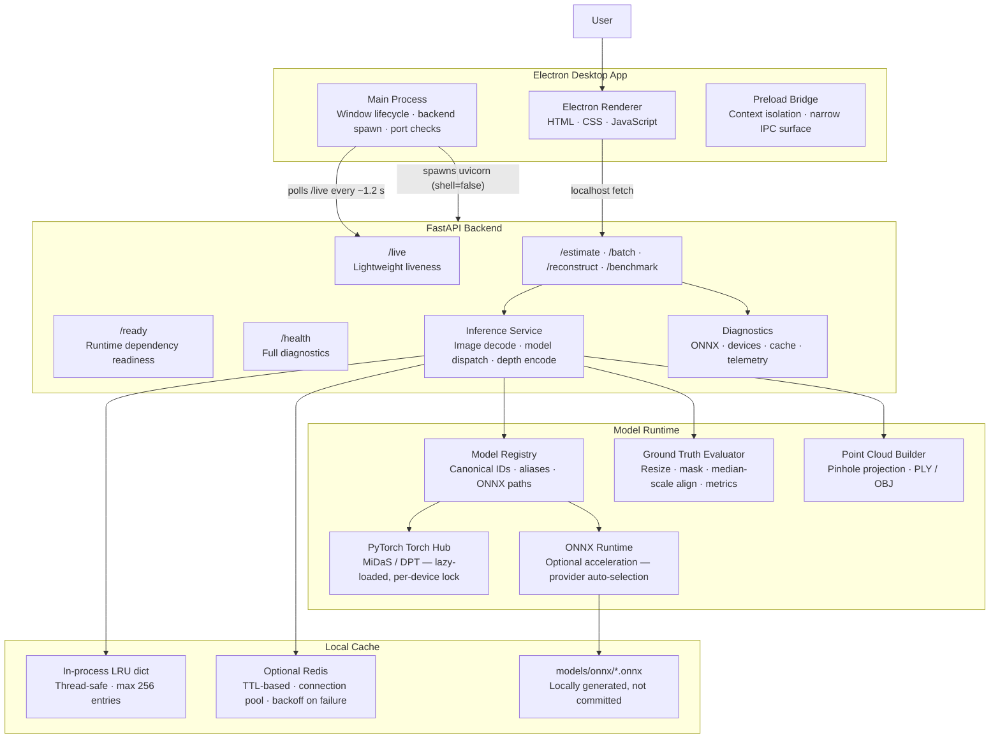
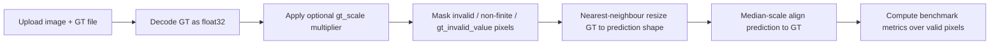

<div align="center">

# DepthLens Pro

### Local-first monocular depth estimation for desktop workflows

Turn ordinary 2D images into depth maps, compare neural depth models, benchmark ONNX acceleration, evaluate against ground truth, and export approximate 3D point clouds — all from a desktop app running on your own machine.

<br/>

[](electron-app/package.json)
[](backend/api/live.py)
[](electron-app/package.json)
[](backend/requirements.txt)
[](scripts/doctor.py)

[](backend/requirements.txt)
[](backend/requirements.txt)
[](#security)
[](LICENSE)

<br/>

**No cloud uploads. No API keys. No subscription.**
Images are processed through a local Electron + FastAPI + PyTorch/ONNX pipeline.

</div>

---


## Refactor Safety Contract

DepthLens Pro now tracks a behavior-preservation baseline for internal refactor phases. See [`docs/refactor-contract.md`](docs/refactor-contract.md) for the public API, UI, install/build, platform, and allowed-file-change contract, and [`docs/refactor-test-matrix.md`](docs/refactor-test-matrix.md) for the required phase-gate commands.

The existing native installation workflow remains the public workflow for both standard and ONNX builds: **clone → setup → build → launch**. Subsequent internal refactors must preserve all public setup, build, launch, resource verification, and ONNX verification commands.

## Table of Contents

| Section | What it covers |
|---|---|
| [Overview](#overview) | What the app does and who it is useful for |
| [How Monocular Depth Estimation Works](#how-monocular-depth-estimation-works) | The ML pipeline explained step by step |
| [Highlights](#highlights) | Core capabilities at a glance |
| [Feature Tour](#feature-tour) | Workspace, webcam, comparison, experiments, performance, and 3D tools |
| [Architecture](#architecture) | How Electron, FastAPI, PyTorch, ONNX, and cache layers work together |
| [Quick Start](#quick-start) | Fast setup for local use |
| [Installation Guide](#installation-guide) | Native, development, backend-only, Docker, and ONNX setup |
| [Configuration](#configuration) | Environment variables and runtime settings |
| [API Reference](#api-reference) | HTTP endpoints, request fields, and response behavior |
| [Models, Colormaps & Metrics](#models-colormaps--metrics) | Supported MiDaS/DPT models and evaluation modes |
| [Ground Truth Evaluation](#ground-truth-evaluation) | GT file support and benchmark metric flow |
| [Understanding Depth Metrics](#understanding-depth-metrics) | What each metric measures and when to use it |
| [Testing & CI](#testing--ci) | Local checks and GitHub Actions pipeline |
| [Production & Packaging](#production--packaging) | Platform-specific 4-step builds, ONNX variants, and Docker deployment |
| [Troubleshooting](#troubleshooting) | Common setup/runtime problems and fixes |
| [Security](#security) | Local-first design, renderer isolation, and process safeguards |
| [Project Structure](#project-structure) | Repository map |
| [Contributing](#contributing) | Development and PR checklist |

---

## Overview

**DepthLens Pro** is a desktop application for generating **monocular depth maps** from regular images.

In plain English: give the app a photo, choose a model, and it predicts which parts of the scene are closer or farther away. The output can be used for visual effects, depth-aware editing, computer vision experiments, point-cloud previews, and model benchmarking.

Technically, the app combines:

- **Electron** for the desktop shell (main process, renderer, secure preload bridge)
- **FastAPI** for the local inference HTTP API (async routes, CORS, structured logging)
- **PyTorch Torch Hub** for MiDaS/DPT model execution (lazy-loaded, device-aware)
- **ONNX Runtime** for optional accelerated inference (CPUExecutionProvider, CUDAExecutionProvider, CoreMLExecutionProvider, and more)
- **OpenCV / NumPy / Pillow** for image decoding, depth normalization, and GT processing
- **Redis or in-memory LRU cache** for repeated inference acceleration
- **Versioned Electron userData settings** with atomic writes, corruption recovery, and a browser localStorage fallback
- **Central platform/resource/ONNX resolvers** for supported native packages and diagnostics
- **Docker Compose** for containerized backend + Redis deployment

> DepthLens Pro predicts **relative depth**, not real-world metric distance. It is useful for visual depth understanding and approximate geometry, not survey-grade measurement.

---

## How Monocular Depth Estimation Works

Understanding what happens inside the pipeline helps you choose the right model, interpret the metrics, and tune output quality.

### 1. Image Ingestion and Preprocessing

The uploaded image is decoded by OpenCV into a BGR NumPy array. If the longest edge exceeds `DEPTHLENS_MAX_DIM` (default 1536 px), the image is down-scaled with area interpolation to keep inference fast without sacrificing perceptual quality.

Each MiDaS model family applies its own preprocessing transform (loaded from Torch Hub's `transforms` module):

- **MiDaS Small** — `small_transform`: resizes to 256×256, normalises with ImageNet statistics, and produces a `(1, 3, 256, 256)` float32 tensor.
- **DPT Hybrid / DPT Large** — `dpt_transform`: resizes to 384×384 with padding that preserves aspect ratio, then normalises. The resulting tensor is `(1, 3, 384, 384)`.

### 2. Forward Pass (PyTorch or ONNX Runtime)

**PyTorch path:**

```
input tensor → model.forward() → (1, H_out, W_out) raw depth tensor
```

The model is loaded once via `torch.hub.load("intel-isl/MiDaS", ...)`, moved to the selected device, and set to `model.eval()`. Forward passes run inside `torch.inference_mode()` to skip gradient bookkeeping. A per-model lock prevents concurrent forward calls on the same model/device instance, which can be unsafe on some backends.

After the forward pass, the output is bicubic-upsampled back to the original image resolution using `torch.nn.functional.interpolate(..., mode="bicubic", align_corners=False)`.

**ONNX path:**

The exported ONNX graph takes the same preprocessed tensor as input. The session is created with `onnxruntime.InferenceSession`, selecting providers in priority order: CUDA > CoreML > OpenVINO > CPU. ORT's graph optimizer runs at `ORT_ENABLE_ALL`, and both intra-op and inter-op parallelism are configured via environment variables. After inference, the output depth map is bicubic-resized back to the source resolution using OpenCV (with clamping to prevent ringing artefacts at depth edges).

### 3. Depth Normalisation

Raw model output is an unbounded float32 plane where larger values mean *farther* (MiDaS convention). The inference service normalises this to `[0, 1]`:

```
depth_norm = (depth - depth.min()) / (depth.max() - depth.min() + 1e-8)
```

This makes the output comparable across different images and models, but also means metric values (metres) are lost. If metric depth is needed, pair the model output with camera calibration and a reference measurement.

### 4. Colourisation and Encoding

The normalised depth plane is multiplied by 255, cast to `uint8`, and passed through an OpenCV colour map (`cv2.applyColorMap`). The resulting BGR image is PNG-encoded and base64-serialised for the HTTP response. Greyscale output follows the same path but converts via `cv2.COLOR_GRAY2BGR`.

### 5. Inference Cache

The full `(model, colormap, device, metrics_mode, outputs, max_dim, image_content_hash)` tuple forms the cache key (SHA-1 of the serialised parameters). If Redis is configured, results are stored as versioned JSON with a configurable TTL (default 3600 s). If Redis is unavailable, the service falls back to a thread-safe in-process LRU dict capped at `CACHE_MAX_ENTRIES` entries. GT depth uploads bypass the cache entirely to prevent stale payloads contaminating benchmark runs.

---

## Highlights

| Capability | What it means |
|---|---|
| 🖼️ **Image-to-depth generation** | Upload one or more images and export colourised or greyscale depth maps |
| ⚙️ **Model selection** | Choose MiDaS Small, DPT Hybrid, or DPT Large depending on speed/quality tradeoff |
| 🧠 **Device selection** | Auto-detection or manual selection of CPU, CUDA GPU, Apple MPS/Neural Engine, or Intel XPU |
| 🎨 **Colormap control** | Visualise depth using Inferno, Plasma, Viridis, Magma, Turbo, Jet, Hot, or Bone |
| 📷 **Live webcam depth** | Process webcam frames locally at a controlled FPS with optional temporal smoothing |
| 📊 **Model comparison** | Run all supported models on the same image and compare outputs side-by-side |
| ⚡ **PyTorch vs ONNX benchmark** | Measure latency, throughput, memory, provider status, and speedup |
| 📡 **Local observability** | Prometheus metrics, inference telemetry, traces, crash analytics, and benchmark history in the Performance panel |
| 🧪 **Experiment exports** | Save validation runs as JSON or CSV for reproducible reporting |
| 📏 **Ground truth evaluation** | Compare predictions against PNG/TIFF/NPY depth labels with median-scale alignment |
| 🧊 **3D point clouds** | Export approximate coloured point clouds as PLY or OBJ |
| 🔒 **Local-first privacy** | Images are processed on `127.0.0.1`; no cloud inference is ever required |

---

## Feature Tour

### Phase 7 / Observability — Local Runtime Telemetry

Observability lives inside the existing **Performance** panel as a second sub-view next to Benchmark. It exposes local-only runtime snapshots, Prometheus metrics, inference latency history, bounded trace spans, sanitized crash analytics, cache events, and benchmark history without adding a new top-level header tab.

The backend provides `GET /metrics` for Prometheus exposition plus `GET /api/observability` and `GET /observability` for JSON snapshots used by the UI. Telemetry is bounded in memory and avoids raw images, base64 image payloads, filenames, image hashes, cache keys, local paths, and high-cardinality user data in labels or history.

### 1. Workspace — Generate Depth Maps

The main workspace handles the complete image-processing flow:

1. Select a compute device (or leave on Auto to use the best detected accelerator).
2. Pick a model architecture.
3. Choose a depth colourmap.
4. Drop images into the queue.
5. Generate and download results.

Supported upload formats include **PNG, JPG, WEBP, and BMP**, up to **20 MB per image**. Images that exceed `max_dim` are automatically down-scaled before inference; the original file is never modified.

The workspace also includes a live session dashboard:

| Metric | Meaning |
|---|---|
| Images processed | Successful inference runs in the current session |
| Average / min / max latency | Server-side model forward-pass timing (excludes network and file I/O) |
| Cache hits | Repeated image/model/colormap combinations served without re-inference |
| Errors | Failed image-processing attempts |
| Throughput | Estimated images processed per minute, derived from average latency |
| Total inference time | Cumulative sum of all model forward-pass times |

---

### 2. Ground Truth Mode

Ground Truth mode processes **one image and one depth label file** together, computing standard benchmark metrics with median-scale alignment.

Supported GT formats:

- `.png` — single-channel 8-bit or 16-bit preferred
- `.tif` / `.tiff` — single-channel floating-point or integer depth
- `.npy` — raw NumPy depth array (loaded with `allow_pickle=False` for safety)

Rules:

- GT file size limit: **20 MB**
- Multi-channel GT files are converted to greyscale via luminance weights (0.299 R + 0.587 G + 0.114 B)
- GT is resized to the prediction resolution using nearest-neighbour interpolation to avoid interpolating sentinel invalid values across boundaries
- An optional `gt_scale` multiplier converts between depth units (e.g. `0.001` to convert millimetres → metres)
- An optional `gt_invalid_value` masks sensor dropout pixels before metric computation
- Median-scale alignment is applied before any error metric is calculated

> **Why nearest-neighbour?** Linear or bicubic interpolation during GT resize would blend valid depth measurements with zero or invalid sentinel pixels, producing synthetic depth values at object boundaries. Nearest-neighbour sampling preserves the original label integrity.

---

### 3. Webcam — Live Depth Streaming

The Webcam tab processes a live camera feed into repeated depth predictions.

Controls:

| Control | Options |
|---|---|
| Start / stop camera | Requests camera permission and begins local capture |
| Pause inference | Keeps the camera active while halting model calls |
| Target FPS | 1, 2, 3, or 5 FPS (hard cap to protect the backend) |
| Frame max dimension | 256, 384, or 512 px (longer edge; aspect ratio is preserved) |
| Visual smoothing | Off, Low (α=0.25), Medium (α=0.45), or High (α=0.65) |
| Capture | Downloads the latest depth frame as PNG |

**Temporal smoothing** uses exponential moving average on raw pixel values between frames:

```
output_pixel = α × previous_pixel + (1 − α) × current_pixel
```

Higher α produces a smoother but more lag-prone result. Smoothing is automatically disabled when the page is hidden to avoid blending stale frames.

The live view shows real-time backend latency, end-to-end latency (including browser encoding), effective FPS, skipped frame count, and the currently active model, device, and colourmap.

---

### 4. Compare — Run All Models on One Image

The Compare tab answers the practical question of which model is right for a scene:

> Should I use the fastest model, the balanced model, or the highest-detail model?

Upload one image, click **Run All Models**, and the app runs inference with:

- MiDaS Small (256×256 input, ~30 ms on CPU)
- DPT Hybrid (384×384 input, ~120 ms on GPU)
- DPT Large (384×384 input, ~400 ms on GPU)

The comparison view shows side-by-side depth previews, latency badges, and a switchable metric chart covering latency, SSIM, SILog, PSNR, gradient mean, edge density, entropy, and dynamic range.

---

### 5. Performance — PyTorch vs ONNX Runtime

The Performance tab benchmarks the standard PyTorch path against optional ONNX Runtime execution using a synthetic 384×384 gradient frame (deterministic, no file upload needed).

Reported fields:

| Field | Description |
|---|---|
| PyTorch avg latency | Average time for `model.forward()` + bicubic resize, across N iterations |
| ONNX avg latency | Average time for `session.run()` + OpenCV bicubic resize, across N iterations |
| Speedup | `pytorch_avg / onnx_avg` — values >1 mean ONNX is faster |
| ONNX throughput | Synthetic frames per second at ONNX avg latency |
| Process RSS | Resident process memory (MB) measured after the benchmark completes |
| Execution status | Provider name (e.g. `CUDAExecutionProvider`) or fallback state with the expected ONNX path |

ONNX weights are **not committed** to this repository and must be generated locally. If ONNX files are absent or invalid, the benchmark reports their expected path, provides the exact export command, and continues running the PyTorch half of the test without interruption.

---

### 6. Experiments — Reproducible Validation Runs

The Experiments tab records structured results from the current workspace queue into named runs.

You can:

- Name a run (default: `DepthLens validation run`)
- Execute all queued images
- Include optional ground-truth metrics when GT mode is enabled in the Workspace
- Export results as JSON (full metadata, base64 previews excluded) or CSV

Exported fields include:

| Field | Description |
|---|---|
| `filename` | Source image name |
| `model` | Canonical model ID (`midas_small`, `dpt_hybrid`, `dpt_large`) |
| `device` | Resolved runtime device string |
| `engine` | `pytorch` or `onnxruntime` |
| `latency_ms` | Server-side model timing in milliseconds |
| `abs_rel` | Absolute relative error against GT (requires GT upload) |
| `rmse` | Proxy RMSE from predicted mean, or GT RMSE when GT is provided |
| `delta_1` | δ < 1.25 accuracy threshold (requires GT) |
| `fallback` | Whether PyTorch fallback was used instead of ONNX |
| `warnings` | Any warnings from inference, GT alignment, or engine fallback |

---

### 7. 3D Reconstruction

The 3D tab converts a source image and its predicted depth into an approximate coloured point cloud using a pinhole camera projection model.

**Projection formula:**

```
X = (pixel_x − cx) × Z / focal_px
Y = (pixel_y − cy) × Z / focal_px   (negated for Y-up coordinate system)
Z = depth_normalised × depth_scale
```

Where `focal_px = focal_scale × max(width, height)` and `(cx, cy)` is the image centre.

Export formats: `PLY` (ASCII, with optional RGB vertex colours) and `OBJ` (Wavefront, with fractional RGB).

Available controls:

| Option | Purpose |
|---|---|
| Max dimension | Resize source image before depth inference |
| Max points | Total point budget for the exported file |
| Preview points | Separate budget for the in-browser WebGL preview (lighter than export) |
| Sampling | `grid` (deterministic stride) or `random` (fixed seed 0, reproducible) |
| Coordinate system | `y_up` (default, flips Y) or `camera` (raw projection) |
| Include RGB colors | Embeds source-image pixel colours per point vertex |
| Focal scale | Scales the assumed focal length; higher values flatten perspective |
| Depth scale | Multiplies Z values; scales the apparent scene depth |
| Near/far percentiles | Clips extreme depth outliers before normalisation |

> Monocular point clouds are approximate. The depth is relative, not metric. For accurate 3D reconstruction, camera calibration and a metric depth source are required.

---

### 8. Guide — Offline In-App Reference

The Guide tab provides a fully offline accordion reference covering the complete workflow, metric definitions, model trade-offs, 3D reconstruction parameters, and troubleshooting steps. It does not call the backend and works even when the inference engine is offline.

---

## Architecture

DepthLens Pro is split into a desktop shell, a local inference HTTP server, a model runtime, and a cache/storage layer.



### Layer Responsibilities

| Layer | Key files | Responsibility |
|---|---|---|
| Electron main process | `electron-app/main.js` | Single-instance lock, backend lifecycle, PID metadata, port fallback, safe shutdown |
| Renderer UI | `frontend/index.html`, `script.js`, `style.css` | Workspace tabs, charts, uploads, previews, 3D viewer, status orb, guide |
| Preload bridge | `electron-app/preload.js` | Narrow `contextBridge` surface — backend URL, dialogs, platform info only |
| Security policy | `electron-app/src/security-policy.js` | Navigation allowlist: local frontend file and `127.0.0.1:PORT` only |
| Process policy | `electron-app/src/backend-process-policy.js` | Checks command-line and stored PID metadata before terminating backend processes |
| FastAPI app | `backend/main.py`, `backend/api/` | Routes, CORS, JSON logging, exception handling, async lifespan hooks |
| Inference service | `backend/services/inference.py` | Image decoding, model dispatch (PyTorch + ONNX), depth normalisation, colourisation, encoding, depth-plane LRU cache |
| Model registry | `backend/model_registry.py` | Canonical IDs, display names, alias normalisation, ONNX path resolution across four candidate directories |
| Cache service | `backend/services/cache_service.py` | Redis integration with backoff, in-memory LRU fallback, versioned JSON serialisation (no pickle) |
| Diagnostics | `backend/services/diagnostics.py`, `onnx_diagnostics.py` | Module importability checks, provider discovery, ONNX weight validation |
| Reconstruction | `backend/services/reconstruction.py` | Pinhole point-cloud generation, PLY/OBJ serialisation, preview point downsampling |
| Ground truth | `backend/services/ground_truth.py` | GT decoding (PNG/TIFF/NPY), invalid-pixel masking, nearest-neighbour resize, median-scale alignment, benchmark metrics |

### Inference Concurrency Model

The backend uses two concurrency controls in combination:

1. **`INFERENCE_MAX_CONCURRENCY` semaphore** — an `asyncio.Semaphore` that limits the number of concurrent `/estimate` requests dispatched via `run_in_threadpool`. Default: 2.
2. **Per-model/device forward lock** — a `threading.Lock` stored in `_MODEL_FORWARD_LOCKS[f"{model_id}:{device_str}"]`. This prevents concurrent forward calls on the same model instance, which is unsafe on some torch backends. The lock covers only the `model(batch)` call; preprocessing and the bicubic resize run concurrently.

For ONNX, a matching `_ONNX_FORWARD_LOCKS` dict serialises `session.run()` calls per model/device pair.

---

## Quick Start

### Prerequisites

| Tool | Version | Why it is needed |
|---|---:|---|
| Git | Any recent | Clone the repository |
| Python | 3.10 – 3.12 | FastAPI backend and ML runtime |
| Node.js | LTS recommended | Electron desktop app |
| npm | Comes with Node.js | Install Electron dependencies |
| Docker | Optional | Backend + Redis containerised flow |

Check your tools:

```bash
git --version
python3 --version   # must be 3.10–3.12
node --version
npm --version
```

---

### Fastest Local Setup

```bash
git clone https://github.com/AyushmanRaha/DepthLensPro.git
cd DepthLensPro

# Install Python + Node dependencies, cache PyTorch MiDaS Torch Hub assets,
# and cache detector weights once. ONNX export is intentionally skipped here.
npm run setup

# Terminal 1 — start local FastAPI backend
npm run backend:dev

# Terminal 2 — open Electron desktop app
npm run frontend:dev
```

Verify the backend is live:

```bash
curl http://127.0.0.1:8765/live
curl http://127.0.0.1:8765/ready
```

Expected `/live` response:

```json
{
  "status": "ok",
  "service": "DepthLens Pro API",
  "version": "3.1.0",
  "state": "idle",
  "pid": 12345,
  "uptime_seconds": 3.142
}
```

> **Setup-time model cache:** The setup step downloads and validates the PyTorch MiDaS Torch Hub repo, transforms, and checkpoints for MiDaS Small, DPT Hybrid, and DPT Large under `models/torch-cache`. It also caches RGB detector weights when enabled. ONNX files are separate and optional under `models/onnx`.

---

## Installation Guide

| Path | Best for | What runs |
|---|---|---|
| A. Native desktop app | Normal desktop use on supported ARM64 systems | Packaged Electron app + embedded backend |
| B. Local development | Editing UI or backend code with hot-reload | Manual uvicorn + Electron dev shell |
| C. Backend only | API testing, scripting, CI, integrations | FastAPI server only (no Electron) |
| D. Docker Compose | Containerised backend with Redis cache | Backend container + Redis container |
| E. ONNX acceleration | Faster inference experiments | Locally generated `.onnx` weight files |

---

### A. Native Desktop App

Platform support is explicit and architecture-specific. The setup entry points are `scripts/setup-macos.sh`, `scripts/setup-linux.sh`, and `scripts/setup-windows.ps1` (also exposed through the Electron npm setup scripts).

| Platform / architecture | Status | Build command |
|---|---|---|
| macOS Apple Silicon arm64 | Supported | `npm run build:mac:arm64` |
| macOS x64 | Not supported | `npm run build:mac:x64` exits with a clear error |
| macOS universal | Not supported | `npm run build:mac:universal` exits with a clear error |
| Windows arm64 | Supported | `npm run build:win:arm64` |
| Windows x64 | Supported | `npm run build:win:x64` |
| Linux arm64 | Supported | `npm run build:linux:arm64` |
| Linux x64 | Supported | `npm run build:linux:x64` |

Windows arm64 and x64 are supported, Linux arm64 and x64 are supported, and macOS remains Apple Silicon only.

The native workflow is deliberately split into **four repeatable steps per platform**: clone, setup, build, and launch. Setup is the only normal step that performs heavyweight dependency installs or model downloads. Standard setup installs the Python venv, backend dependencies, Electron dependencies, PyTorch MiDaS Torch Hub cache, and detector weights; it does **not** generate ONNX by default. ONNX setup adds export/validation for all three files in `models/onnx`: `midas_small.onnx`, `dpt_hybrid.onnx`, and `dpt_large.onnx`. Standard builds require `models/torch-cache` and treat ONNX as optional; ONNX builds require both the PyTorch cache and all three ONNX files.

#### macOS — standard build

```bash
# 1. Clone
git clone https://github.com/AyushmanRaha/DepthLensPro.git
cd DepthLensPro

# 2. Setup
npm run setup:mac

# 3. Build
npm run build:mac:arm64

# 4. Launch
npm run launch:mac
```

#### macOS — ONNX build

```bash
# 1. Clone
git clone https://github.com/AyushmanRaha/DepthLensPro.git
cd DepthLensPro

# 2. Setup with ONNX
npm run setup:mac:onnx

# 3. Build with ONNX
npm run build:mac:arm64:onnx

# 4. Launch
npm run launch:mac
```

#### Windows — standard build

```powershell
# 1. Clone
git clone https://github.com/AyushmanRaha/DepthLensPro.git
cd DepthLensPro

# 2. Setup
npm run setup:win

# 3. Build x64 or arm64
npm run build:win:x64
npm run build:win:arm64

# 4. Launch
npm run launch:win
```

#### Windows — ONNX build

```powershell
# 1. Clone
git clone https://github.com/AyushmanRaha/DepthLensPro.git
cd DepthLensPro

# 2. Setup with ONNX
npm run setup:win:onnx

# 3. Build with ONNX for x64 or arm64
npm run build:win:x64:onnx
npm run build:win:arm64:onnx

# 4. Launch
npm run launch:win
```

#### Linux — standard build

```bash
# 1. Clone
git clone https://github.com/AyushmanRaha/DepthLensPro.git
cd DepthLensPro

# 2. Setup
npm run setup:linux

# 3. Build x64 or arm64
npm run build:linux:x64
npm run build:linux:arm64

# 4. Launch
npm run launch:linux
```

#### Linux — ONNX build

```bash
# 1. Clone
git clone https://github.com/AyushmanRaha/DepthLensPro.git
cd DepthLensPro

# 2. Setup with ONNX
npm run setup:linux:onnx

# 3. Build with ONNX for x64 or arm64
npm run build:linux:x64:onnx
npm run build:linux:arm64:onnx

# 4. Launch
npm run launch:linux
```


#### Setup progress and verification

Setup output is intentionally verbose and streams in real time. Long-running installs and downloads print section headers and commands before they run, for example:

```text
[1/8] Selecting Python
[2/8] Creating or validating venv
[3/8] Upgrading pip/setuptools/wheel/certifi
[4/8] Installing backend dependencies
[5/8] Installing Electron dependencies
[6/8] Caching PyTorch MiDaS assets
[7/8] Handling optional ONNX assets
[8/8] Verifying resources
```

During MiDaS caching, `scripts/prefetch-midas-assets.py` prints the active `TORCH_HOME`, each selected model, whether offline validation is being used, retry counts, and final cache verification. Use these checks after setup:

```bash
npm run verify:resources
node electron-app/scripts/verify-resources.js --root-kind repo --mode native --torch-cache required --onnx optional .
npm run verify:onnx                 # validates existing ONNX files only
node electron-app/scripts/verify-resources.js --root-kind repo --mode native --torch-cache required --onnx require-all --models all .
```

Packaged resource verification is performed by the build scripts. To run it manually after packaging, use:

```bash
cd electron-app
node scripts/verify-packaged-resources.js --platform darwin --arch arm64 --mode native --torch-cache required --onnx optional
node scripts/verify-packaged-resources.js --platform linux --arch x64 --mode native --torch-cache required --onnx require-all --models all
```

Model assets are intentionally not committed to git. They live in:

| Asset | Repo path | Packaged path | Required for standard builds |
|---|---|---|---|
| PyTorch MiDaS Torch Hub repo, transforms, checkpoints | `models/torch-cache` | `<Resources>/models/torch-cache` | Yes |
| Detector checkpoints | `models/torch-cache/hub/checkpoints` | `<Resources>/models/torch-cache/hub/checkpoints` | Optional feature cache |
| ONNX exports | `models/onnx` | `<Resources>/models/onnx` | No; required only for ONNX builds/benchmarks |

Platform-specific outputs:

| Platform | Output |
|---|---|
| macOS | `electron-app/dist/mac-arm64/DepthLens Pro.app` and `.dmg` |
| Windows | `electron-app/dist/win-arm64-unpacked/` or `electron-app/dist/win-x64-unpacked/` and NSIS installer |
| Linux | `electron-app/dist/*arm64*.AppImage`, `electron-app/dist/*x64*.AppImage`, and unpacked resources when retained by electron-builder |

The build scripts verify repo resources before packaging and packaged resources after packaging. They do not silently download model assets. If `models/torch-cache` is missing, standard builds fail early with a “run setup first” remediation. If an ONNX build is requested and any ONNX file is missing or empty, the build fails early with the matching `setup:<platform>:onnx` command. Electron packages `models` as extra resources, so packaged resources contain `Resources/models/torch-cache` and, for ONNX builds, `Resources/models/onnx`.

---

### B. Local Development

Run the backend and desktop shell in two separate terminals:

```bash
# Terminal 1
npm run backend:dev
# Equivalent: venv/bin/python -m uvicorn backend.app:app --host 127.0.0.1 --port 8765 --reload

# Terminal 2
npm run frontend:dev
# Equivalent: cd electron-app && electron .
```

Useful inspection commands:

```bash
curl http://127.0.0.1:8765/live
curl http://127.0.0.1:8765/ready
curl http://127.0.0.1:8765/health      # full diagnostics including device list, ONNX status, memory/disk telemetry
curl http://127.0.0.1:8765/devices     # available compute targets
curl http://127.0.0.1:8765/onnx/status # ONNX weight and provider diagnostics
```

---

### C. Backend Only

```bash
npm run setup
npm run backend:dev
```

Or invoke Uvicorn directly (useful for custom ports or workers):

```bash
venv/bin/python -m uvicorn backend.app:app --host 127.0.0.1 --port 8765 --workers 1
```

The `backend.app` entry point (`backend/app.py`) is a backward-compatible ASGI shim that ensures the repo root is on `sys.path` before importing `backend.main:app`. Both of these are equivalent and interchangeable:

```bash
uvicorn backend.app:app    # repo-root CWD
uvicorn app:app            # backend/ CWD (legacy packaged flow)
```

---

### D. Docker Compose

```bash
docker compose up --build          # foreground
docker compose up --build -d       # background
docker compose down                # stop
docker compose down -v             # stop and remove Redis volume
```

Verify:

```bash
curl http://127.0.0.1:8765/live
```

Docker defaults:

| Setting | Default |
|---|---:|
| Backend port | `8765` |
| Redis port | `6379` (internal to Compose network, not exposed) |
| CPU limit | `4.0` cores |
| Memory limit | `8 GB` |
| Shared memory | `8 GB` (needed for PyTorch multiprocessing) |
| Backend user | Non-root `depthlens` (UID/GID created in image) |

The Dockerfile uses a two-stage build: a `builder` stage installs all Python wheels into a venv at `/opt/venv`, and a `runner` stage copies only the venv and the backend package — keeping the final image free of build tools.

---

### E. Optional ONNX Acceleration

ONNX Runtime is entirely optional for standard builds and separate from the required PyTorch MiDaS cache. The app works without ONNX files by using PyTorch MiDaS assets cached under `models/torch-cache`; ONNX builds add `.onnx` files under `models/onnx`.

Generate ONNX files locally:

```bash
# Export the default MiDaS Small graph
venv/bin/python backend/scripts/export_onnx.py --model midas_small --force

# Export all supported models
venv/bin/python backend/scripts/export_onnx.py --all --force

# Validate existing ONNX files without re-exporting
npm run verify:onnx
```

The export script tries two strategies in order:

1. **Legacy `torch.onnx.export`** — standard ONNX opset-17 export with constant-folding.
2. **Dynamo export** — uses `torch.onnx.export(..., dynamo=True)` when the PyTorch version supports it.

If the first strategy produces an invalid graph (checked via `onnx.checker.check_model` and a dummy inference session), the file is quarantined with a `.failed` suffix and the second strategy is tried. This ensures partially-exported files never silently corrupt future benchmark runs.

Expected ONNX location (configurable via `ONNX_WEIGHTS_DIR` or `DEPTHLENSPRO_MODEL_DIR`):

```
models/onnx/
├── midas_small.onnx
├── dpt_hybrid.onnx
└── dpt_large.onnx
```

---

## Configuration

Settings are read from environment variables, with optional fallback to a `.env` file in the repository root. `pydantic-settings` is used when available; a lightweight dotenv parser handles the case where dependencies are not yet installed.

### Safe Local `.env`

```env
HOST=127.0.0.1
PORT=8765
LOG_LEVEL=INFO
DEBUG=false

REDIS_HOST=127.0.0.1
REDIS_PORT=6379
REDIS_DB=0
CACHE_TTL_SECONDS=3600
CACHE_MAX_ENTRIES=256

DEPTHLENS_PRELOAD_MODEL=false
DEPTHLENS_WARMUP_MODEL=MiDaS_small
DEPTHLENS_WARMUP_DEVICE=auto
DEPTHLENS_MAX_DIM=1536
DEPTHLENS_DEFAULT_METRICS=fast
DEPTHLENS_DEFAULT_OUTPUTS=color
DEPTHLENS_OBSERVABILITY_ENABLED=true
DEPTHLENS_PROMETHEUS_ENABLED=true
DEPTHLENS_TELEMETRY_MAX_EVENTS=200
DEPTHLENS_TRACE_HISTORY_LIMIT=200
DEPTHLENS_CRASH_HISTORY_LIMIT=100
DEPTHLENS_BENCHMARK_HISTORY_LIMIT=50
DEPTHLENS_TRACE_SAMPLE_RATE=1.0
```

### Server

| Variable | Default | Description |
|---|---|---|
| `HOST` | `127.0.0.1` locally, `0.0.0.0` in Docker | ASGI bind host |
| `PORT` | `8765` | ASGI port |
| `LOG_LEVEL` | `INFO` | `DEBUG`, `INFO`, `WARNING`, `ERROR`, or `CRITICAL` |
| `DEBUG` | `false` | Enables FastAPI debug mode (detailed error responses) |
| `WEB_CONCURRENCY` | `1` | Uvicorn worker count (Docker only; use 1 for single-GPU inference) |

### Cache

| Variable | Default | Description |
|---|---|---|
| `REDIS_URL` | unset | Full Redis URL override (takes precedence over individual fields) |
| `REDIS_HOST` | `127.0.0.1` | Redis host |
| `REDIS_PORT` | `6379` | Redis port |
| `REDIS_DB` | `0` | Redis logical database |
| `REDIS_PASSWORD` | unset | Optional Redis password |
| `REDIS_SOCKET_TIMEOUT_SECONDS` | `1.5` | Connect/read timeout; keep low to fail fast and fall back to in-memory |
| `REDIS_MAX_CONNECTIONS` | `20` | Connection pool maximum |
| `CACHE_TTL_SECONDS` | `3600` | Cache entry lifetime |
| `CACHE_MAX_ENTRIES` | `256` | In-memory LRU entry cap |

### Inference

| Variable | Default | Description |
|---|---|---|
| `DEPTHLENS_PRELOAD_MODEL` | `false` | Warm a model in the background after startup |
| `DEPTHLENS_WARMUP_MODEL` | `MiDaS_small` | Model to pre-warm when preload is enabled |
| `DEPTHLENS_WARMUP_DEVICE` | `auto` | Device to pre-warm on |
| `DEPTHLENS_SKIP_WARMUP` | unset | Set to `1` to skip warmup (used in CI/testing) |
| `DEPTHLENS_MAX_DIM` | `1536` | Maximum long image edge before down-scaling |
| `DEPTHLENS_DEFAULT_METRICS` | `fast` | `none`, `fast`, or `full` |
| `DEPTHLENS_DEFAULT_OUTPUTS` | `color` | `color`, `gray`, or `color,gray` |
| `INFERENCE_MAX_CONCURRENCY` | `2` | Max concurrent inference operations (asyncio semaphore) |
| `DEPTHLENS_OBSERVABILITY_ENABLED` | `true` | Enable local observability snapshots and instrumentation |
| `DEPTHLENS_PROMETHEUS_ENABLED` | `true` | Enable `/metrics` Prometheus exposition when `prometheus-client` is available |
| `DEPTHLENS_TELEMETRY_MAX_EVENTS` | `200` | Bounded recent HTTP/inference event history size |
| `DEPTHLENS_TRACE_HISTORY_LIMIT` | `200` | Bounded trace span history size |
| `DEPTHLENS_CRASH_HISTORY_LIMIT` | `100` | Bounded sanitized crash history size |
| `DEPTHLENS_BENCHMARK_HISTORY_LIMIT` | `50` | Bounded benchmark history size |
| `DEPTHLENS_TRACE_SAMPLE_RATE` | `1.0` | Trace sampling ratio from `0.0` to `1.0` |
| `ORT_INTRA_OP_NUM_THREADS` | CPU-dependent / Docker `2` | ONNX Runtime intra-op thread pool |
| `ORT_INTER_OP_NUM_THREADS` | `1` | ONNX Runtime inter-op thread pool |

### Paths

| Variable | Default | Description |
|---|---|---|
| `DEPTHLENS_BACKEND_PORT` | `8765` | Electron backend port hint (read before spawning uvicorn) |
| `DEPTHLENSPRO_MODEL_DIR` | unset | Custom model directory; ONNX files searched in `{dir}/onnx/` |
| `DEPTHLENS_ONNX_DIR` | unset | Direct ONNX directory override |
| `ONNX_WEIGHTS_DIR` | unset | Legacy ONNX directory (lowest priority) |
| `DEPTHLENS_AUTO_EXPORT_ONNX` | `false` | Auto-export ONNX during benchmark when weights are missing |

### Observability Privacy

Phase 7 telemetry is local-only: DepthLens Pro does not send analytics to cloud services or external telemetry endpoints. Histories are bounded in process memory, Prometheus labels intentionally avoid high-cardinality user data, and telemetry avoids raw images, base64 payloads, uploaded filenames, image hashes, cache keys, local full paths, and private exception details.

### CI / Test Flags

| Variable | Purpose |
|---|---|
| `TESTING=1` | Lightweight test mode; skips warmup and model downloads |
| `CI=1` | CI marker used by test fixtures |
| `CODEX_ENV=1` | Automation/sandboxed environment marker |
| `DEPTHLENS_DISABLE_MODEL_DOWNLOADS=1` | Prevents torch.hub from downloading weights (used in offline CI) |

---

## API Reference

Base URL:

```
http://127.0.0.1:8765
```

### Endpoint Overview

| Method | Path | Purpose |
|---|---|---|
| `GET` | `/` | Service name and API version |
| `GET` | `/live` | Lightweight liveness check — fast, no dependencies |
| `GET` | `/ready` | Runtime dependency readiness — checks importability |
| `GET` | `/health` | Full diagnostics: devices, cache, ONNX, memory, disk |
| `GET` | `/devices` | Available compute devices |
| `GET` | `/models` | Supported model registry (canonical IDs, specs, input sizes) |
| `GET` | `/colormaps` | Supported colormap names |
| `GET` | `/onnx/status` | ONNX weight paths, provider availability, checker state |
| `GET` | `/benchmark` | PyTorch vs ONNX benchmark |
| `GET` | `/api/benchmark` | Frontend-compatible benchmark alias |
| `GET` | `/cache/metrics` | Cache telemetry (hits, misses, keyspace size, backend type) |
| `GET` | `/metrics` | Prometheus metrics exposition for local scraping |
| `GET` | `/api/observability` | JSON observability snapshot for the Performance panel |
| `GET` | `/observability` | Observability snapshot alias |
| `DELETE` | `/cache` | Clear all cache entries |
| `POST` | `/estimate` | Single-image depth estimation |
| `POST` | `/batch` | Batch depth estimation (up to 10 images) |
| `POST` | `/api/reconstruct` | 3D point-cloud reconstruction |
| `POST` | `/reconstruct` | Reconstruction alias |

---

### `POST /estimate`

Generates a depth map for one image.

#### Form Fields

| Field | Type | Default | Description |
|---|---|---|---|
| `file` | file | **required** | Input image, max 20 MB |
| `model` | string | `MiDaS_small` | `MiDaS_small`, `DPT_Hybrid`, or `DPT_Large` (aliases normalised) |
| `colormap` | string | `inferno` | Any supported colormap name |
| `device` | string | `auto` | `auto`, `cpu`, `mps`, `cuda:0`, `xpu:0`, etc. |
| `metrics` | string | `fast` | `none`, `fast`, or `full` |
| `outputs` | string | `color` | `color`, `gray`, or `color,gray` |
| `max_dim` | integer | `1536` via config | Resize long edge before inference |
| `gt_file` | file | optional | PNG/TIFF/NPY ground-truth depth file |
| `gt_required` | boolean | `false` | Return 422 if GT file is missing |
| `gt_scale` | float | optional | Multiplier applied to GT values (e.g. `0.001` for mm→m) |
| `gt_invalid_value` | float | optional | Sentinel value to mask from GT before metrics |

#### Example

```bash
curl -X POST http://127.0.0.1:8765/estimate \
  -F "file=@photo.jpg" \
  -F "model=MiDaS_small" \
  -F "colormap=inferno" \
  -F "device=auto" \
  -F "metrics=fast" \
  -F "outputs=color"
```

#### Response Fields

| Field | Description |
|---|---|
| `depth_map` | Base64 PNG colourised depth map |
| `grayscale` | Base64 PNG greyscale depth map (when `outputs` includes `gray`) |
| `metrics` | Grouped prediction stats, proxy metrics, and optional GT metrics |
| `latency_ms` | Server-side forward-pass time in milliseconds |
| `model_id` | Canonical model ID |
| `device_used` | Resolved runtime device string |
| `engine_used` | `pytorch`, `onnxruntime`, or `cache` |
| `fallback_used` | `true` when ONNX was requested but PyTorch was used instead |
| `cached` | `true` when response came from cache |
| `resolution` | `{"width": W, "height": H}` of the processed image |
| `gt_metadata` | GT processing details, scale, alignment, valid pixel counts |

---

### `POST /batch`

Runs depth estimation on multiple images concurrently (up to 10).

Each file is independently validated, cached, and processed. Non-image files and files over 20 MB are reported as errors without stopping the remaining items.

```bash
curl -X POST http://127.0.0.1:8765/batch \
  -F "files=@image_1.jpg" \
  -F "files=@image_2.jpg" \
  -F "model=MiDaS_small" \
  -F "colormap=inferno" \
  -F "device=auto"
```

Response shape:

```json
{
  "results": [...],
  "errors": [{"filename": "bad.txt", "error": "Image file required"}],
  "total": 2,
  "succeeded": 1,
  "failed": 1
}
```

---

### `POST /api/reconstruct`

Generates an approximate point cloud from a source image.

| Field | Type | Default | Description |
|---|---|---|---|
| `file` | file | **required** | Source image, max 20 MB |
| `model` | string | `MiDaS_small` | Depth model |
| `device` | string | `auto` | Runtime device |
| `colormap` | string | `inferno` | Depth visualisation colormap |
| `max_dim` | integer | optional | Resize before depth inference |
| `export_format` | string | `ply` | `ply` or `obj` |
| `max_points` | integer | `120000` | Export point budget |
| `preview_points` | integer | `5000` | In-app WebGL preview budget |
| `focal_scale` | float | `1.2` | Approximate focal length multiplier |
| `depth_scale` | float | `1.0` | Z-axis multiplier |
| `depth_near_percentile` | float | `2.0` | Near clipping percentile (clips foreground outliers) |
| `depth_far_percentile` | float | `98.0` | Far clipping percentile (clips background outliers) |
| `sampling` | string | `grid` | `grid` (deterministic) or `random` (seed 0) |
| `include_rgb` | boolean | `true` | Embed source-image pixel colours per point |
| `coordinate_system` | string | `y_up` | `y_up` (Y negated) or `camera` (raw projection) |

---

### `GET /benchmark`

Benchmarks PyTorch and ONNX using a synthetic 384×384 frame.

```bash
curl "http://127.0.0.1:8765/benchmark?model=MiDaS_small&device=auto&iterations=3"
```

Query parameters:

| Parameter | Default | Description |
|---|---|---|
| `model` | `MiDaS_small` | Model to benchmark |
| `device` | `auto` | Runtime device |
| `iterations` | `3` | Number of timing iterations (clamped to 1–20) |

The benchmark runs under a global mutex that prevents concurrent benchmark calls, and sets a `/live` response field `"state": "busy"` so the frontend can indicate that a benchmark is in progress.

---

## Models, Colormaps & Metrics

### Supported Models

| Canonical ID | Display name | Architecture | Input size | Recommended use |
|---|---|---|---:|---|
| `midas_small` | MiDaS Small | MiDaS small / EfficientNet-Lite | 256×256 | Fast previews, CPU-only, webcam |
| `dpt_hybrid` | DPT Hybrid | DPT Hybrid / ViT-Hybrid | 384×384 | Balanced quality and speed |
| `dpt_large` | DPT Large | DPT Large / ViT-Large | 384×384 | Maximum detail; GPU required for practical speed |

Model names are normalised to canonical IDs automatically. All of these resolve to `midas_small`:

```
MiDaS_small  /  MiDaS Small  /  midas_small  /  midas-small  /  MiDaS-Small
```

---

### Which Model Should I Use?

| Goal | Recommended model |
|---|---|
| Fastest result | MiDaS Small |
| Webcam / real-time preview | MiDaS Small |
| Balanced visual quality | DPT Hybrid |
| Maximum edge detail | DPT Large |
| CPU-only machine | MiDaS Small |
| CUDA or MPS GPU available | DPT Hybrid or DPT Large |
| Benchmarking ONNX acceleration | MiDaS Small (most ONNX-export-friendly) |

---

### Colormaps

Supported colormaps:

```
inferno · plasma · viridis · magma · jet · hot · bone · turbo
```

| Colormap | Use when |
|---|---|
| `inferno` | You want high contrast; safe default for most visualisations |
| `viridis` | You want perceptually uniform, colorblind-safer output |
| `plasma` | You want a bright, warm presentation style |
| `magma` | You want a softer dark-to-light depth map |
| `turbo` | You want strong colour separation across the full depth range |
| `jet` | You need a classic rainbow map for compatibility |
| `hot` | You want heat-map-style output |
| `bone` | You want a subtle greyscale-adjacent map |

---

### Metrics Modes

| Mode | Description | Latency impact |
|---|---|---|
| `none` | Return output images only — no metric computation | Minimal |
| `fast` | Lightweight prediction statistics (min, max, mean, std, entropy, histogram) | ~1–3 ms |
| `full` | Full statistics plus proxy diagnostics (SSIM, SILog, PSNR, gradient, edge density) | ~5–15 ms |

### Metric Groups

| Group | Examples | Requires GT? |
|---|---|---|
| Prediction stats | min, max, mean, std, median, histogram, entropy, coverage | No |
| Proxy metrics | SSIM (vs input), SILog, PSNR, gradient error, edge density, MAE/RMSE vs predicted mean | No |
| Ground-truth metrics | Abs Rel, Sq Rel, GT RMSE, log RMSE, δ < 1.25 / 1.25² / 1.25³ | Yes |
| Reported unavailable | GT SSIM, GT PSNR, ordinal error, surface normal error, LPIPS | Depends; not yet implemented |

---

## Ground Truth Evaluation

DepthLens Pro supports GT-based evaluation for one image at a time.

### Supported GT Formats

| Format | Notes |
|---|---|
| PNG | Single-channel preferred; multi-channel converted to greyscale |
| TIFF / TIF | Single-channel float or integer depth |
| NPY | Numeric depth array loaded with `allow_pickle=False` |
| EXR / PFM | Not currently supported |

### GT Processing Flow



### Why Median-Scale Alignment?

MiDaS-style monocular depth is inherently **relative** — the model predicts depth ordering and relative scale, not absolute distances in metres. Directly comparing raw predictions against metric GT would produce meaningless numbers.

Median-scale alignment computes:

```
scale = median(gt_valid_pixels) / median(pred_positive_pixels)
pred_scaled = pred * scale
```

This removes the global scale ambiguity before computing error metrics, making results comparable across different scenes and model configurations. The scale factor is clamped to `[1e-3, 1000]` to reject implausible alignments (e.g. unit mismatches where GT is in millimetres but predictions are in normalised units).

---

## Understanding Depth Metrics

### Prediction-Only Metrics (no GT required)

These metrics are computed from the normalised depth plane alone. They measure the internal richness and structure of the prediction, not its accuracy against a reference.

| Metric | What it measures | Good values |
|---|---|---|
| **Entropy** | Shannon entropy of the 256-bin depth histogram | Higher = more uniformly distributed depth values |
| **Dynamic range** | log₂(max/min non-zero depth) in bits | Higher = wider depth variation captured |
| **Coverage** | Fraction of histogram bins with ≥1% of peak count | Higher = depth values spread across full range |
| **Edge density** | Fraction of pixels with gradient magnitude > mean+std | Higher = more structural depth edges |
| **SSIM (proxy)** | Structural similarity between predicted depth and greyscale RGB input | Not a benchmark metric; correlates depth structure with image edges |
| **SILog (proxy)** | Log-depth dispersion of the prediction itself | Not true SILog; use for relative comparison only |

### GT Metrics (requires ground truth upload)

These are standard monocular depth estimation benchmark metrics used in papers like Eigen et al. and the MiDaS evaluation suite.

| Metric | Formula | Interpretation |
|---|---|---|
| **Abs Rel** | `mean(|pred − gt| / gt)` | Primary quality metric; lower is better |
| **Sq Rel** | `mean((pred − gt)² / gt)` | Penalises large errors more heavily; lower is better |
| **GT RMSE** | `sqrt(mean((pred − gt)²))` | Root mean squared error; lower is better |
| **GT Log RMSE** | `sqrt(mean((log pred − log gt)²))` | Less sensitive to scale outliers; lower is better |
| **δ < 1.25** | `mean(max(pred/gt, gt/pred) < 1.25)` | Percentage of pixels within 25% of GT; higher is better |
| **δ < 1.25²** | Same with threshold 1.5625 | Looser accuracy; higher is better |
| **δ < 1.25³** | Same with threshold 1.953 | Loosest threshold; higher is better |

---

## Testing & CI

### Run Local Checks

Phase 1 repair verification assumes the backend dependencies are installed before
full pytest collection. Use the normal four-step workflow (`clone → setup → build
→ launch`) and run the appropriate setup command first, for example
`npm run setup:<platform>` for standard builds or `npm run setup:<platform>:onnx`
when validating the required ONNX files (`midas_small.onnx`, `dpt_hybrid.onnx`,
and `dpt_large.onnx`). Standard setup/build does not require ONNX generation.

```bash
python -m black --check .
python -m ruff check .
python -m mypy backend/
python -m pytest backend/tests/test_install_contract.py
python -m pytest

cd electron-app
npm test
cd ..
```

Or as a single pipeline:

```bash
python -m black --check . && python -m ruff check . && python -m mypy backend/ && python -m pytest backend/tests/test_install_contract.py && python -m pytest && cd electron-app && npm test && cd ..
```

### Useful Test Commands

```bash
# Backend tests only
pytest backend/tests/

# One test file with verbose output
pytest backend/tests/test_routes.py -v

# Electron lightweight security and resource tests
cd electron-app && npm test
```

### CI Pipeline

GitHub Actions runs on pushes and pull requests to `main` or `master`:

```
Checkout → Python 3.12 setup → Install backend deps
  → Black check → Ruff check → mypy backend/
    → pytest → Electron lightweight tests
```

The test suite covers API behaviour, cache serialisation safety (no pickle deserialization), ONNX fallback paths, reconstruction logic, packaging verification, and Electron security policies — without requiring a GPU, Redis instance, or real model weights.

#### What the Tests Stub

- **torch / cv2** — fully stubbed via `conftest.py` and `monkeypatch`; no GPU or system OpenCV library required
- **ONNX Runtime** — stubbed per-test with `sys.modules` injection
- **Redis** — disabled via `monkeypatch.setattr(cache_service, "redis", None)`
- **Model downloads** — prevented via `DEPTHLENS_DISABLE_MODEL_DOWNLOADS=1`
- **Warmup** — skipped via `TESTING=1`

---

## Production & Packaging

### Native Platform Builds

Use the root `npm run build:*` commands shown in the Installation Guide, or call the verbose platform scripts directly:

```bash
# macOS Apple Silicon only
scripts/build-native-macos.sh --arch arm64 --without-onnx

# Linux x64 / arm64
scripts/build-native-linux.sh --arch x64 --without-onnx
scripts/build-native-linux.sh --arch arm64 --without-onnx
```

```powershell
# Windows x64 / arm64
.\scripts\build-native-windows.ps1 -Arch x64 -WithoutOnnx
.\scripts\build-native-windows.ps1 -Arch arm64 -WithoutOnnx
```

ONNX variants download or generate all required ONNX files under `models/onnx` before packaging:

```bash
scripts/build-native-macos.sh --arch arm64 --with-onnx --onnx-models all
scripts/build-native-linux.sh --arch x64 --with-onnx --onnx-models all
```

```powershell
.\scripts\build-native-windows.ps1 -Arch x64 -WithOnnx -OnnxModels all
```

Each native build script:

1. Runs `setup-{platform}.sh` / `setup-windows.ps1` (creates venv, installs deps, checks Node)
2. Cleans previous `dist/` output
3. Runs `verify-resources.js` to confirm all required files are present before packaging
4. Invokes `electron-builder` for the target platform and architecture
5. Runs `verify-packaged-resources.js` to confirm the packaged app contains backend, frontend, venv, and models directories

Pass `--with-onnx` and `--onnx-models midas_small` to export and bundle ONNX weights in the package.

### Docker Backend

Build only:

```bash
docker build -t depthlenspro-backend:latest .
```

Run backend + Redis:

```bash
docker compose up --build        # foreground
docker compose up --build -d     # background
```

The Docker image uses Python 3.12 slim, installs dependencies into an isolated venv, and runs as a non-root `depthlens` user. The two-stage build keeps the final image free of build-time dependencies.

---

## Troubleshooting

### Backend Offline

Check liveness:

```bash
curl http://127.0.0.1:8765/live
```

Run full diagnostics:

```bash
python scripts/diagnose_backend.py
```

Common fixes:

```bash
npm run backend:dev     # start the backend
npm run stop:backend    # terminate a stale backend process
```

---

### `/live` Works but `/ready` Fails

`/live` only confirms the HTTP process is responding. `/ready` checks whether all required Python modules (`fastapi`, `uvicorn`, `numpy`, `torch`, `cv2`, `PIL`) can be imported without error.

```bash
npm run setup                       # reinstall dependencies
venv/bin/python -m pip check        # verify no broken packages
curl http://127.0.0.1:8765/ready    # check readiness again
```

---

### Inference Controls Are Disabled

Usually this means the UI is waiting for the backend's `/ready` endpoint to confirm inference runtime availability.

```bash
curl http://127.0.0.1:8765/live
curl http://127.0.0.1:8765/ready
curl http://127.0.0.1:8765/health
```

Then restart:

```bash
npm run stop:backend
npm run backend:dev
```

---


### “Depth engine ready” but inference fails

Older builds could report backend readiness when Python imports succeeded even though MiDaS runtime assets were missing. `/ready` now separates `backend_alive`, `runtime_imports_ready`, `model_assets_ready`, `pytorch_hub_cache_ready`, `onnx_any_ready`, `onnx_all_ready`, and `inference_ready`. If `inference_ready` is false, inspect `fatal_reason` and `recommended_action`:

```bash
curl http://127.0.0.1:8765/ready
```

For native apps, rerun the platform setup and rebuild so packaged resources include the cache:

```bash
npm run setup:mac && npm run build:mac:arm64
npm run setup:linux && npm run build:linux:x64
npm run setup:win && npm run build:win:x64
```

### `MODEL_ASSETS_UNAVAILABLE`

This means MiDaS Torch Hub repo code or checkpoints are missing/incomplete under `TORCH_HOME` (`models/torch-cache` in the repo, `<Resources>/models/torch-cache` in packaged apps). The response includes `torch_home`, `expected_cache`, and an action. ONNX is optional for standard builds; PyTorch MiDaS assets are not.

Fix:

```bash
npm run setup:mac        # or setup:linux / setup:win
npm run build:mac:arm64 # or your platform build command
```

### `ONNX missing_model_file`

This is not a core engine failure for standard builds. It means the optional ONNX benchmark/acceleration file is absent. Standard inference still uses PyTorch when `models/torch-cache` is valid. For ONNX builds or benchmarks, generate all required files:

```bash
npm run setup:mac:onnx      # or setup:linux:onnx / setup:win:onnx
npm run verify:onnx
```

### Setup appears stuck

Setup should no longer sit silently at “loading assets.” It streams pip, npm, MiDaS, detector, ONNX export, and verification output in real time. If progress stops, the last printed command/model identifies the current operation. Re-run with a larger MiDaS timeout if a slow network is expected:

```bash
python scripts/doctor.py --timeout-seconds 1800 --retries 3
```

Offline validation without downloads:

```bash
venv/bin/python scripts/prefetch-midas-assets.py --offline --models all
```

### Packaged app missing resources

Build scripts verify packaged resources, but installed stale copies can still be launched accidentally. Verify the packaged output directly:

```bash
cd electron-app
node scripts/verify-packaged-resources.js --platform darwin --arch arm64 --mode native --torch-cache required --onnx optional
node scripts/verify-packaged-resources.js --platform win32 --arch x64 --mode native --torch-cache required --onnx optional
node scripts/verify-packaged-resources.js --platform linux --arch x64 --mode native --torch-cache required --onnx optional
```

### RGB Camera Detection Reports Missing Detector Weights

The RGB Camera View / 3D tab uses TorchVision detector weights cached by the setup step under `models/torch-cache`. This cache is not an ONNX cache; ONNX remains optional under `models/onnx`.

If `/api/detect` or RGB Camera View reports missing detector weights, rerun the setup step with network access for your platform:

```bash
npm run setup:mac
npm run setup:linux
npm run setup:win
```

Only skip detector weights if RGB object detection is not needed:

```bash
python scripts/doctor.py --without-detector-weights
```

When skipped, setup completes but RGB Camera detection may fail until detector weights are cached.

---

### ONNX Benchmark Is Unavailable

Validate existing ONNX files:

```bash
npm run verify:onnx
```

Check backend ONNX diagnostics:

```bash
curl http://127.0.0.1:8765/onnx/status
```

The response includes `recommended_export_command` with the exact CLI invocation needed to generate any missing file.

Generate ONNX weights:

```bash
venv/bin/python backend/scripts/export_onnx.py --model midas_small --force
```

The app continues working through PyTorch fallback. ONNX is never required for the core depth estimation workflow.

---

### Port `8765` Is Already in Use

Diagnose:

```bash
python scripts/diagnose_backend.py
```

macOS / Linux:

```bash
lsof -nP -iTCP:8765 -sTCP:LISTEN
```

Windows PowerShell:

```powershell
Get-NetTCPConnection -LocalPort 8765 -State Listen
```

Use a different port:

```bash
DEPTHLENS_BACKEND_PORT=8770 npm run frontend:dev
venv/bin/python -m uvicorn backend.app:app --host 127.0.0.1 --port 8770
```

Electron automatically finds the next available port if `DEPTHLENS_BACKEND_PORT` is not pinned and the default port is busy. The frontend reads the actual backend URL from Electron's IPC at runtime, so port mismatches between the shell and the app are avoided.

---

### Packaged App Missing Resources

Verify resources before packaging:

```bash
npm run verify:resources
```

Verify a packaged output after building:

```bash
cd electron-app
npm run verify:packaged:mac     # darwin arm64
npm run verify:packaged:win     # win32 arm64
npm run verify:packaged:linux   # linux arm64
```

---

### macOS Duplicate App Instances / Spotlight Conflicts

```bash
cd electron-app
npm run scan:apps       # lists all DepthLens Pro.app bundles found on disk
npm run clean:dist      # removes electron-app/dist/
npm run clean:install   # removes /Applications/DepthLens Pro.app
```

Only ever launch `electron-app/dist/mac-arm64/DepthLens Pro.app`. A bundle at `dist/mac/` (without the `arm64` suffix) is a stale build artefact that should be removed.

---

### PowerShell Blocks Scripts

Use the npm wrapper (no execution-policy change required):

```powershell
npm run setup:win
```

Or run with an explicit policy bypass:

```powershell
powershell -ExecutionPolicy Bypass -File scripts/setup-windows.ps1
```

---

## Security

DepthLens Pro is designed as a local-first desktop ML tool. The security model assumes the inference server runs on `127.0.0.1` and is accessed only by the local Electron renderer — not exposed to the network.

### Security Design

| Area | Approach |
|---|---|
| Local inference | All requests go to `127.0.0.1`; no hosted inference service is used |
| Renderer isolation | Electron `contextIsolation: true`, `sandbox: true`, `nodeIntegration: false` |
| Navigation policy | Renderer navigation is restricted to the local frontend file and `127.0.0.1:PORT` only — other localhost ports are blocked |
| External links | HTTPS and `mailto:` links open in the system browser via `shell.openExternal`; new-window requests are denied |
| Backend process ownership | Before killing any process on the backend port, Electron checks that the process command-line and stored PID metadata match a known DepthLens-owned invocation |
| Single instance | Electron prevents multiple desktop app instances from fighting over backend state |
| PID metadata | Backend PID and connection metadata are stored in platform user-data files at mode `0600` |
| Cache serialisation | Cache payloads are serialised as versioned JSON (magic prefix `DLP2\0`). Legacy pickle payloads (prefix `DLP1\0` or `\x80`) are detected, deleted, and never deserialised |
| Error handling | Client-facing 500 responses are sanitised (`"Internal server error"` only); full stack traces remain in server logs |
| Secrets | Default local flow requires no API keys, tokens, or credentials |
| Spawn safety | Backend is started with `spawn(pythonPath, args, { shell: false })` — arguments are passed as an array, not interpolated into a shell string |

### Privacy Notes

- Uploaded images are processed locally and never leave the machine.
- The backend listens on `127.0.0.1` by default; Docker mode exposes the port according to your Compose port mapping.
- First-time PyTorch model loading may download model weights from Torch Hub (GitHub/CDN) if they are not already cached at `~/.cache/torch/hub`.
- ONNX files are generated locally and stored under `models/onnx/`.

### Reporting Vulnerabilities

Please do **not** open a public GitHub issue for security-sensitive reports.

Include:

- Description of the issue
- Steps to reproduce
- Affected component
- Possible impact
- Suggested mitigation, if known

See [`SECURITY.md`](SECURITY.md) for the full policy.

---

## Project Structure

```text
DepthLensPro/
├── backend/
│   ├── api/
│   │   ├── live.py                  # / and /live routes (no heavy imports)
│   │   └── routes.py                # All other routes — estimate, batch, health, benchmark, cache, reconstruct
│   ├── services/
│   │   ├── benchmarks.py            # PyTorch vs ONNX benchmarking, auto-export, busy flag
│   │   ├── cache_service.py         # Redis + in-memory LRU, versioned JSON serialisation
│   │   ├── diagnostics.py           # Module importability, ONNX weight inventory
│   │   ├── ground_truth.py          # GT decode, nearest-neighbour resize, median-scale align, metrics
│   │   ├── inference.py             # Core image-to-depth pipeline, depth cache, ONNX/PyTorch dispatch
│   │   ├── onnx_diagnostics.py      # ONNX session creation, provider selection, checker validation
│   │   └── reconstruction.py        # Pinhole projection, PLY/OBJ serialisation, preview downsampling
│   ├── scripts/
│   │   └── export_onnx.py           # ONNX export (legacy + dynamo strategies), quarantine, validation
│   ├── tests/                       # Pytest suite — no GPU, Redis, or real model weights required
│   ├── utils/
│   │   └── hardware.py              # Device discovery, ONNX provider mapping, acceleration probe
│   ├── app.py                       # ASGI compatibility entry point (adds repo root to sys.path)
│   ├── config.py                    # Pydantic settings with dotenv fallback
│   ├── depth_models.py              # ONNXExecutionEngine, DepthEstimator (legacy)
│   ├── main.py                      # FastAPI app factory, CORS, JSON logging, lifespan
│   ├── model_metadata.py            # Lightweight aliases for backwards-compatible imports
│   ├── model_registry.py            # Canonical model specs, alias normalisation, ONNX path resolution
│   └── requirements.txt
│
├── electron-app/
│   ├── assets/                      # App icons for all platforms
│   ├── scripts/                     # Packaging, verification, lifecycle helpers
│   ├── src/
│   │   ├── platform-targets.js       # Central supported OS/architecture map, platform targets, settings bridge tests
│   ├── src/
│   │   ├── backend-process-policy.js # Backend ownership checks (command-line + PID metadata)
│   │   └── security-policy.js        # Navigation allowlist, external URL classification
│   ├── main.js                      # Electron main process — single-instance, backend lifecycle, port discovery
│   ├── preload.js                   # Narrow contextBridge surface
│   └── package.json
│
├── frontend/
│   ├── index.html                   # App shell and all workspace panels (Workspace, Webcam, Compare, Performance, Experiments, 3D, Guide)
│   ├── script.js                    # Frontend behaviour — fetch, charts, gallery, lightbox, webcam, 3D viewer
│   ├── style.css                    # Full design system (dark + light theme, CSS variables, animations)
│   └── welcome-anim.js              # Depth Field Calibration canvas animation (self-contained)
│
├── models/
│   └── onnx/                        # Generated ONNX files (not committed)
│
├── scripts/
│   ├── doctor.py                    # Cross-platform setup and environment verification
│   ├── diagnose_backend.py          # Port/process/endpoint diagnostics
│   ├── setup-macos.sh
│   ├── setup-linux.sh
│   ├── setup-windows.ps1
│   ├── build-native-macos.sh
│   ├── build-native-linux.sh
│   └── build-native-windows.ps1
│
├── .github/
│   └── workflows/ci.yml             # GitHub Actions — lint, type-check, test, Electron tests
├── Dockerfile                       # Two-stage Python 3.12 slim build
├── docker-compose.yml
├── package.json                     # Root npm scripts
├── pyproject.toml                   # Black, Ruff, pytest configuration
├── mypy.ini
├── LICENSE
└── README.md
```

---

## Contributing

Contributions are welcome. Before opening a pull request, run the full check suite:

```bash
black --check .
ruff check .
mypy backend/
pytest

cd electron-app
npm test
cd ..
```

### PR Checklist

- Keep the change focused on one concern
- Add or update tests for all behaviour changes; aim for the same coverage the existing suite achieves without real GPU or model downloads
- Preserve existing API response shapes unless a breaking change is explicitly discussed first
- Update this README and relevant docs when setup, routes, runtime behaviour, or security properties change
- Avoid unrelated formatting-only changes in the same PR
- Run packaged-resource verification when touching Electron packaging scripts

### Code Style

- Python is formatted with Black (`line-length = 100`) and linted with Ruff (`E`, `F`, `W`, `I` rules)
- Type annotations are checked with mypy in strict mode (excluding `backend/tests/`)
- JavaScript follows the style already present in `main.js` and `script.js` — no separate formatter is enforced, but the Electron test suite (`npm test`) must pass

---

## License

DepthLens Pro is licensed under the **MIT License**.

See [`LICENSE`](LICENSE) for the full terms.

---

## Acknowledgements

DepthLens Pro builds on excellent open-source projects:

| Project | Role |
|---|---|
| [Intel ISL MiDaS](https://github.com/isl-org/MiDaS) | MiDaS/DPT monocular depth estimation models |
| [PyTorch](https://pytorch.org) | Primary ML runtime and Torch Hub model loading |
| [ONNX Runtime](https://onnxruntime.ai) | Optional accelerated inference across CPU, CUDA, CoreML, OpenVINO |
| [FastAPI](https://fastapi.tiangolo.com) | Local HTTP API with async support and automatic OpenAPI docs |
| [Electron](https://www.electronjs.org) | Desktop application shell with context isolation |
| [OpenCV](https://opencv.org) | Image decoding, resizing, colourisation, and GT alignment |
| [NumPy](https://numpy.org) | Depth array arithmetic, GT metric computation |
| [Pillow](https://python-pillow.org) | PNG/TIFF/NPY GT file decoding |
| [Redis](https://redis.io) | Optional distributed cache backend |
| [Chart.js](https://www.chartjs.org) | Latency and benchmark charts in the frontend |

---

<div align="center">

**Made with care by [Ayushman Raha](https://github.com/AyushmanRaha)**

`com.ayushmanraha.depthlens-pro`

</div>
