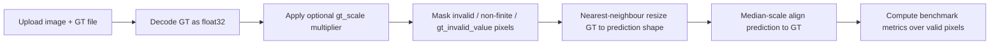

# Ground Truth Evaluation

[← Back to README](../README.md)

DepthLens Pro supports GT-based evaluation for one image at a time.

### Supported GT Formats

| Format | Notes |
|---|---|
| PNG | Single-channel preferred; multi-channel converted to greyscale |
| TIFF / TIF | Single-channel float or integer depth |
| NPY | Numeric depth array loaded with `allow_pickle=False` |
| EXR / PFM | Not currently supported |

### GT Processing Flow



### Why Median-Scale Alignment?

MiDaS-style monocular depth is inherently **relative** — the model predicts depth ordering and relative scale, not absolute distances in metres. Directly comparing raw predictions against metric GT would produce meaningless numbers.

Median-scale alignment computes:

```
scale = median(gt_valid_pixels) / median(pred_positive_pixels)
pred_scaled = pred * scale
```

This removes the global scale ambiguity before computing error metrics, making results comparable across different scenes and model configurations. The scale factor is clamped to `[1e-3, 1000]` to reject implausible alignments (e.g. unit mismatches where GT is in millimetres but predictions are in normalised units).

<div align="right"><sub><a href="../README.md#depthlens-pro">⬆ back to README</a></sub></div>

---
