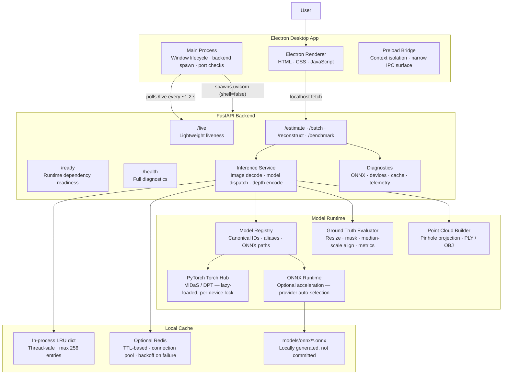

# System Architecture

[← Back to README](../README.md)

DepthLens Pro is split into a desktop shell, a local inference HTTP server, a model runtime, and a cache/storage layer.

The static diagram below gives a quick visual overview; the Mermaid diagram that follows shows the same system in more implementation detail.

  

A single `/estimate` request starts in the renderer when the user submits an image. The renderer sends a localhost request through the backend URL exposed by the preload bridge; Electron main owns backend startup and port discovery, while the FastAPI route validates upload size, model, colormap, metrics, output mode, and optional GT fields. The inference service decodes and possibly downsizes the image, builds a stable cache key from the full parameter tuple plus the image-content SHA-1, and checks Redis first when configured. Redis outages do not fail user requests; the service falls back to an in-memory LRU so inference remains available on local machines without external services. On a cache miss, dispatch enters the global `INFERENCE_MAX_CONCURRENCY` semaphore, then the selected PyTorch or ONNX model/device forward lock. The raw depth plane is resized, normalized, colorized/encoded, recorded in bounded telemetry, cached when eligible, and returned to the renderer for preview and export.

### Layer Responsibilities

| Layer | Key files | Responsibility |
|---|---|---|
| Electron main process | `electron-app/main.js`, `electron-app/src/main/*.js` | Small composition entrypoint plus focused modules for paths, backend HTTP probes, port fallback, PID metadata, Python resolution, backend lifecycle, settings persistence, and windows. Stable desktop lifecycle, backend control, and IPC wiring. |
| Renderer UI | `frontend/index.html`, `frontend/js/*.js`, `style.css` | Workspace tabs, charts, uploads, previews, 3D viewer, status orb, guide. Ordered frontend modules provide UI tabs, DOM integration, CSS-driven presentation, endpoint calls, persistence, and feature behavior. |
| Preload bridge | `electron-app/preload.js` | Narrow `contextBridge` surface — backend URL, dialogs, platform info only |
| Security policy | `electron-app/src/security-policy.js` | Navigation allowlist: local frontend file and `127.0.0.1:PORT` only |
| Process policy | `electron-app/src/backend-process-policy.js` | Checks command-line and stored PID metadata before terminating backend processes |
| FastAPI app | `backend/main.py`, `backend/api/` | Routes, CORS, JSON logging, exception handling, async lifespan hooks |
| Inference service | `backend/services/inference.py` | Image decoding, model dispatch (PyTorch + ONNX), depth normalisation, colourisation, encoding, depth-plane LRU cache |
| Model registry | `backend/model_registry.py` | Canonical IDs, display names, alias normalisation, ONNX path resolution across four candidate directories |
| Cache service | `backend/services/cache_service.py` | Redis integration with backoff, in-memory LRU fallback, versioned JSON serialisation (no pickle) |
| Diagnostics | `backend/services/diagnostics.py`, `onnx_diagnostics.py` | Module importability checks, provider discovery, ONNX weight validation |
| Reconstruction | `backend/services/reconstruction.py` | Pinhole point-cloud generation, PLY/OBJ serialisation, preview point downsampling |
| Ground truth | `backend/services/ground_truth.py` | GT decoding (PNG/TIFF/NPY), invalid-pixel masking, nearest-neighbour resize, median-scale alignment, benchmark metrics |

### Inference Concurrency Model

The backend uses two concurrency controls in combination:

1. **`INFERENCE_MAX_CONCURRENCY` semaphore** — an `asyncio.Semaphore` that limits the number of concurrent `/estimate` requests dispatched via `run_in_threadpool`. Default: 2.
2. **Per-model/device forward lock** — a `threading.Lock` stored in `_MODEL_FORWARD_LOCKS[f"{model_id}:{device_str}"]`. This prevents concurrent forward calls on the same model instance, which is unsafe on some torch backends. The lock covers only the `model(batch)` call; preprocessing and the bicubic resize run concurrently.

For ONNX, a matching `_ONNX_FORWARD_LOCKS` dict serialises `session.run()` calls per model/device pair.

<a href="../README.md#depthlens-pro">⬆ back to README</a>

---
